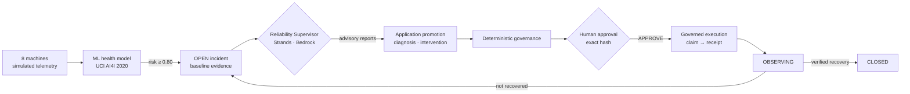

<div align="center">
  
</div>

# Operon

**Autonomous Reliability Operations for Industrial Systems**

A live, self-contained demonstration of the **governed agentic loop** for industrial
reliability. An ML health model — trained on the public **UCI AI4I 2020** benchmark —
continuously scores a simulated plant floor of eight machines. When failure risk crosses the
action gate, Operon opens a **durable incident** and runs it through an enforced lifecycle:
deterministic baseline evidence is collected, **Strands specialist agents** (diagnostic,
engineering, operations, critic, planner) reason under a Reliability Supervisor on
**AWS Bedrock**, and the application — never the model — promotes a diagnosis, validates an
intervention, evaluates deterministic governance, and issues an approval requirement. A human
approves the **exact** work package by hash. Execution is claimed and receipted, the asset is
observed, and the incident closes only when the application **verifies recovery** from
persisted post-intervention evidence. The dashboard quantifies recovered value and OEE lift
against configured economics.

The governing invariant is enforced by distinct records:
**prediction ≠ diagnosis ≠ intervention ≠ approval ≠ execution ≠ outcome.**
Agents reason; the application owns authority.

> **Vendor-neutral portfolio project.** The bundled AI4I 2020 dataset is synthetic and
> licensed under [CC BY 4.0](https://creativecommons.org/licenses/by/4.0/); the remaining
> demo data is synthetic. See [THIRD_PARTY_NOTICES.md](THIRD_PARTY_NOTICES.md) for
> attribution. This POC is not affiliated with, endorsed by, or built for any specific company.


---

## Architecture



Every phase change is a journaled SQLite transaction. The full state graph
(`OPEN → INVESTIGATING → AWAITING_EVIDENCE → DIAGNOSIS_VALIDATED → PLANNING →
INTERVENTION_VALIDATED → AWAITING_APPROVAL → READY → EXECUTING → OBSERVING → CLOSED`, plus
`ESCALATED`, `EXECUTION_FAILED`, `CANCELLED`) lives in `core/reliability/state.py`; the design
is documented in [docs/OPERON_ARCHITECTURE.md](docs/OPERON_ARCHITECTURE.md) and
[docs/STRANDS_FOUNDATION.md](docs/STRANDS_FOUNDATION.md).

## Quick start (Windows, ~2 minutes)

Uses **[uv](https://docs.astral.sh/uv/)** for a reproducible Python env (pins Python 3.12).
The React dashboard is **pre-built and committed**, so you need **no Node.js** to run it.

1. Install uv once: `irm https://astral.sh/uv/install.ps1 | iex`
2. Double-click **`install.bat`** (creates the env; downloads Python 3.12 if needed).
3. Double-click **`run.bat`**. Your browser opens the dashboard automatically.

Manual / cross-platform:

```bash
git clone <repository-url> operon
cd operon
uv sync                    # create .venv + install deps
uv run python run.py       # trains model on first run, serves http://127.0.0.1:8000/
```

The fleet simulation starts with the server and runs **fully offline** — no cloud account
required. Press **Start guided demo** in the header to watch a scripted, clearly labelled
**SIMULATED** walkthrough of the whole lifecycle. Without a reasoning backend configured,
real incidents still open and collect baseline evidence, but they wait in `INVESTIGATING`
because no specialist can run; Operon never substitutes a silent fallback for reasoning.

Normal relaunches preserve the SQLite database. Use **Reset** in the dashboard, or launch
with `uv run python run.py --reset-demo`, when you explicitly want a fresh run.

---

## Turning on live reasoning (optional)

Specialist and supervisor reasoning is built on the **Strands Agents SDK** (pinned
`strands-agents==1.54.0`) with **Amazon Bedrock** as the only model provider. The backend
is selected with `OPERON_REASONING_BACKEND`:

| Value | What runs | Needs |
|-------|-----------|-------|
| `none` | No reasoning; incidents wait in `INVESTIGATING` | nothing (default without AWS creds) |
| `local` | Strands supervisor in-process, holding the evidence service | AWS creds + Bedrock model access (default when creds resolve) |
| `packet` | The remote request/response contract executed in-process — offline parity for AgentCore | AWS creds + Bedrock |
| `agentcore` | The same contract invoked on a deployed **Bedrock AgentCore Runtime** | a deployed runtime (see below) |

Whatever the backend, its output is **advisory**. Every response is re-validated against the
frozen run snapshot (protocol version, correlation, code/prompt/schema identity, schema,
citations) before the application decides whether anything is promoted. A model failure
persists an escalated audit report and leaves the incident phase unchanged.

### AWS Bedrock — in-process Strands (the default live path)

1. Enable a Claude model (or cross-region inference profile) in **AWS Bedrock → Model access**.
2. Provide credentials by any standard AWS method — `aws configure`, an `AWS_PROFILE`, an
   instance role, or keys in `.env` (`cp .env.example .env`). Set `BEDROCK_MODEL_ID`, or the
   role-specific `OPERON_BEDROCK_SUPERVISOR_MODEL_ID` / `OPERON_BEDROCK_SPECIALIST_MODEL_ID`.
3. Relaunch. With resolvable AWS credentials and no Gemini key the backend defaults to
   `local`; set `OPERON_REASONING_BACKEND=local` explicitly to be sure.

Credentials run **server-side** and never touch the browser. Diagnosis promotion also
requires a **trusted technical confirmation** (an independent inspection record), and a
draft intervention requires a trusted resource confirmation and work-package binding. The
HTTP endpoints that accept those submissions are disabled unless
`OPERON_TRUSTED_SUBMISSIONS=1`, because the server has no authentication layer.

### AWS Bedrock AgentCore — remote reasoning runtime (implemented, not live-validated)

The repository contains the application side of an AgentCore deployment:
`core/reasoning/agentcore.py` (the `bedrock-agentcore` invoke/stop client with bounded
streaming reads and error mapping), `agentcore_app/main.py` (the `BedrockAgentCoreApp`
entrypoint that runs the supervisor over a bounded evidence packet with **no** database or
authority access), and `scripts/agentcore/` (offline CodeZip builder, read-only preflight,
dry-run-by-default deploy, double-gated live smoke, IAM templates). Configure
`OPERON_REASONING_BACKEND=agentcore` plus `OPERON_AGENTCORE_RUNTIME_ARN`,
`OPERON_AGENTCORE_REGION` and both `OPERON_BEDROCK_*_MODEL_ID` values; the runbook is
[docs/AGENTCORE_DEPLOYMENT.md](docs/AGENTCORE_DEPLOYMENT.md). Bucket/IAM provisioning,
readiness polling, teardown and observability enablement are deliberately **manual**, the
tests use fake clients only, and no live AgentCore run is recorded in this repository. A
deferred-evidence loop across the remote boundary is planned, not implemented: remote
evidence requests park the incident in `AWAITING_EVIDENCE`.

### Google Gemini — peer agents and legacy demo only

Gemini does **not** power the specialists. A `GEMINI_API_KEY` (free tier at
[aistudio.google.com/apikey](https://aistudio.google.com/apikey)) backs the Governance and
Monitoring **peer agents** (see below) and the deprecated proposal-first demo path. The
client keeps a token-bucket rate limiter (`GEMINI_RPM`, default 12/min) with backoff and
falls back to deterministic policy engines without a key. `SENTINEL_LLM_PROVIDER` and
`POC_FORCE_DETERMINISTIC=1` still select that legacy provider; forcing deterministic also
leaves the reasoning backend at `none` unless `OPERON_REASONING_BACKEND` is set.

---

## Deploy a public demo

The whole app is a single container (FastAPI + the pre-built dashboard), so it drops onto
any container host. An included **Render Blueprint** (`render.yaml`) provides the service
configuration.

- **Render** — *New → Blueprint → pick this repository*. Free tier, WebSockets supported.
- **Railway / Fly.io** — both auto-detect the `Dockerfile`; no extra config needed.
- **Locally** — `docker build -t operon . && docker run -p 8000:8000 operon`

The hosted demo sets `POC_FORCE_DETERMINISTIC=1` — no AWS creds, no cost, no shared keys —
so it serves the offline fleet simulation and the guided SIMULATED demo. To run live
Strands reasoning in a deployment, set `POC_FORCE_DETERMINISTIC=0`, add your `AWS_*` and
Bedrock model env vars in the host's dashboard, and optionally set
`OPERON_REASONING_BACKEND`. On free tiers the service sleeps when idle and cold-starts in
~30 s.

---

## The 90-second demo script

Press **Start guided demo** (header). The guided demo is a scripted read model, labelled
**Guided Demo · Simulated Plant · SIMULATED · no live model**; it touches no production
table, model or reasoning backend, and it pauses the live tick loop while it runs.

1. **Signal.** `AC-COMP-01` (compressor) climbs from 14 % to 86 % failure risk. Crossing the
   **80 % action gate** opens incident `DEMO-INCIDENT-01`: *prediction, not cause*.
2. **Investigate.** Baseline evidence is collected, a diagnosis run delegates to the
   diagnostic specialist and critic, and the incident parks in `AWAITING_EVIDENCE` until a
   simulated technician inspection arrives. Only then is a diagnosis **promoted**.
3. **Plan and validate.** A work-package binding produces a draft intervention; engineering,
   operations, critic and planner advisories review the exact draft; the application
   promotes it and issues an approval requirement bound to the intervention hash.
4. **Human-in-the-loop.** The script stops at `AWAITING_APPROVAL` — no timer or callback can
   approve. Click **Approve exact plan & dispatch** (about 42 s in). The call carries the
   exact `requirement_id`, `intervention_id`, `intervention_hash` and `context_revision`.
5. **Execute, observe, verify.** A work order and execution receipt appear, the incident
   enters `OBSERVING`, recovery samples accumulate against the frozen observation plan, and
   a `VERIFIED_RECOVERY` outcome closes the incident (about 33 s). The impact bar shows the
   scripted recovered value. **Reject** instead and the scripted incident is cancelled (on the live
   lifecycle a rejection escalates the incident for human follow-up).

Use **Reset** (top-right) to run it again. The live simulator behind the guided demo stages
four degradations — `AC-COMP-01` (power), `CNC-MILL-07` (overstrain), then the pumps
`HYD-PUMP-03` and `COOL-PMP-09` on the same heat-dissipation trajectory — and its response
to a confirmed work package is profile-driven (recovers or persists), so verification can
also report `NOT_RECOVERED` (back to investigation) or `REGRESSED` (escalated).

**API surface.** The dashboard talks to `server/main.py` over REST + a `/ws` WebSocket:
`GET /api/state`, `GET /api/incidents/{id}` (lifecycle projection + read model),
`POST /api/approve|reject/{equipment_id}` and `POST /api/incidents/{id}/approval` (exact
approval intent required), `/execute`, `/outcome` (deterministic verification, no body),
`/confirmations/technical`, `/confirmations/resource` and `/drafts` (trusted, flag-gated),
`POST /api/demo/scenario`, `POST /api/reset`, `/api/start`, `/api/stop`, `GET /api/health`.

> **Legacy path.** The original proposal-first demo (agent drafts a plan on threshold
> crossing, approval commits it immediately) is deprecated compatibility code: run it with
> `OPERON_LEGACY_DEMO=1`. Its artifacts carry no promotion lineage and are refused by the
> authoritative lifecycle.

---

## What's inside

```text
operon/
  run.py / run.bat / install.bat     launcher + first-time setup (uv)
  pyproject.toml / uv.lock           reproducible Python env (3.12)
  .env.example                       Bedrock / AgentCore / tuning config template
  data/
    ai4i2020.csv                     UCI AI4I 2020 dataset (public benchmark)
  core/                              UI-agnostic domain logic (pure Python)
    config.py       thresholds, economics, provider + reasoning-backend selection
    dataset.py      AI4I loader + feature engineering (power, ΔT, overstrain)
    model.py        GradientBoosting: P(failure) head + failure-mode head
    db.py           SQLite semantic model (governed tables)
    migrations/     001–007: incidents, governed execution, promotion,
                    lifecycle, dependency-scoped freshness, outcome verification
    seed_data.py    fleet master data: 8 assets, 4 failure modes, crew, parts
    simulator.py    multi-equipment telemetry, staggered failures, intervention response
    reliability/    the authoritative incident lifecycle: state graph + append-only
                    repository, signal admission, baseline evidence, provenance +
                    dependency-scoped freshness, promotion boundary, deterministic
                    governance, approval, execution claims/receipts, outcome policy
    agents/         Strands specialists + Reliability Supervisor (advisory contracts)
    reasoning/      backend seam: local | packet | agentcore, packet protocol, trust checks
    demo/           scripted guided-demo runner + inspectable artifact read model
    services/       swappable capability layer: 7 interfaces (5 tools + 2 peers),
                    SENTINEL_*_ADAPTER registry, adapters local/mcp/a2a/gemini_peers
    tools.py        thin facade over services/
    agent.py        legacy proposal agent + triage helpers (OPERON_LEGACY_DEMO)
    engine.py       tick loop: scoring, admission, lifecycle progression, projections
  server/main.py    FastAPI — REST + WebSocket; serves the built dashboard
  mcp_app/server.py FastMCP server — governed tools over MCP
  a2a_app/server.py A2A peer server — Governance + Monitoring agents
  agentcore_app/    Bedrock AgentCore Runtime entrypoint + hash-locked requirements
  scripts/agentcore/  build, preflight, deploy, smoke, IAM policy templates
  docs/             OPERON_ARCHITECTURE, STRANDS_FOUNDATION, AGENTCORE_DEPLOYMENT, EXTENDING
  frontend/         React + Vite dashboard (source + committed dist/)
  tests/            29 offline test modules (network guarded)
```

Every number a stakeholder might challenge lives in `core/config.py` and is surfaced in the
UI, so the business case is transparent and editable.

---

## Building on it — the services layer

Operon doesn't call external systems directly; it calls **service interfaces**, each
satisfied by a **swappable adapter** (ports-and-adapters). The repo ships a local,
SQLite-backed adapter for each so it runs offline, but you can point any service at your
real systems — a CMMS (SAP PM / IBM Maximo), a warehouse system, an MES scheduler, a paging
service — without touching the lifecycle:

| Service | Operon uses it to… | Swap with |
|---------|--------------------|-----------|
| `InventoryService`    | check spare-parts stock              | `SENTINEL_INVENTORY_ADAPTER` |
| `WorkforceService`    | find a certified technician          | `SENTINEL_WORKFORCE_ADAPTER` |
| `SchedulingService`   | reserve a planned window             | `SENTINEL_SCHEDULING_ADAPTER` |
| `CmmsService`         | commit a **repair work package**     | `SENTINEL_CMMS_ADAPTER` |
| `NotificationService` | raise alerts, page technicians       | `SENTINEL_NOTIFICATIONS_ADAPTER` |
| `GovernanceService`   | peer review of a plan (legacy path)  | `SENTINEL_GOVERNANCE_ADAPTER` |
| `MonitoringService`   | flag systemic patterns across alerts | `SENTINEL_MONITORING_ADAPTER` |

On the authoritative path the work package — work order + reserved spares + labor booking +
schedule hold + dispatch notification — is committed by **governed execution**, not by
approval: the lifecycle claims the approved intervention in one transaction, hands the CMMS
adapter a sealed execution authorization, and records a receipt against the claim identity.
A `CONFIRMED` receipt means the commit happened, not that the asset recovered. The local
adapter writes to the same SQLite database; notifications are recorded, not sent.

The same tool capabilities are also exposed over **MCP** (Model Context Protocol) by a
FastMCP server, including `execute_governed_intervention`, so external hosts and agents can
use them:

```bash
uv run python -m mcp_app.server            # stdio (e.g. for Claude Desktop)
uv run python -m mcp_app.server --http      # streamable-http on :8100
```

There's an `mcp` adapter behind every tool interface — set `SENTINEL_<DOMAIN>_ADAPTER=mcp`
and Operon reaches its own capabilities *over MCP* (self-spawned, no port), with `local`
still the offline default.

Two capabilities are **peer agents**, not tools — a **Governance** agent (APPROVE /
CONDITIONS / VETO on a proposed plan) and a **Monitoring** agent (systemic patterns across
alerts). Their default adapter is `llm`: they reason with Gemini when a key is set and fall
back to deterministic engines otherwise; set `SENTINEL_GOVERNANCE_ADAPTER=local` to pin the
deterministic path. Monitoring feeds the triage broadcast; the Governance peer is consulted
only on the legacy proposal path — the authoritative lifecycle uses the deterministic policy
in `core/reliability/governance.py`. Both peers can be reached over the **A2A** protocol:

```bash
uv run python -m a2a_app.server            # Governance + Monitoring peers on :8200
# then: SENTINEL_GOVERNANCE_ADAPTER=a2a  SENTINEL_MONITORING_ADAPTER=a2a
```

**A2A is for agents; MCP is for tools** — both are transports behind the same
service interfaces. See **[docs/EXTENDING.md](docs/EXTENDING.md)** for the adapter
recipe, MCP setup, and A2A peers.

---

## Editing the dashboard (needs Node ≥ 18)

The committed `frontend/dist/` means the app runs without Node. The dashboard (React 18,
Recharts, Framer Motion, Vite) shows the fleet grid with risk sparklines, the predictive
signal chart with the action gate, an incident queue, and an incident command view: the
lifecycle strip, evidence ledger with provenance, agent runs and delegations, the promoted
diagnosis and intervention, the approval card bound to the intervention hash, the
execution → observe → verify outcome card, and the event journal. To change the UI:

```bash
cd frontend
npm install
npm run dev        # hot-reload at :5173, proxies API+WS to the backend on :8000
npm run build      # rebuild the committed dist/ bundle
```

Run `uv run python run.py` in another terminal so the dev server has a live backend.

---

## Tests

```bash
uv run pytest                    # full suite
uv run pytest -m "not integration"   # fast unit/functional only (no subprocess/server)
```

The suite (29 modules, 723 tests) runs entirely offline behind a socket guard: no live
Bedrock, Gemini or AgentCore calls. It covers the incident state graph, admission and
baseline evidence, provenance and dependency-scoped freshness, promotion (failure injection,
concurrent retries, stale sources, legacy exclusion), governance, exact approval, execution
claims and receipts, outcome verification (execution never closes, pre-boundary samples do
not count, recovered / not-recovered / regressed / inconclusive), the engine tick and
recovery, the Strands specialists and supervisor with scripted models, the reasoning packet
protocol and trust checks, the AgentCore backend and deployment tools with fake clients, the
scripted demo, the services layer, and the peer policies. The `integration` tests exercise a
real **MCP** round-trip (self-spawned stdio server, through governed execution) and a real
**A2A** round-trip (peer server in-process via ASGI). Tests use a throwaway SQLite file.

---

## The ML model

Trained on the **AI4I 2020** dataset (10,000 rows, 3.4 % failure rate) with two heads:

- **Failure head** — GradientBoosting classifier → P(failure). Held-out **AUC ≈ 0.97**.
- **Mode head** — classifies the specific failure mode (Tool-Wear / Heat-Dissipation /
  Power / Overstrain). Held-out accuracy **≈ 0.96**.

Three engineered features (mechanical power, process–air ΔT, overstrain = tool-wear × torque)
map directly onto the documented AI4I failure physics, and ablation-based attribution
explains every signal ("dominant driver is …"). The model retrains in ~10 s on first run and
is cached to `data/health_model.joblib`. Its score is a **signal**, never a diagnosis: it
admits incidents at the 0.80 gate and, with the same 0.45 / 0.80 bands, is the persisted
evidence the outcome policy reads to verify recovery.
