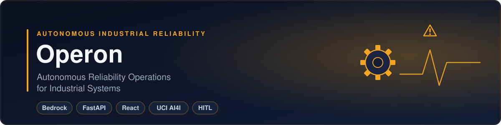
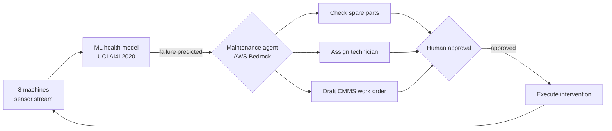

<div align="center">
  
</div>

# Operon

**Autonomous Reliability Operations for Industrial Systems**

A live, self-contained demo of the **agentic closed loop** for industrial predictive
maintenance. An ML health model — trained on the public **UCI AI4I 2020** benchmark —
continuously scores a plant floor of eight machines. When it predicts an imminent failure,
an **AI maintenance agent** (running on **AWS Bedrock**) reasons over a governed data model
and proposes a complete, grounded intervention: check spare parts, assign a certified
technician, block a planned schedule window, and draft a CMMS work order. A human approves
with one click. Approving converts a projected ~8 h unplanned line-down into a ~45 min
planned swap, and the dashboard quantifies the recovered value and OEE lift.

When **several machines degrade at once, the agent triages them** — ranking by criticality ×
failure-probability × business impact — and works the highest-value risk first.

> **Vendor-neutral portfolio project.** The bundled AI4I 2020 dataset is synthetic and
> licensed under [CC BY 4.0](https://creativecommons.org/licenses/by/4.0/); the remaining
> demo data is synthetic. See [THIRD_PARTY_NOTICES.md](THIRD_PARTY_NOTICES.md) for
> attribution. This POC is not affiliated with, endorsed by, or built for any specific company.


---

## Architecture



## Quick start (Windows, ~2 minutes)

Uses **[uv](https://docs.astral.sh/uv/)** for a reproducible Python env (pins Python 3.12).
The React dashboard is **pre-built and committed**, so you need **no Node.js** to run it.

1. Install uv once: `irm https://astral.sh/uv/install.ps1 | iex`
2. Double-click **`install.bat`** (creates the env; downloads Python 3.12 if needed).
3. Double-click **`run.bat`**. Your browser opens the dashboard automatically.

Manual / cross-platform:

```bash
git clone <repository-url> agentic-predictive-maintenance
cd agentic-predictive-maintenance
uv sync                    # create .venv + install deps
uv run python run.py       # trains model on first run, serves http://127.0.0.1:8000/
```

The demo auto-starts the moment the page loads. It runs **fully offline** with a
deterministic agent — no cloud account required.

Normal relaunches preserve the SQLite database. Use **Reset demo** in the dashboard,
or launch with `uv run python run.py --reset-demo`, when you explicitly want a fresh run.

---

## Turning on the live agent (optional)

By default the agent uses a deterministic planner (bullet-proof, no creds). Give it an LLM
API key and it switches to a **real tool-calling loop**, reasoning over the same governed
tools — the header badge flips to **`GEMINI · LIVE AGENT`** (or `BEDROCK · …`). Any error
silently falls back to the deterministic plan, so the demo can never break.

The provider is auto-selected: **Gemini** if a key is set, else **Bedrock**, else
deterministic. Force one with `SENTINEL_LLM_PROVIDER=gemini|bedrock|deterministic`.

### Google Gemini — recommended for this POC (free tier)

1. Grab a free key at **[aistudio.google.com/apikey](https://aistudio.google.com/apikey)** (no card).
2. `cp .env.example .env` and set `GEMINI_API_KEY=…` (optionally `GEMINI_MODEL_ID`, default `gemini-2.5-flash`).
3. `uv run python run.py`.

The client stays under the free-tier limit with a **token-bucket rate limiter** (`GEMINI_RPM`,
default 12/min) and retries transient `429`/`5xx` with **exponential backoff + jitter** —
so a burst of alerts degrades gracefully instead of erroring.

### AWS Bedrock — kept for the scale / real-data phase

1. Enable a Claude model in the **AWS Bedrock console → Model access** for your region.
2. Provide credentials by any standard AWS method — `aws configure`, an `AWS_PROFILE`, an
   instance role, or keys in `.env`. Set `BEDROCK_MODEL_ID` if needed.
3. Relaunch. (Set `SENTINEL_LLM_PROVIDER=bedrock` if you also have a Gemini key set.)

Because credentials run **server-side**, they never touch the browser. Each person who
clones the repo supplies their **own** key — nothing is shared or committed.

---

## Deploy a public demo

The whole app is a single container (FastAPI + the pre-built dashboard), so it drops onto
any container host. An included **Render Blueprint** (`render.yaml`) provides the service
configuration.

- **Render** — *New → Blueprint → pick this repository*. Free tier, WebSockets supported.
- **Railway / Fly.io** — both auto-detect the `Dockerfile`; no extra config needed.
- **Locally** — `docker build -t operon . && docker run -p 8000:8000 operon`

The hosted demo runs the **deterministic agent** by default (`POC_FORCE_DETERMINISTIC=1` — no
AWS creds, no cost, no shared keys). To make a deployment run the **live Bedrock agent**, set
`POC_FORCE_DETERMINISTIC=0` and add your `AWS_*` + `BEDROCK_MODEL_ID` env vars in the host's
dashboard. On free tiers the service sleeps when idle and cold-starts in ~30 s.

---

## The 90-second demo script

1. **Fleet is green.** Eight assets stream healthy telemetry (AI4I feature space:
   air/process temperature, rotational speed, torque, tool wear).
2. **Staggered degradation.** `AC-COMP-01` (compressor) degrades first, then `CNC-MILL-07`
   (mill), and then **two pumps** — `HYD-PUMP-03` and `COOL-PMP-09` — walk the *same*
   Heat-Dissipation trajectory. Watch the live probability chart climb.
3. **Agent engages + triages.** As probabilities cross the **80 % threshold**, the cards go
   red and the **Maintenance Agent** activates. With multiple alerts open, it **ranks them**
   and streams a reasoning trace + grounded tool-calls per alert. A **Governance** verdict
   (Approve / Conditions / Veto, with reasons) appears on each alert *before* you approve,
   and when the two pumps alert together the **Monitoring** agent flags a **systemic pattern**.
   Nothing is written yet.
4. **Human-in-the-loop.** Click **Approve & dispatch** on the top-priority alert. The work
   order commits to the CMMS, the asset recovers, and the **Business Value** bar lights up.
5. **Counterfactual (optional).** **Reject** another alert to show the un-actioned asset
   running to an unplanned failure and the loss it incurs.

Use **Reset demo** (top-right) to run it again.

> **Step 13B note.** The script above describes the original proposal-first demo.
> It is now deprecated compatibility code: run it with `OPERON_LEGACY_DEMO=1`.
> By default the engine follows the authoritative lifecycle
> (`OPEN → INVESTIGATING → … → AWAITING_APPROVAL → READY → EXECUTING → OBSERVING → CLOSED`):
> a signal opens a durable incident and deterministic baseline evidence is collected;
> diagnosis, intervention and approval authority exist only after the Strands
> supervisor runs (Bedrock) and trusted confirmations are submitted. A confirmed
> work package only reaches `OBSERVING`; `CLOSED` requires the application's
> deterministic outcome verification of persisted post-intervention evidence
> (Step 14), and an asset that does not recover returns to investigation. Approval calls
> must carry the exact `requirement_id`, `intervention_id`, `intervention_hash` and
> `context_revision` shown on the alert; equipment-only approvals are rejected.
> Trusted confirmation/binding endpoints are disabled unless
> `OPERON_TRUSTED_SUBMISSIONS=1`. See [docs/STRANDS_FOUNDATION.md](docs/STRANDS_FOUNDATION.md).

---

## What's inside

```text
agentic-predictive-maintenance/
  run.py / run.bat / install.bat     launcher + first-time setup (uv)
  pyproject.toml / uv.lock           reproducible Python env (3.12)
  .env.example                       AWS Bedrock / tuning config template
  data/
    ai4i2020.csv                     UCI AI4I 2020 dataset (public benchmark)
  core/                              UI-agnostic domain logic (pure Python)
    config.py       assumptions, thresholds, AWS Bedrock config
    dataset.py      AI4I loader + feature engineering (power, ΔT, overstrain)
    model.py        GradientBoosting: P(failure) head + failure-mode head
    db.py           SQLite semantic model (governed tables)
    seed_data.py    fleet master data: 8 assets, 4 failure modes, crew, parts
    simulator.py    multi-equipment telemetry with correlated sensors + staggered failures
    tools.py        the agent's governed tools — a thin facade over services/
    services/       swappable capability layer (ports & adapters)
      base.py         5 service interfaces the agent depends on
      registry.py     per-domain adapter selection via SENTINEL_*_ADAPTER
      adapters/local.py  default SQLite-backed reference adapters
    agent.py        Bedrock Converse agentic loop + deterministic fallback + triage
    engine.py       demo engine: concurrent alerts, scoring, write-back
  server/
    main.py         FastAPI — REST + WebSocket; serves the built dashboard
  mcp_app/
    server.py       FastMCP server — exposes the governed tools over MCP
  a2a_app/
    server.py       A2A peer server — Governance + Monitoring agents
  docs/
    EXTENDING.md    how to plug the agent into your own CMMS / WMS / paging systems
  frontend/                          React + Vite dashboard (source + committed dist/)
    src/            App, live charts (Recharts), animation (Framer Motion)
    dist/           pre-built bundle (runs with no Node)
```

Every number a stakeholder might challenge lives in `core/config.py` and is surfaced in the
UI, so the business case is transparent and editable.

---

## Building on it — the services layer

The agent doesn't call a database directly; it calls **service interfaces**, each
satisfied by a **swappable adapter** (ports-and-adapters). The repo ships a
local, SQLite-backed adapter for each so it runs offline, but you can point any
service at your real systems — a CMMS (SAP PM / IBM Maximo), a warehouse system,
an MES scheduler, a paging service — without touching the agent:

| Service | The agent uses it to… | Swap with |
|---------|-----------------------|-----------|
| `InventoryService`    | check spare-parts stock              | `SENTINEL_INVENTORY_ADAPTER` |
| `WorkforceService`    | assign a certified technician        | `SENTINEL_WORKFORCE_ADAPTER` |
| `SchedulingService`   | reserve a planned window             | `SENTINEL_SCHEDULING_ADAPTER` |
| `CmmsService`         | draft a WO → commit a **repair work package** | `SENTINEL_CMMS_ADAPTER` |
| `NotificationService` | raise alerts, page technicians       | `SENTINEL_NOTIFICATIONS_ADAPTER` |

On approval the agent assembles a complete **repair work package** — work order +
reserved spares + labor booking + schedule hold + dispatch notification — as one
governed transaction.

The same capabilities are also exposed over **MCP** (Model Context Protocol) by a
FastMCP server, so external hosts and agents can use them:

```bash
uv run python -m mcp_app.server            # stdio (e.g. for Claude Desktop)
uv run python -m mcp_app.server --http      # streamable-http on :8100
```

There's even an `mcp` adapter behind every service interface — set
`SENTINEL_<DOMAIN>_ADAPTER=mcp` and the agent reaches its own capabilities *over
MCP* (self-spawned, no port), with `local` still the offline default.

Two capabilities are **agents**, not tools — a **Governance** agent (rules
APPROVE / CONDITIONS / VETO on a plan before you approve it) and a **Monitoring**
agent (flags systemic patterns across alerts). By default they **reason with
Gemini** (grounded in the plan / alert set) and **fall back to a deterministic
engine** without a key or under rate limits — set `SENTINEL_GOVERNANCE_ADAPTER=local`
to pin the deterministic path. They can also be reached as peers over the **A2A**
protocol:

```bash
uv run python -m a2a_app.server            # Governance + Monitoring peers on :8200
# then: SENTINEL_GOVERNANCE_ADAPTER=a2a  SENTINEL_MONITORING_ADAPTER=a2a
```

**A2A is for agents; MCP is for tools** — both are transports behind the same
service interfaces. See **[docs/EXTENDING.md](docs/EXTENDING.md)** for the adapter
recipe, MCP setup, and A2A peers.

---

## Editing the dashboard (needs Node ≥ 18)

The committed `frontend/dist/` means the app runs without Node. To change the UI:

```bash
cd frontend
npm install
npm run dev        # hot-reload at :5173, proxies API+WS to the backend on :8000
npm run build      # rebuild the committed dist/ bundle
```

Run `uv run python run.py` in another terminal so the dev server has a live backend.

---

## Tests

```bash
uv run pytest                    # full suite
uv run pytest -m "not integration"   # fast unit/functional only (no subprocess/server)
```

Fast tests cover the services layer, governed write-back, the Governance/Monitoring
policy logic, provider selection, the rate limiter, and the deterministic fallback.
The `integration` tests exercise a real **MCP** round-trip (self-spawned stdio
server) and a real **A2A** round-trip (peer server in-process via ASGI). Tests use
a throwaway SQLite file and never make live LLM calls.

---

## The ML model

Trained on the **AI4I 2020** dataset (10,000 rows, 3.4 % failure rate) with two heads:

- **Failure head** — GradientBoosting classifier → P(failure). Held-out **AUC ≈ 0.97**.
- **Mode head** — classifies the specific failure mode (Tool-Wear / Heat-Dissipation /
  Power / Overstrain). Held-out accuracy **≈ 0.96**.

Three engineered features (mechanical power, process–air ΔT, overstrain = tool-wear × torque)
map directly onto the documented AI4I failure physics, and ablation-based attribution
explains every alert ("dominant driver is …"). The model retrains in ~10 s on first run and
is cached to `data/health_model.joblib`.
