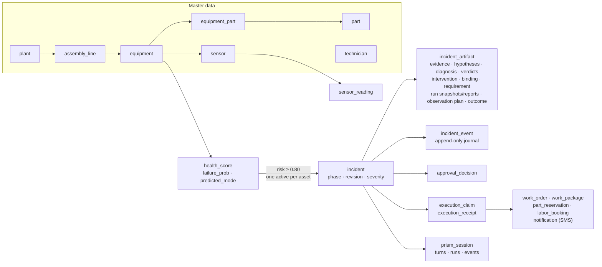
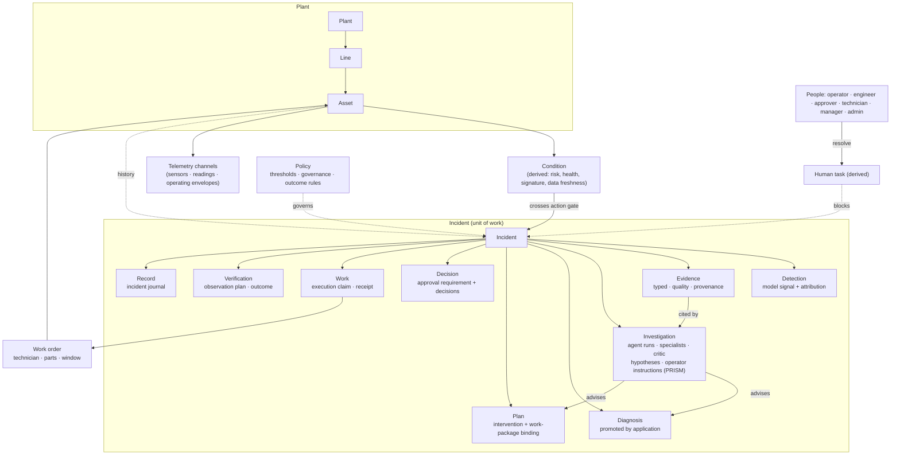
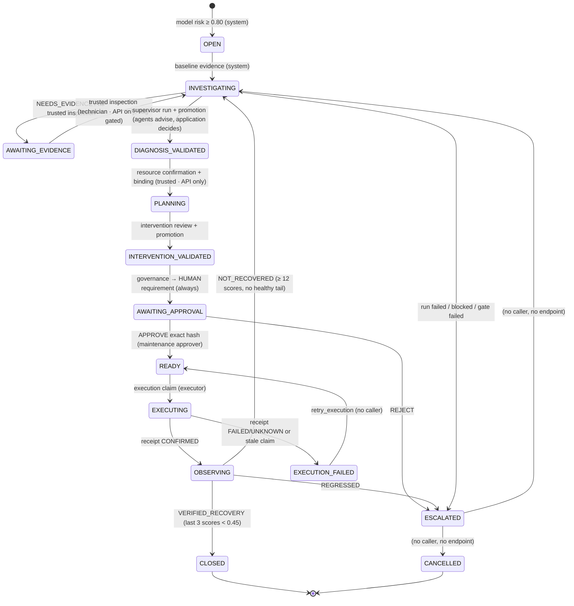
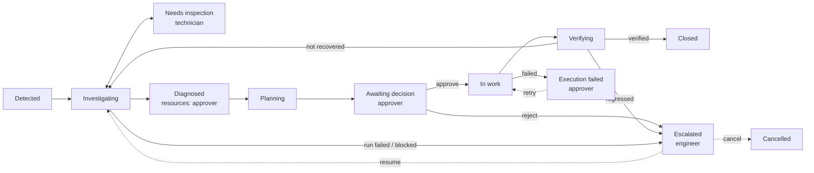
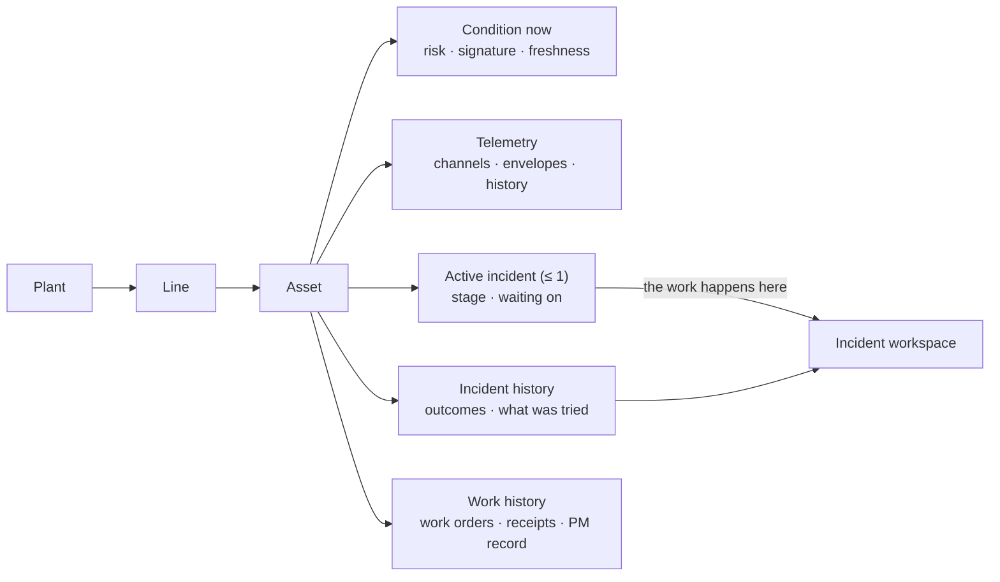
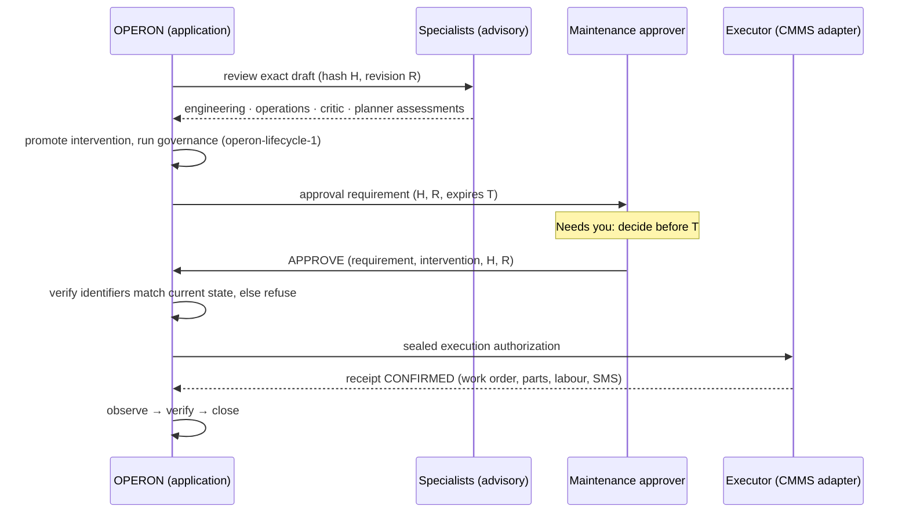

# OPERON V2: Product model & information architecture (Phase 1)

Status: Phase 1 (analysis and design). Nothing here changes application behaviour. It defines what
OPERON V2 *is* as a product and how people navigate and operate it, before any visual redesign.

Foundation: [`design/mode.md`](../mode.md) (Phase 0 surface classification).

Evidence base:
- the repository at `overhaul/v2` (`0594d16` + docs), including the backend domain (`core/db.py`,
  `core/migrations/001–008`, `core/reliability/*`, `core/agents/contracts.py`, `core/engine.py`,
  `server/main.py`) and the frontend (`frontend/src/**`);
- the live application observed in Phase 0 (deterministic mode, idle and through a full Guided
  Demo), and a smoke run of `overhaul/v2`.

Conventions:
- **CURRENT** marks what the code does today.
- **PROPOSED** marks the V2 product model.
- A *gap* is something the V2 information architecture needs that the backend can't do yet. Gaps
  are recorded, not implemented; backend work belongs to Phase 6.

---

## 1. Executive summary

OPERON is a **reliability operations system for a plant**. Today the frontend presents it as a
command view of a governed AI pipeline. V2 should present it as **a place where plant people resolve
equipment problems**:

- **The incident is the unit of work.** Every consequential thing (evidence, hypotheses, diagnosis,
  plan, approval, work, verification) belongs to an incident, and the backend already models it
  that way (`incident`, `incident_artifact`, `incident_event`).
- **The asset is the unit of context.** People think "what is wrong with Compressor 01". Condition,
  telemetry, history and work live on the asset.
- **Humans are blockers, not spectators.** The lifecycle stops at four human touchpoints: technician
  inspection, resource confirmation, approval of the exact plan, and resolution of exceptions. V2's
  top level is organised around **what is waiting on a person** ("Needs you"), not around the
  pipeline.
- **The agent is a participant inside incidents, not a destination.** Investigation, hypotheses,
  critic challenges and steering belong in the incident. A standalone "Operon Agent" page is
  retired from primary navigation.
- **Meaning before styling.** V2 separates five things the current UI conflates:
  - asset condition
  - incident stage
  - who the incident is waiting on
  - severity
  - provenance

  It also bans invented numbers. The current KPI deck has hard-coded fallbacks and a synthetic
  "Value at risk" formula.

Proposed top level: **Overview · Needs you · Incidents · Assets · Work · Performance**, plus
**Audit log** and **System** as secondary areas. The Guided Demo moves out of the operational chrome
into an explicit Demo mode.

The implementation inspection also found that the **lifecycle has dead ends the UI can't resolve**:

- escalated and rejected incidents can't be resumed or cancelled;
- live incidents stall waiting for a technician inspection that only an API flag can supply;
- only the latest incident per asset reaches the UI.

The V2 information architecture is designed for the complete lifecycle. Where the backend doesn't
support it yet, this document marks the gap (§17 and §18).

---

## 2. Current product model (CURRENT)

What exists today, from the code:

| Concept | Implementation | Notes |
|---|---|---|
| Plant | `plant` row `US01` "Demo Manufacturing Plant 01" (`core/seed_data.py:160`, `config.PLANT_NAME`) | Only the name reaches the UI (`meta.plant`). |
| Line | `assembly_line` `LINE-A` "Coil Assembly Line A" (`seed_data.py:162`) | **In the schema but never shown** in the UI. |
| Asset | `equipment`: 8 assets with class, criticality HIGH/MEDIUM/LOW, product tier (`seed_data.py:13-22`) | UI calls them "Machines". |
| Sensor / telemetry | `sensor` (5 per asset: AIRTEMP, PROCTEMP, SPEED, TORQUE, TOOLWEAR), `sensor_reading` | The UI holds the last 90 ticks (`HISTORY_CAP`, `engine.py:62`). |
| Health | `health_score(failure_prob, health_score = 1 − failure_prob, predicted_mode)`, GradientBoosting on AI4I (`core/model.py`) | Two numbers for one fact. |
| Asset status | `status_for(prob)`: ≥0.80 CRITICAL, ≥0.45 WARNING, else HEALTHY (`engine.py:99-104`) **overridden** by incident events: CRITICAL, SCHEDULED, DOWN (`engine.py:735-745`) | Status mixes condition with incident existence (Phase 0 saw "CRITICAL" at risk 0.00). |
| Detection | Model signal ≥ 0.80 admits an incident, admission key `model-risk:{asset}` (`reliability/repository.py:400`) | No record exists for the 0.45–0.80 warning band. **At most one active incident per asset.** |
| Incident | `incident(phase ×14, revision, severity, triage_score, mode LIVE/DETERMINISTIC/MIXED)` | Identified by UUID only; no human-readable reference. |
| Evidence | `Evidence` artifacts: kinds telemetry, model_signal, maintenance_history, document, asset_relation, operational_context, resource_availability, inspection, outcome, health_score. Quality GOOD/SUSPECT/MISSING; provenance OBSERVED/SIMULATED/DERIVED. Plus `EvidenceRequest` (OPEN/SATISFIED/UNAVAILABLE). | Immutable, typed, cited by agents. |
| Hypothesis | Advisory `HypothesisSuggestion` (supporting/contradicting evidence, falsification tests, confidence) inside `DiagnosticAssessment` (`agents/contracts.py:32-56`); `Hypothesis` artifact OPEN/SUPPORTED/REFUTED/UNRESOLVED | Exists in data; barely visible in the UI. |
| Agent run | `SupervisorRunSnapshot` → `SupervisorReport` (completion MODEL_COMPLETED/LIMIT_EXHAUSTED/TIMEOUT/MODEL_FAILED/INVALID_OUTPUT/CANCELLED); specialist roles diagnostic, engineering, operations, critic, planner; `AgentAction` steps; bounded by `SupervisorBounds` | Advisory only. |
| PRISM session | `prism_session` / `prism_turn` / `prism_run` / `prism_event` (`migrations/008`) | Operator instructions per incident with revision fencing. |
| Diagnosis | `Diagnosis` CANDIDATE/ACCEPTED/SUPERSEDED, promoted by the application with a `ValidationVerdict` (ACCEPT/REJECT/NEEDS_EVIDENCE) | Promotion **requires a trusted technician inspection** (`promotion.py:236-242`). |
| Recommendation / plan | `Intervention` (risk, cost, downtime, avoided loss, window, steps by capability) + `WorkPackageBinding` (technician, parts, schedule) + advisory `MaintenancePlanAssessment` | The intervention hash is what approval binds to. |
| Approval | `ApprovalRequirement` (mode HUMAN, `required_roles=("maintenance_approver",)`, expiry = min(24 h, window start)) + `ApprovalDecision` (actor_id, actor_role, APPROVE/REJECT) (`lifecycle.py:606-703`) | On the lifecycle path approval is **always** required. APPROVE → READY; **REJECT → ESCALATED**. |
| Action / execution | `execution_claim`, `execution_receipt` (CONFIRMED/FAILED/UNKNOWN); the local CMMS adapter writes `work_order`, `work_package`, `part_reservation`, `labor_booking` and an SMS `notification` in one transaction (`services/adapters/local.py:170-247`) | Nothing updates work-order status afterwards. |
| Verification | `ObservationPlan` + `Outcome` VERIFIED_RECOVERY → CLOSED, NOT_RECOVERED → INVESTIGATING, REGRESSED → ESCALATED, INCONCLUSIVE stays OBSERVING (`outcome.py:117-197`) | The only route to CLOSED is verified recovery. |
| Maintenance activity | Only incident-generated work orders, plus one seeded historical PREVENTIVE record | No preventive-maintenance schedule, backlog or calendar. |
| People | `technician` (6, skills CSV, shift A/B, availability) | **No users, authentication or roles.** `actor_id` and `actor_role` are caller-declared strings (`server/main.py:46-48`). Frontend ROLES are presentation only. |
| Notification | Backend: `alert` and `notification` tables (an SMS to the technician recorded as SENT), never surfaced. Frontend: notifications derived from the WebSocket event log, browser-only, lost on reload. | Two unrelated notification concepts. |
| Audit | `incident_event` (append-only; INCIDENT_OPENED … OUTCOME_RECORDED), immutable artifacts, `prism_event` | Strong, and the product's backbone of trust. |
| Policy | `operon-lifecycle-1` governance checks; outcome policy `operon-outcome-1`; freshness policy; thresholds 0.45/0.80 (`config.py`) | Read-only in the UI. |

**What the current UI is organised around:** a single *focused* asset and incident at a time
(`OperationsBoard` `focusAsset`), an 11-segment process line (`selectors.js` STEPS), and pages per
data type (machines, incidents, maintenance rows, activity rows).



---

## 3. Proposed V2 product model (PROPOSED)

One sentence: **OPERON watches every asset's condition, opens an incident when failure risk crosses
the action gate, investigates it with advisory agents, and drives it to a verified fix through a
small number of explicit human decisions, keeping a tamper-evident record of who (or what) did
what.**

Five product nouns organise V2. Everything else is a part of one of them.

| Noun | What it is | Owns |
|---|---|---|
| **Asset** | A piece of plant equipment in a plant → line hierarchy | condition, telemetry, incident history, work history |
| **Incident** | A reliability problem on one asset, from detection to verified closure | evidence, investigation, diagnosis, plan, decision, work, verification, record |
| **Human task** ("Needs you") | Anything the lifecycle can't proceed without a person doing. Derived from incident state, not a new store. | inspection, resource confirmation, approval, exception resolution |
| **Work order** | The committed maintenance work that results from an approved plan | technician, parts, window, execution receipt, verification |
| **Record** | The audit trail: lifecycle events, artifacts and provenance | the incident journal, the system journal |

Key modelling decisions (rationale in §18):

1. **Condition ≠ incident.** Asset condition (Normal / Elevated / Critical, plus data stale) comes
   only from model risk. Whether an incident exists is a separate fact. This removes the current
   status override.
2. **Hypotheses and recommendations are not lifecycle states.** They are advisory content inside
   *Investigation* and *Planning*. The lifecycle states are the application's authoritative
   positions.
3. **The agent is a capability of an incident.** Agent runs, delegations and PRISM revisions are
   attached to the incident and shown as its *Investigation*.
4. **Human tasks are first-class in the UI but derived in data.** A "Needs you" item is computed
   from:
   - phase AWAITING_EVIDENCE with an open inspection request;
   - planning that needs a ResourceConfirmation;
   - AWAITING_APPROVAL with a requirement;
   - ESCALATED;
   - EXECUTION_FAILED.

   No new backend table is required to *show* them. *Acting* on several of them needs backend
   endpoints that don't exist yet (§17).
5. **Notifications are pointers, not records.** An update points to an incident, task or asset.
   The durable record is the incident journal.
6. **"Maintenance" means incident-driven work** until preventive-maintenance data exists. V2 doesn't
   invent PM schedules.

---

## 4. Domain / entity model



Entity disposition (the 17 concepts asked about, with current status and V2 treatment):

| Concept | Separate entity today? | V2 treatment |
|---|---|---|
| Plant / facility | Yes (`plant`, one row) | Context header; single-plant for V2. |
| Line | Yes (`assembly_line`, hidden) | **Surface** as an asset grouping (one line today). |
| Machine / asset | Yes (`equipment`) | Primary noun **Asset**. |
| Sensor / telemetry | Yes | Part of Asset (channels and envelopes). |
| Health state | Derived (`health_score`, `failure_prob`) | **Condition**: one risk-based scale; health score shown only as secondary. |
| Detection / anomaly | Model signal evidence, only above 0.80 | Detection is the first section of an incident. The 0.45–0.80 band becomes an asset **Elevated** condition, not an object. |
| Incident | Yes | Primary unit of work. |
| Evidence | Yes (artifact) | Incident section with provenance and quality. |
| Diagnosis / hypothesis | Diagnosis = artifact (authoritative); hypotheses = advisory | Hypotheses shown inside Investigation; diagnosis is a milestone. |
| Agent | Roles, not entities | Shown as named specialists inside Investigation. |
| Agent run / investigation | Yes (run snapshot, report, PRISM run) | **Investigation** section of the incident; global runtime health under System. |
| Recommendation | Intervention + advisory plan | The **Plan** section; the exact plan is what a human decides on. |
| Approval | Yes (requirement + decision) | **Decision**: a Needs-you task and an incident section. |
| Action | Execution claim + receipt + work order | **Work** section and Work list. |
| Maintenance activity | Only incident-driven work orders | **Work orders**. No PM until data exists. |
| Technician / operator | Technician = master data; operators don't exist | People exist as roles in the UI; identity is a gap (G8). |
| Notification | Backend tables (unsurfaced) + browser-only frontend log | **Updates** (secondary to Needs you). |
| Audit / provenance | Yes (journal, immutable artifacts, provenance fields) | **Record**: per incident and globally. Provenance is shown on every advisory or simulated item. |
| Policy / safety constraint | Code-level policies, thresholds | Read-only "Policy" in System, cited at the decision point. |

---

## 5. Primary personas

Derived from repository roles (`state/session.jsx` ROLES), backend actors (`technician` table,
`TrustedTechnicalConfirmation.actor_id`, `APPROVER_ROLE`, provider configuration API) and Phase 0.
The code's names are kept where they are accurate. Two personas the backend already requires but
the UI omits are added: **technician** and **administrator**.

| | **Control-room operator** (`plant_operator`) | **Reliability engineer** (`reliability_engineer`) | **Maintenance supervisor / approver** (`maintenance_approver`) | **Maintenance technician** (backend `technician`; no UI role today) | **Reliability / plant manager** (`observer`) | **System administrator** (implied by `/api/providers`, thresholds, adapters) |
|---|---|---|---|---|---|---|
| Needs to know | Which assets are abnormal and whether something is being done about each | Why an asset is unhealthy, what the evidence and hypotheses are, and whether the agent's reasoning holds | What exact work is proposed, its cost, downtime, window, parts and technician, and whether to commit | What to inspect and where, what work is assigned and when, and what "done" means | Whether reliability is improving and whether value is real and traceable | Whether the system is healthy: reasoning provider, data stream, policies |
| Decides | Whether to escalate to people (informally) | Whether the diagnosis is credible; how to direct the investigation; how to resolve escalations | **Approve or reject the exact plan**; how to handle failed execution | Inspection result (mechanism confirmed or not); whether the work was completed | Priorities and investment | Provider and model, thresholds (engine config), integrations |
| Performs | Monitor, acknowledge, drill into assets and incidents | Review evidence, read specialist runs, send instructions (PRISM), review verification | Approve or reject, confirm resources, follow work to verification | Submit inspection, execute work, confirm completion | Review performance and incidents | Configure, test connection, run Demo mode and simulation controls |
| Urgency | Seconds to minutes (live) | Minutes to hours | Minutes to hours (approval expires at min(24 h, window start)) | Hours (shift-bound) | Days | Rare, but a provider failure stalls every incident |
| Sees immediately | Fleet condition, active incidents and who they wait on, connection state | Incidents in investigation or escalated, their evidence gaps | Decisions waiting on them, with expiry | Their open inspection requests and work orders | Outcome counts, recovered value with provenance | System status and provider state |
| Shouldn't need to see | Hashes, run internals, delegation trees | Engine controls, demo scaffolding | Delegation-level reasoning (available on demand), raw journal | Fleet-wide analytics, agent internals | Raw journal, runtime vocabulary | Incident details beyond troubleshooting |
| AI useful for | Prioritisation (triage rank), plain-language summary of each incident | Hypotheses with supporting/contradicting evidence, critic challenges, evidence requests, steering | Summarised engineering, operations and critic reviews of the exact plan | Checklist derived from the plan's `verification_criteria` / `preconditions` | Explaining outcome trends (future) | — |
| Human approval explicit | — | Promoting a diagnosis relies on the technician's trusted inspection (not the engineer's click) | **Approval binds requirement + intervention hash + context revision** | Inspection is a *trusted input*, attributed to a person | — | Provider changes apply to the next run (declared) |

**Secondary: the evaluator** (judges and reviewers, `docs/DEMO.md`) is served by **Demo mode**
(§10, §18 D7) and does not drive this information architecture.

---

## 6. Jobs to be done

Hierarchy:

- **L0 – Keep the plant running:** catch failures early and resolve them with verified fixes,
  safely and accountably.
- **L1 – Know** what needs attention (J1–J3).
- **L1 – Resolve** incidents (J4–J9).
- **L1 – Plan & do** maintenance work (J10–J11).
- **L1 – Account** for what happened (J12–J14).
- **L1 – Run** the system (J15).

Support today: ● good · ◐ partial · ○ poor · ✕ none.

| # | Job ("…") | Persona | Current support | Where today / problem |
|---|---|---|---|---|
| J1 | Tell me what requires attention right now | Operator, all | ◐ | Dashboard focuses **one** asset and incident; KPI "Operations pipeline" shows only `activeAlerts[0]`. Phase 0 saw 4 concurrent incidents. |
| J2 | What's waiting on **me**? | Approver, technician, engineer | ○ | Only approvals are counted (`needsAction` = AWAITING_APPROVAL). Inspections, escalations and failed execution are invisible as tasks. |
| J3 | What changed since I last checked? | All | ○ | Notifications are browser-only and lost on reload; Activity is a raw journal. |
| J4 | Why is this asset unhealthy? | Operator, engineer | ◐ | Machine detail has telemetry and signature; the attribution behind the model signal is buried in the incident timeline. |
| J5 | What evidence supports this diagnosis? | Engineer, approver | ◐ | Evidence slots and the inspector exist; hypotheses with supporting/contradicting evidence are not shown as such. |
| J6 | What is the system recommending, and why? | Approver | ◐ | Exact plan grid, but reviews are reduced to "3 structured reviews" and a Validated stamp. |
| J7 | Does this need my approval, and what exactly am I approving? | Approver | ◐ | Approval gate exists, but in 3 places and with an illegible binding row. Expiry isn't shown. |
| J8 | Provide what the incident is waiting for (inspection, resources) | Technician, approver | ✕ | No UI. Endpoints are flag-gated (`OPERON_TRUSTED_SUBMISSIONS`); live incidents stall in AWAITING_EVIDENCE. |
| J9 | Resolve an exception (escalated, rejected, failed, not recovered) | Engineer, approver | ✕ | Escalated: "an explicit application decision resumes or cancels", but no endpoint exists. The retry path has no caller. |
| J10 | What work is committed and is it done? | Approver, technician | ◐ | Maintenance table projected from incidents; work-order status never updates. |
| J11 | What maintenance is upcoming? | Approver | ✕ | No preventive-maintenance data; only bound windows of active plans. |
| J12 | Did the intervention fix the problem? | Engineer, approver, manager | ● | Outcome record with before/after metrics; recovery monitor. |
| J13 | What did the agent do and why? | Engineer | ◐ | Agent page shows runs, delegations and PRISM state, mixed with reserved developer content; the console is buried. |
| J14 | What has already been tried on this asset? | Engineer, technician | ○ | UI keeps only the latest incident per asset (engine `self.alerts[eid]`; reducer keyed by `equipment_id`). |
| J15 | Is OPERON itself healthy and configured? | Admin | ● | Settings → AI provider, Plant & system. |
| J16 | Is reliability improving and is the value real? | Manager | ◐ | Analytics is generation-scoped (≈ 90 ticks); KPI deck mixes real and invented values. |

---

## 7. Current IA audit

Current navigation (`app/routes.js` NAV): Operate (Dashboard, Machines, Incidents, Operon Agent) ·
Plan (Maintenance, Analytics) · Review (Activity, Notifications) · Account (Profile, Settings). The
top bar holds: search, Policy gate · HITL badge, provider chip, plant clock, Engine menu, theme,
notifications, user.

| Route | Purpose | Primary persona / job | Displays | Actions | Overlap | Missing context / problems | V2 |
|---|---|---|---|---|---|---|---|
| `/app/dashboard` | Command view: KPIs, fleet strip, process line, Signal / Operation / Record | Operator / J1 | KPI deck (incl. invented Value at risk, fallback OEE 0.71), 8 tiles, one focused incident | Select asset, switch Active/Past/Nominal, **approve/reject** (gate), open Record tray | Duplicates incident detail (same Operation column), machine telemetry, activity | One incident at a time; no queue; "Past" chips always say "Closed / Verified" (`IncidentSwitcher.jsx:116-121`) even for cancelled/failed | **Replace** with Overview |
| `/app/machines` | Fleet table | Operator, engineer / J4 | 10 columns, sparkline, status, incident count | Filter, sort, open asset | Fleet strip on Dashboard | Status mixes condition and incident; no line grouping | **Keep** as Assets |
| `/app/machines/:id` | Asset detail | Engineer / J4, J14 | Baseline envelopes, telemetry, incidents, maintenance, Operon actions, activity | Open incident, agent workspace, **Run Guided Demo here** | Incident & agent pages | Only the latest incident; demo action in a product page; static "Guarded" failure modes | **Keep, restructure** |
| `/app/incidents` | Incident table | Approver, engineer / J1–J2 | Phase, handling, severity (= asset criticality), risk, revision, provenance | Filter, open | Dashboard, notifications | No "waiting on" grouping; UUID identity; severity mislabelled | **Keep** |
| `/app/incidents/:id` | Incident detail | Approver, engineer / J5–J7, J12 | Process line, Operation / Timeline / Record / Telemetry tabs, identifiers, trust boundary | Approve/reject (with confirm) | Agent page (same Operation column) | No human-task actions; exceptions have no next action; the binding row overlaps | **Keep as the core workspace** |
| `/app/agent` | Agent workspace | Engineer / J13 | Context list, runtime state, PRISM panel, operation, runs, evidence, console, recommendations | Approve/reject, send instruction (Activity tab) | Incident detail (≈ 70 % duplicate) | Reserved cells, run-state vocabulary, API paths (developer and evaluator content) | **Merge** into Incident → Investigation; runtime health → System |
| `/app/maintenance` | Work items projected from incidents | Approver / J10 | Interventions, approvals, work orders, receipts, bindings | Filter, inspect | Incident detail | Mixes decision objects (approvals) with work; work-order status never changes | **Rename & refocus** as Work |
| `/app/analytics` | Charts & business KPIs | Manager / J16 | Risk/health trends, distributions, economics | Toggle fleet/per asset | KPI deck | Generation-scoped; economics partly simulated | **Keep** as Performance |
| `/app/activity` | Global chronological record | Engineer, manager / J3, J13 | Lanes (authority, advisory, trusted, human, engine) | Filter | Incident Record tab | Mixes engine stream noise (pause/reset) with the audit trail | **Move** to secondary (Audit log) |
| `/app/notifications` | Browser-local event inbox | All / J3 | Event-derived items by category | Mark read/unread | Activity | Not durable; "needs action" covers only approvals | **Merge** into Needs you + Updates |
| `/app/profile` | Browser-local identity | All | Name, role (presentation only) | Edit, sign out | Settings → Account | Role has no effect | **Fold** into account menu (Preferences) |
| `/app/settings` | Preferences + AI provider + plant & system | Admin, all | Browser-local prefs, provider cards, thresholds, engine controls | Toggles, provider select/test, start demo, pause, reset | Engine menu (duplicate controls) | Personal and system settings mixed on one page | **Split**: Preferences (personal) + System (admin) |
| Engine menu (top bar) | Simulator & demo control | Admin, evaluator | Running/tick | Start/restart Guided Demo, pause/resume, reset | Settings → Plant & system | Simulator controls in operational chrome | **Move** to System → Simulation & demo |
| Policy gate · HITL badge, provider chip | Static claims and runtime status | Evaluator | — | — | — | The badge is a static claim, not state | **Replace** with one system-status indicator |
| `/login` | Demo sign-in | All | Thesis panel, form | Sign in | — | No identity behind it | **Keep** (auth is a gap) |
| Guided Demo (state) | Deterministic scenario over the real lifecycle | Evaluator | Top-bar subtitle, SIMULATED tags | Start/restart via Engine menu, Settings, machine detail | — | No narrative layer; entry points spread across product pages | **Isolate** as Demo mode |

**Screens that exist mainly because of the hackathon or demo:**
- the Engine menu (pause/resume simulator, reset engine);
- "Run Guided Demo here" on machine detail;
- the Policy gate · HITL badge;
- the Agent page's RuntimeState panel (reserved cells, RUN_STATES vocabulary, capability locks);
- the PRISM session panel as a separate column;
- the KPI deck's synthetic Value at risk and fallback OEE;
- AssetNominalBoard's static "Guarded" failure modes;
- the unused `CommandHeader.jsx` and `ProvenanceFooter.jsx`.

None of these are removed in Phase 1. They are classified for Phase 4.

---

## 8. Current → proposed screen mapping

| Current | V2 destination | Change |
|---|---|---|
| Dashboard (`/app/dashboard`) | **Overview** | Rebuilt around Needs you, active incidents by "waiting on", fleet condition, recent changes. The focused-incident command view is retired; its content lives in Incident detail. |
| — | **Needs you** | New, derived queue: approvals, inspections, resource confirmations, escalations, execution failures. |
| Incidents (`/app/incidents`) | **Incidents** | Kept; grouped and sorted by attention level and "waiting on"; human-readable reference (gap G6). |
| Incident detail (`/app/incidents/:id`) | **Incident** | Becomes the single workspace: Summary & next step · Evidence · Investigation · Plan & decision · Work & verification · Record. |
| Operon Agent (`/app/agent`) | **Incident → Investigation** + **System → Reasoning runtime** | Retired from primary navigation. The deep link `?incident=` redirects to Incident → Investigation. |
| Machines / Machine detail | **Assets** / **Asset** | Kept; condition separated from incidents; full incident history (gap G5); line grouping. |
| Maintenance | **Work** | Work orders and their execution and verification only; approvals move to Needs you and Incident. |
| Analytics | **Performance** | Kept; honest provenance; no invented values. |
| Activity | **Audit log** (secondary) | Kept as the system-wide record; engine and demo noise filtered into System. |
| Notifications page + bell | **Updates** (inside Needs you / bell) | Bell shows Needs-you count first, then updates. |
| Profile | Account menu → **Preferences** | Merged with personal settings. |
| Settings | **Preferences** (personal) + **System** (admin) | Split by scope. |
| Engine menu, demo entry points | **System → Simulation & demo** | Out of the operational top bar. |
| Inspector tray | **Artifact inspector** (contextual side panel) | Kept and justified (provenance drill-down). |

---

## 9. Proposed V2 navigation hierarchy

```text
OPERON  ·  [Plant ▾]  ·  global search  ·  system status  ·  Needs you (n)  ·  account
│
├── Overview                       what needs a human now, across the plant
│
├── Needs you                      my tasks, then everyone's: approve · inspect · confirm resources
│   │                              · resolve escalation · resolve failed execution
│   └── Updates                    what changed (pointers to incidents/assets/work)
│
├── Incidents                      list grouped by attention · filter by stage / waiting-on / asset
│   └── Incident <ref>             the workspace
│       ├── Summary & next step    stage, waiting on, next action, plain-language status
│       ├── Evidence               typed evidence · quality · provenance · open requests
│       ├── Investigation          agent runs · specialists · hypotheses · critic · direct the investigation
│       ├── Plan & decision        exact plan · reviews · binding · approval (the only approval surface)
│       ├── Work & verification    work order · receipt · observation · outcome
│       └── Record                 incident journal (lanes) · artifact inspector
│
├── Assets                         by line · condition · open incident
│   └── Asset <id>
│       ├── Condition              risk, signature, envelopes, data freshness
│       ├── Telemetry              channels & history
│       ├── Incidents              active + full history
│       └── Work history           work orders, receipts, outcomes
│
├── Work                           committed work orders · in progress · awaiting verification
│   └── Work order <id>            (opens within its incident context)
│
├── Performance                    outcomes · recovered value (with provenance) · risk trends
│
└── (secondary)
    ├── Audit log                  system-wide record
    └── System (admin)             reasoning provider & runtime · policies & thresholds
                                   · integrations/adapters · simulation & Demo mode
```

**Global elements (justified by classification and jobs):**

- **System status indicator.** It replaces the badge and chip and shows stream connection,
  reasoning mode (live model / deterministic / unavailable) and data freshness. Reasoning
  unavailability stalls every incident, so it is global. The demo label also appears here when
  Demo mode is on.
- **Needs-you counter.** It is the primary count in the chrome and replaces the
  "unread notifications" emphasis (J2).
- **Global search.** Justified by many identifiers: asset ids, incident references, work orders,
  hash prefixes. Scope: assets, incidents, work orders.
- **Artifact inspector side panel.** Opens any evidence, run, verdict or decision with its
  provenance from anywhere, keeping the reader in context (existing `#artifact=` deep link).
- **Breadcrumbs** on object-detail pages (Incident, Asset, Work order). Cross-links: Asset ⇄
  Incident ⇄ Work order; Needs-you items link to the exact incident section.
- **Role differences** (same information architecture, different defaults):

  | Persona | Landing / emphasis |
  |---|---|
  | Operator | Overview |
  | Engineer | Incidents filtered to investigation and escalated |
  | Approver | Needs you |
  | Technician | Needs you (inspections, work) |
  | Manager | Performance |
  | Admin | Sees System |

  Observers never see decision actions. Role-aware views depend on identity (gap G8); until then
  the role chooser in Preferences only changes defaults, as it does today.

---

## 10. Screen responsibility matrix

| Screen | WHO | WHY they open it | Question answered | Can do | Next |
|---|---|---|---|---|---|
| Overview | Operator (all) | Start of shift; on an alert | What needs a human now, and is anything getting worse? | Open task, incident or asset | Needs you, Incident, Asset |
| Needs you | Approver, technician, engineer | Counter/notification; start of shift | What is waiting on me, and how urgent is it? | Jump to the exact decision or input | Incident → the relevant section |
| Updates | All | "What changed?" | What happened since I last looked? | Open target | Incident, Asset, Work |
| Incidents | Engineer, approver | Triage, follow-up | Which incidents are open, at what stage, waiting on whom? | Filter, open | Incident |
| Incident | Engineer, approver, technician | Work the problem | Where is this incident, why, and what happens next? | Approve/reject, submit inspection/resources (gap), resolve exception (gap), direct investigation, inspect artifacts | Asset, Work order, Record |
| Asset | Operator, engineer, technician | Asset is abnormal, or a routine check | What is this asset's condition, history and work? | Open incident, view telemetry | Incident, Work order |
| Work | Approver, technician | Follow committed work | What work is committed, in progress, awaiting verification? | Open work order in context | Incident, Asset |
| Performance | Manager, engineer | Periodic review | Are we preventing failures, and is the value real? | Filter period/asset | Incidents (drill-down) |
| Audit log | Engineer, manager, auditor | Investigation, accountability | Who or what did what, when, under which policy? | Filter, inspect | Incident |
| System | Admin | Setup, failure | What is OPERON running on, and is it healthy? | Configure provider, test connection, view policy, run simulation / Demo mode | — |
| Demo mode | Evaluator, presenter | Demonstration | How does the governed loop work? | Start, reset, approve/reject (real) | Incident (real) |

---

## 11. Incident lifecycle

### 11.1 As implemented (CURRENT)

Verified against `core/reliability/state.py` (transition graph), `lifecycle.py` (governance,
approval) and `outcome.py` (verification):



Facts that shape the information architecture:

- **Approval is always required** on the lifecycle path (`lifecycle.py:279-283`). No plan reaches
  READY without a human.
- **Rejection escalates** (`lifecycle.py:695`), and **escalation has no exit**: no API endpoint
  resumes or cancels. An escalated incident also keeps blocking a new incident for that asset (the
  unique admission key excludes only CLOSED/CANCELLED). **CANCELLED is unreachable.**
- **Live incidents stall at AWAITING_EVIDENCE** unless `OPERON_TRUSTED_SUBMISSIONS=1` and someone
  POSTs a confirmation. Only the Guided Demo injects SIMULATED inspections.
- **The approval requirement expires** at min(24 h, window start). The UI never shows this.
- INCONCLUSIVE verification keeps the incident OBSERVING silently.

### 11.2 User-facing lifecycle (PROPOSED)

The user's hypothesis (Detection → Incident → Evidence → Investigation → Hypotheses →
Recommendation → Approval → Execution → Validation → Closure/escalation) holds, with three
corrections from the engine:

1. Evidence and investigation are a **loop**, not consecutive steps.
2. Hypotheses and the recommendation are **advisory content** inside stages, not stages.
3. Two human inputs (inspection, resources) gate progress **before** approval.

V2 collapses 14 internal phases into **8 stages + 2 exception states**, each with an explicit
**waiting-on** owner:

| V2 stage | Internal phases | Waiting on | Agent does | Human does | Leaves to |
|---|---|---|---|---|---|
| 1 Detected | OPEN | System | — | (operator notices) | Investigating |
| 2 Investigating | INVESTIGATING | Agent (+ system evidence) | Supervisor delegates diagnostic, critic; proposes hypotheses; requests evidence | Engineer may direct (PRISM) | Needs inspection, Diagnosed, Escalated |
| 2a ↳ Needs inspection | AWAITING_EVIDENCE | **Technician** | — (blocked) | Inspect, confirm or refute the mechanism | Investigating |
| 3 Diagnosed | DIAGNOSIS_VALIDATED | System / **approver** (resources) | — | Confirm technician, parts, window | Planning |
| 4 Planning | PLANNING, INTERVENTION_VALIDATED | Agent | Engineering, operations, critic, planner review the exact draft | — | Awaiting decision |
| 5 Awaiting decision | AWAITING_APPROVAL | **Maintenance approver** | (reviews complete) | Approve or reject the exact plan, before expiry | In work, Escalated |
| 6 In work | READY, EXECUTING | Executor / technician | — | Carry out the work order | Verifying, Execution failed |
| 7 Verifying | OBSERVING | System (observation) | — | — | Closed, Investigating, Escalated |
| 8 Closed | CLOSED | — | — | — | (history) |
| ⚠ Escalated | ESCALATED | **Engineer** | — | Resume investigation or cancel (gap G2) | Investigating, Cancelled |
| ⚠ Execution failed | EXECUTION_FAILED | **Approver** | — | Retry, reinvestigate, escalate or cancel (gap G3) | In work, Investigating, Escalated, Cancelled |



**Provenance and audit requirements at each stage:**
- Every advisory item carries role, run and provider/model (or "deterministic") provenance.
- Every authoritative transition carries a revision and a reason from `incident_event`.
- Every human input carries the actor and the exact identifiers it binds to: the inspection binds to
  the incident revision, the approval to requirement + intervention hash + context revision.
- SIMULATED inputs are always labelled.

**Returning to an incident later:**
- a stable URL `/incidents/<ref>`;
- a human-readable reference (gap G6; until then, asset + opened time);
- each Needs-you item deep-links to the incident section that needs action;
- closed incidents stay reachable from the asset's history (gap G5);
- the journal remains the source of truth.

---

## 12. Machine-centric workflow



Rules that keep the asset and incident views from duplicating each other:

1. **The asset shows state and history; the incident shows the work.** The asset page shows an
   active incident as one summary row (stage, waiting on, next step, link). It never re-renders
   the incident's operation column, evidence or approval gate. That duplication is what makes the
   current Dashboard, Incident and Agent pages near-copies.
2. **Telemetry belongs to the asset; incident telemetry is a view.** The incident shows the trace
   annotated with detection, planned window, execution and observation, the same data seen through
   the incident's time window.
3. **"What has already been tried?"** lives on the asset: past incidents with diagnosis, action and
   outcome. This needs incident history per asset (gap G5). Today only the latest incident per
   asset reaches the UI.
4. **Elevated assets without incidents** (0.45–0.80) are visible on Overview and Assets as "watch".
   That is the only place this pre-incident state appears, because no record exists for it.
5. **One active incident per asset** is a backend rule (admission key). The asset page must say so
   when an escalated incident blocks new detection on that asset.

---

## 13. Agent experience model

**Decision: no standalone generic Agent page in primary navigation.** Agent activity is always
*about* an incident: PRISM sessions are keyed by incident, runs are incident stages, and
specialists review that incident's evidence and drafts. A separate destination forces users to
re-establish context, and duplicates ~70 % of the incident page today.

Where agent behaviour appears:

| Context | What the user sees |
|---|---|
| Incident → **Investigation** | Primary home. Shows:<br>• why a run started (stage DIAGNOSIS / INTERVENTION_REVIEW, trigger, input revision);<br>• which specialists were consulted and what each concluded, at summary level (`reasoning_summary`, recommendation, confidence);<br>• hypotheses with supporting and contradicting evidence and falsification tests;<br>• critic challenges and evidence gaps;<br>• evidence requested;<br>• blocked actions and reasons;<br>• disposition and completion (incl. LIMIT_EXHAUSTED, TIMEOUT, MODEL_FAILED, INVALID_OUTPUT);<br>• provider/model or "deterministic advisory". |
| Incident → Investigation → **Direct the investigation** | PRISM instruction input. It is a revision, not a chat: an immediate acknowledgement, the current canonical result, and superseded or stale results kept as history. |
| Incident → **Plan & decision** | The reviews of the *exact* plan: engineering feasibility, operations resource feasibility, critic recommendation, planner exposure / reversibility / safety flags. These are condensed into "what the reviewers found" next to the approval. |
| Incident → Summary | One plain-language line of what the agent is doing now, or "waiting on X". |
| Asset | "Investigations on this asset" as a history list. No live agent UI. |
| Work order | None (execution is deterministic). |
| System → **Reasoning runtime** | Provider, model, availability, recent run failures across incidents, bounds. This is the admin/engineer home for the current Agent page's RuntimeState and capability content. |

**Abstraction level.** Show findings, evidence references, confidence and dispositions; delegation
trees and raw outputs are available on demand in the inspector. That follows
`OPERON_ARCHITECTURE.md` §K: "concise findings and evidence references … not an unrestricted stream
of model reasoning."

**Not a chatbot.** No avatars, personas, typing indicators or free conversation. Agent output is
always visibly *advisory* and never styled or worded as a decision.

---

## 14. Approval / human-in-the-loop model

Four kinds of human touchpoint, all of which become Needs-you tasks:

| Touchpoint | Actor | Binds to | Current support | Consequence |
|---|---|---|---|---|
| Technician inspection | Technician | Incident + revision; mechanism confirmed/refuted | API only, flag-gated | Unblocks diagnosis promotion |
| Resource confirmation | Approver / planner | Technician qualification, availability, window, parts | API only, flag-gated | Unblocks planning |
| **Approval of the exact plan** | Maintenance approver (`required_roles`) | requirement_id + intervention_id + intervention_hash + context_revision; expires min(24 h, window start) | UI (gate ×3) + confirm modal | APPROVE → In work; REJECT → Escalated |
| Exception resolution | Engineer (escalated), approver (execution failed) | Incident + revision | None | Resume / retry / cancel |



Rules:
- **One approval surface.** The decision is made in Incident → Plan & decision. Needs-you items
  and notifications link to it; they don't embed it (today it renders in three places).
- **The decision shows what is bound:** the plan (action, parts, technician, window, cost,
  downtime, avoided loss), the reviews' findings, the conditions, the expiry, and the identifiers
  in a verifiable form.
- **Reject asks why and what next.** Today REJECT silently escalates into a dead end. V2's
  information architecture expects a reason and a route (replan or reinvestigate, which the state
  graph already allows from AWAITING_APPROVAL). Backend gap G4.
- **Nothing executes from anything but an approval.** The UI must never present a path that
  implies otherwise, including in Demo mode.

---

## 15. Priority / status semantics

V2 separates six dimensions that the current UI blends together. Examples:
- `statusTone` maps HEALTHY to *normal* but CRITICAL also comes from an incident override;
- "Severity" in the incidents table is actually asset criticality;
- notification *unread* is used as urgency.

| Dimension | Values | Source | Meaning |
|---|---|---|---|
| **Asset condition** | Normal (< 0.45) · Elevated (0.45–0.80) · Critical (≥ 0.80) · No data / stale | `failure_prob` vs `config` thresholds, sample age | How likely the asset is to fail. **Never** derived from incident existence. |
| **Incident stage** | 8 stages + Escalated, Execution failed, Cancelled (§11.2) | `incident.phase` | Where the incident is. |
| **Waiting on** | System · Agent · Technician · Approver · Engineer · Executor · nobody (closed) | Phase + open requests | Who must act next. Primary grouping for work queues. |
| **Severity** | Critical · High · Medium · Low | `incident.severity` and `triage_score` / `triage_rank` (exist, unused), asset criticality | Consequence if unresolved. Asset criticality is an *input*, not the label. |
| **Attention** (derived, the one urgency scale) | **Act now** · **At risk** · **Watch** · **Info** | See below | Ordering for Overview, Needs you, Incidents. |
| **Provenance / authority** | Authoritative · Advisory · Trusted input · Human decision · Simulated / deterministic | Artifact kind, provenance fields | Not urgency. Orthogonal, always shown. |

Attention levels:

- **Act now:** a human is the blocker. Awaiting decision, Needs inspection, resource confirmation,
  Escalated or Execution failed. Ordered by severity, then deadline (approval expiry or window
  start), then age.
- **At risk:** Critical condition with an incident progressing without a human; REGRESSED;
  reasoning unavailable while incidents are open.
- **Watch:** Elevated condition without an incident; Verifying; INCONCLUSIVE observation.
- **Info:** Closed / verified, routine updates.

System-level states (not per object): stream disconnected, reasoning provider unavailable or
deterministic, data stale. These are global because they stall everything.

Mapping of current terms:

| Current term | V2 meaning |
|---|---|
| HEALTHY / WARNING / CRITICAL (asset) | Normal / Elevated / Critical **condition** (override removed) |
| SCHEDULED / DOWN (asset override) | Asset has work In work / asset down (legacy only) |
| "degraded" | Not a backend state; use Elevated |
| Pending approval | Stage Awaiting decision; attention Act now |
| Failed action | Execution failed; attention Act now |
| Maintenance due | No data; reserved until PM exists |
| Unresolved notification | Not urgency. Read state is per person; tasks stay until resolved, not until read. |

Colour is deliberately not chosen here. The only semantic requirement carried from Phase 0: normal
must recede, and provenance must remain distinguishable from urgency.

---

## 16. Responsive information strategy

Builds on Phase 0 viewport observations: no page overflows at 390 px, but tables scroll internally,
the approval binding is illegible below desktop, and the dashboard becomes one long column.

| Workflow | Desktop workstation ≥ 1440 | Laptop 1280–1440 | Tablet 768–1279 | Phone < 768 |
|---|---|---|---|---|
| Overview / triage | Full: Needs you, incidents by attention, fleet condition, updates | Same, fewer columns | Needs you + incidents; fleet as a compact list | Needs you + "Act now" incidents only |
| Needs you | Full | Full | Full | **Full**: the most plausible mobile job |
| Incident: summary & next step | Full | Full | Full | **Full** |
| Incident: evidence & investigation | Full, side by side with inspector | Stacked sections | Stacked; inspector as overlay | Summaries only; details on demand |
| **Approval decision** | Full binding visible | Full | Full (binding must be legible) | Show the plan and binding legibly, or **don't offer Approve** (open question Q2) |
| Technician inspection | Full | Full | **Primary** if technicians use tablets (Q1) | Primary if technicians use phones (Q1) |
| Assets list / asset | Table + condition + history | Table | Condensed table (id, condition, incident) | Condition + active incident only |
| Telemetry | Multi-channel | Multi-channel | One channel at a time | Latest values + sparkline |
| Work | Table | Table | Condensed | "My work orders" (technician) |
| Performance | Full | Full | Single column | Headline outcomes only |
| Audit log | Full | Full | Read-only list | Not a target |
| System | Full | Full | Read-only | Not a target |
| Demo mode | Laptop/projector 1280–1920 | Yes | No | No |

Progressive collapse order (the last item collapses first):
1. Act-now tasks and the next step
2. Stage and waiting-on
3. Condition
4. Evidence summaries
5. Investigation detail
6. Telemetry detail
7. Journal and identifiers

---

## 17. Major UX problems V2 must solve

1. **No place for human tasks.** Inspection, resource confirmation and exception resolution have no
   UI. Approvals are the only "needs action". (J2, J8, J9)
2. **Lifecycle dead ends are invisible.** Escalated and rejected incidents can't progress, and
   block new detection on that asset, but the UI says only "remains active". The UI must show
   which actions exist, and the backend must supply them (G2–G4).
3. **One-at-a-time triage.** The Dashboard focuses one asset and incident. Concurrent incidents
   (4 seen in Phase 0) need a queue ordered by attention.
4. **Three copies of the incident workspace** (Dashboard, Incident detail, Agent) and three
   approval gates.
5. **Agent as a destination with developer content.** Reserved cells, the run-state vocabulary and
   API paths sit in the operator UI, and the steering console is hidden in an "Activity" tab.
6. **Condition conflated with incidents.** Status override → "CRITICAL at 0.00 risk"; "Severity"
   column = asset criticality.
7. **Invented or misleading values.** Value at risk formula, OEE fallback 0.71, and "Closed /
   Verified" on every past incident chip.
8. **Lost history.** Only the latest incident per asset reaches the UI, and notifications vanish
   on reload.
9. **Identity.** UUIDs as primary labels; no human-readable incident reference; no authenticated
   actor behind approvals.
10. **Simulator and demo controls in the operational chrome** (Engine menu, Run Guided Demo here,
    static HITL badge).
11. **Internal vocabulary as UI.** 14 phases and an 11-segment process line instead of
    user-meaningful stages with an owner.
12. **Unsurfaced backend truth.** Approval expiry, `incident.severity` / `triage_rank`, line
    hierarchy, the work-order/SMS commitment, and INCONCLUSIVE observation.

---

## 18. Decisions made

| # | Decision | Rationale |
|---|---|---|
| D1 | **Incident is the unit of work; Asset is the unit of context.** | Matches the backend aggregate (`incident` + artifacts + journal) and the jobs (§6). |
| D2 | **Overview replaces Dashboard** and is organised by attention and "waiting on", not by one focused asset. | J1/J2; Phase 0 governing idea for B ("what needs a human now"). |
| D3 | **Introduce "Needs you"**: a derived human-task queue (approve, inspect, confirm resources, resolve exceptions). | The lifecycle stops only at humans; today only approvals are counted. |
| D4 | **Retire the standalone Agent page**; agent activity lives in Incident → Investigation; runtime health lives in System. | §13; 70 % duplication; Phase 0 failure mode for D (chat-like, developer content). |
| D5 | **One approval surface** (Incident → Plan & decision), linked from everywhere. | Phase 0 rule C ("one approval gate, identical everywhere") taken further: one place. |
| D6 | **8 user-facing stages + exceptions, each with a waiting-on owner**; internal phases stay visible in the Record. | Comprehensible lifecycle without implementation knowledge. |
| D7 | **Simulation and Guided Demo move to System → Simulation & Demo mode**; Demo mode adds a removable narrative layer over the real product. | Phase 0: the demo is HYBRID; operational screens stay PRODUCT. |
| D8 | **Maintenance becomes Work** (incident-driven work orders); approvals leave it. No PM views until data exists. | No preventive-maintenance model in the backend; avoid speculative features. |
| D9 | **Notifications become Updates**, secondary to Needs you; durable inbox is gap G7. | Read state ≠ urgency. |
| D10 | **Settings split into Preferences (personal) and System (admin).** | Different personas, scopes and frequencies (Phase 0 H). |
| D11 | **Terminology:** "Incident" (kept), "Asset" (replaces "Machine": covers pumps, conveyors, compressors), "Work order", "Needs you", "Investigation", "Performance" (replaces "Analytics"), "Audit log" (replaces "Activity"). | Plant language over implementation language. Final wording can be revisited in Phase 3 copy. |
| D12 | **Plant → Line → Asset** hierarchy surfaced (single plant, one line today). | Exists in the schema (`assembly_line`); no multi-site switching built. |
| D13 | **Six-dimension status model** (§15) with one derived attention scale. | Removes current conflations. |
| D14 | **No invented numbers.** Every KPI shows source and scope; simulated values are labelled. | Phase 0 truthful-state constraint; KpiDeck fallbacks. |
| D15 | **Backend gaps are documented, not worked around in UI.** The UI never fakes an action the backend can't perform. | Integrity of the governed loop. |

Backend gaps (for Phase 6 planning; **not** implemented in Phase 1):

| Gap | Needed for | Current state |
|---|---|---|
| G1 | Trusted inspection and resource confirmation from the UI | Endpoints exist, flag-gated, unauthenticated |
| G2 | Resolve escalation (resume / cancel) | No endpoint; CANCELLED unreachable |
| G3 | Retry failed execution | `retry_execution` exists without caller or endpoint |
| G4 | Reject → replan/reinvestigate with reason | REJECT → ESCALATED dead end |
| G5 | Incident history per asset | Only latest incident per asset projected |
| G6 | Human-readable incident reference | UUID only |
| G7 | Durable, per-user updates / inbox | Browser-only log |
| G8 | Authentication, identity, roles | Caller-declared `actor_id` / `actor_role` |
| G9 | Long-horizon performance data | Generation-scoped analytics |
| G10 | Work-order status lifecycle | Written once, never updated |

---

## 19. Open questions

1. **Technician device and mode.** Do technicians use OPERON directly (tablet or phone on the
   floor), or does inspection arrive via CMMS integration? This decides the inspection UI's
   priority and its responsive target.
2. **Mobile approval.** Should approval be possible on a phone? If yes, the binding must be
   legible there. If not, phones show the task but defer the action.
3. **Who resolves escalations** in your plants: the reliability engineer, the maintenance
   supervisor, or either? Who may cancel?
4. **What should REJECT do?** Replan (PLANNING), reinvestigate (INVESTIGATING) or escalate, and who
   chooses?
5. **Preventive maintenance.** Is a PM schedule or backlog in scope for V2 (new data), or does
   "Work" stay incident-driven?
6. **Identity.** Is real authentication (and therefore role-aware views and attributable
   approvals) in scope for V2, and when? Most role differences in §9 depend on it.
7. **Multi-plant / multi-line.** Single plant and line now; should the information architecture
   reserve a plant switcher?
8. **Operator acknowledgement.** The backend `alert` table has an ACKNOWLEDGED status that is never
   used. Should operators acknowledge detections?
9. **Simulation in production.** In a real deployment there is no simulator. Should the System →
   Simulation area exist only in demo or hosted builds?
10. **Demo mode narrative.** Phase 0 Q9 still stands: may Demo mode add step captions and
    annotations?
11. **Naming.** Are "Asset", "Needs you", "Work" and "Performance" acceptable, or does the plant
    vocabulary differ (e.g. "Equipment", "Work orders", "Reliability")?
12. **Phase 0 carry-overs:** control-room wall display, real fleet scale, concurrency per approver,
    working conditions.

---

## 20. Explicit recommendations for Phase 2 (design / reference research)

Phase 2 should research, not design, and should be scoped by the decisions above.

1. **Reference families to study** (selection happens in Phase 2):
   - industrial HMI practice for "normal recedes" and alarm prioritisation, relevant to §15;
   - CMMS / work-order systems for Work and technician inspection;
   - incident-management tools for queue, ownership ("waiting on") and timeline patterns;
   - human-in-the-loop approval and decision-support interfaces for the exact-plan decision with
     bound identifiers;
   - provenance and audit presentation, separating advisory from authoritative output;
   - interfaces for supervising autonomous or agentic systems without chat metaphors, for
     Investigation and "Direct the investigation".
2. **Evaluate each reference against OPERON criteria, not aesthetics:**
   - Does it make the next human action obvious?
   - Does it keep advisory output subordinate?
   - Does it handle concurrent work?
   - Does it support dense data with "normal recedes"?
   - Does it work at the §16 breakpoints?
3. **Content and terminology research:** validate the §11.2 stage names, the "waiting on" labels
   and the §15 attention names against plant maintenance vocabulary (Q11).
4. **Low-fidelity information-architecture validation:** walk the §10 matrix with the six personas
   as task scenarios (e.g. "approve the compressor plan before the window", "you are the
   technician asked to inspect HYD-PUMP-03"). Use paper or wireframe flows, no styling.
5. **Backend gap sequencing:** confirm with the owner which of G1–G10 V2 will deliver, because
   Needs you, exception handling and asset history depend on them. Record the answer before
   Phase 3 locks components.
6. **Out of scope for Phase 2:** colours, fonts, component libraries, implementation and any
   change to `main`.
