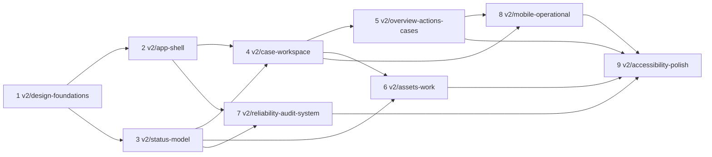

# OPERON V2: Screen specifications & Phase 4 handoff (Phase 3)

Status: Phase 3 specification, **reconciled with the reviewed Phase 3.1 findings** (`09 §22`).
Together with `07` this is the **implementation baseline for Phase 4A**. The Phase 4A scope is frozen
in §11. Documentation only. No application code changed. This document uses the tokens, components
and status grammar in
[`07-product-design-system.md`](07-product-design-system.md) (cited as `07 §n`).

**Conventions:**

| Marker | Meaning |
|---|---|
| **AVAILABLE NOW** | Served by the current backend (endpoint or field named) |
| **X*n*** | A small read-only *projection exposure*: the data exists in the backend but isn't sent where the UI needs it. A fallback is specified. |
| **G*n*** | A backend capability gap. It is never faked; the UI states what is unavailable. |

User-facing **Case** = backend `incident`. Identifiers in examples are seeded demo values
(`core/seed_data.py`).

**Illustrative values.** Numbers, times, counts, hashes, work-order numbers and money amounts in
the ASCII layouts are placeholders that show format and placement only. An implementation renders
only the backend field named for that slot (§1.1). Where no field exists it shows the specified
"not available" state, never a value.

---

## 1. Backend reality

### 1.1 Available now

| Data / action | Source | Notes for design |
|---|---|---|
| Fleet (8 assets) | WS / `GET /api/state` → `fleet[]`: `equipment_id`, `name`, `equipment_class`, `criticality`, `failure_prob` (model risk score), `health_score`, `predicted_mode(_label)`, `torque`, `tool_wear`, `rot_speed`, `temp_diff`, `point`, `status` + `status_source` | `status` may be an **incident override** (`status_source = active_incident`). V2 computes condition from `failure_prob` vs thresholds only (`07 §12.4`). |
| Thresholds | `warn_threshold` (0.45), `trigger_threshold` (0.80) | Chart lines, condition bands |
| Telemetry history | `histories[eid]`: last 90 points per asset (`HISTORY_CAP`) | Scope label "last 90 samples · this run" |
| Plant name | `plant_name` | Line and time zone: X3 |
| Engine state | `running`, `tick`, `authority_path` | Simulation & Demo; freshness (tick cadence) |
| Analysis runtime | `reasoning_provenance` (`backend`, provider/model, `status: available / awaiting_runtime`, `unavailable_reason`), `supervisor_available`, `GET /api/health` | System status indicator; provider-error state |
| Providers | `GET /api/providers`; `POST /api/providers/select`; `PUT /api/providers/{kind}`; `POST /api/providers/{kind}/test`. `ProviderStatus`: `configured`, `reachable`, `model(s)`, `credential` (non-secret status), `capabilities`, `error`, `checked_at`, `detail` | Never returns secrets; secret entry is loopback-only unless trusted |
| Cases (projected) | WS `alerts[]`: **one per asset (latest)** with `incident_id`, `status`, `lifecycle{phase, revision, intervention_id, intervention_hash, requirement_id, authority_valid, authority_reason, outcome_result, last_reason, read_model}`, `proposal{intervention{capability, parameters, window}, governance{conditions, policy_version}}`, `triage_rank / score`, `predicted_mode_label`, `created_tick` | Only the latest case per asset (G5) |
| Case detail | `GET /api/incidents/{id}` → lifecycle projection (incl. `severity`, `requirement{requirement_id, intervention_id, intervention_hash, expires_at, required_roles, conditions, context_revision}` when PENDING) + `read_model` | `read_model`:<br>• `evidence[]` (kind, summary, quality, provenance, source, observed / retrieved at, payload, derived_from);<br>• `hypotheses[]`;<br>• `diagnosis`;<br>• `verdicts[]`;<br>• `intervention` (steps with preconditions and verification criteria, risk, window, `estimated_cost`, `estimated_downtime_minutes`, `estimated_avoided_loss`, `business_assumption_version`);<br>• `binding`;<br>• `requirements`;<br>• `approval_decisions`;<br>• `execution_receipts`;<br>• `observation_plans`;<br>• `outcomes`;<br>• `agent_actions`;<br>• `agent_runs`;<br>• `events[-80:]` |
| Artifact detail | `GET /api/demo/artifacts/{artifact_id}`: any durable artifact of a projected case | Inspector; evidence-request text (X6 fallback) |
| Approve / reject | `POST /api/incidents/{id}/approval` with exact `requirement_id`, `intervention_id`, `intervention_hash`, `context_revision`, `decision`, optional `actor_id`, `actor_role`, `rationale` | **Approve dispatches immediately** (`engine.approve` → `execute`). Reject → ESCALATED. Rationale is recorded today. |
| Explicit dispatch | `POST /api/incidents/{id}/execute` | Re-dispatch of a READY case (e.g. after restart). Never automatic. |
| Explicit verification | `POST /api/incidents/{id}/outcome` | Admin / System only |
| Trusted inputs | `POST …/confirmations/technical`, `…/confirmations/resource`, `…/drafts` | **Disabled unless `OPERON_TRUSTED_SUBMISSIONS=1`**; unauthenticated (G1, G8) |
| PRISM (direct the investigation) | `GET /api/prism`, `/api/prism/metrics`, `POST /api/prism/sessions`, `GET /api/prism/sessions[/{id}]`, `POST …/{id}/messages`, `GET …/{id}/events` | Instruction = revision with acknowledgement; superseded results kept |
| Simulation / demo | `POST /api/start`, `/api/stop`, `/api/reset`, `/api/demo/scenario {equipment_id}`; `demo_scenario` projection (`active`, `label`, `status`, `phase`, `approval_state`, `elapsed_seconds`, `reasoning`, `error`) | System → Simulation & Demo only |
| Excluded on purpose | `business{oee_baseline, oee_target, fleet_projection, downtime_cost_per_hour, recovered_per_event, …}` | Config constants and projections. **Never displayed** (Phase 1 D14). |

### 1.2 Design requires backend work

Gap definitions are quoted from Phase 1 §18 (G1–G10) and Phase 2 §15 (G11–G12) without
redefinition.

| Gap | Definition (needed for / current state) | Designs affected | UI before the gap closes |
|---|---|---|---|
| **G1** | Trusted inspection and resource confirmation from the UI / Endpoints exist, flag-gated, unauthenticated | 6, 20, 21; Diagnosed stage | The form renders only when submissions are enabled (X7). Otherwise: "Inspection submission isn't available in this deployment." |
| **G2** | Resolve escalation (resume / cancel) / No endpoint; CANCELLED unreachable | 12, My actions | States that resolution is unavailable and that the asset can't open a new case |
| **G3** | Retry failed execution / `retry_execution` exists without caller or endpoint | 12 (Dispatch failed) | Shows the failed step and receipts; "Retry isn't available in this version" |
| **G4** | Reject → replan / reinvestigate with reason / REJECT → ESCALATED dead end | 8, 22 | Offers **Reject and escalate** (truthful) with required reason; Request changes not rendered |
| **G5** | Incident history per asset / Only latest incident per asset projected | 4, 14, 16 | "Latest case per asset in this build" |
| **G6** | Human-readable incident reference / UUID only | All case labels | Interim reference: asset tag + opened time ("AC-COMP-01 · 05 Oct 13:02"); UUID in the inspector |
| **G7** | Durable, per-user updates / inbox / Browser-only log | Updates, shell | "This session only" |
| **G8** | Authentication, identity, roles / Caller-declared `actor_id` / `actor_role` | All decisions and inputs; role views | Role is a presentation preference. Actions are recorded with a declared actor and labelled "declared, not verified". |
| **G9** | Long-horizon performance data / Generation-scoped analytics | 16 | Scope label "this engine run" |
| **G10** | Work-order status lifecycle / Written once, never updated | 9, 10, 15 | "Field completion not reported" |
| **G11** | Approval renewal after expiry / Requirement EXPIRED → decisions refused; no caller re-issues; case stuck in AWAITING_APPROVAL | 8, 22, §7 | "Expired: nothing executed; renewal not available yet" |
| **G12** | Ownership & acknowledgement / No human owner or assignee on `incident`; backend `alert.ACKNOWLEDGED` unused | 1–4 | Waiting-on role only; no fake assignee, no acknowledge control |
| **G13** *(new, proposed)* | Structured inspection result: **Pass / Flag / Fail** per check, mechanism *not confirmed / undetermined*, free-text notes. **Roll-up rule** (R-23, MaintainX-style): the inspection result is **Fail** if any check fails; **Flag** if any check is flagged and none fail; otherwise **Pass** / `PerformedCheck.passed` is `Literal[True]`; a confirmation can only *confirm* a mechanism | 21 | Pass-only submission maps exactly to the current contract. Flag / Fail and "not confirmed" are shown, but submission is blocked with the reason and a **Copy result** hand-off. |
| **G14** *(new, proposed; Phase 2 noted "attachments" without a number)* | Evidence attachments (photos) / No attachment store | 21, Evidence | Camera control not rendered; listed as "coming later" in the inspection help text only |

**Projection exposures** (read-only; no new behaviour; each has a fallback):

| ID | Exposure | Fallback in V2 until done |
|---|---|---|
| X1 | `requirement.expires_at` in the WS alert projection | Fetch `GET /api/incidents/{id}` for each case in Awaiting decision (≤ 8) on change of `requirement_id` |
| X2 | `incident.severity` in the WS alert projection | Rows show **asset criticality** labelled as such; case header fetches severity |
| X3 | `assembly_line` and `plant.timezone` in the snapshot | Line shown as "Line" (single, unnamed); times in browser zone with zone abbreviation |
| X4 | Case `opened_at` and `updated_at` in the WS alert | `read_model.incident.created_at` / `updated_at` from the per-case fetch |
| X5 | Global, paginated incident-event journal query (plus system events) | Audit log = journals of projected cases (last 80 events each) + PRISM events + this session's system events, labelled as such |
| X6 | `EvidenceRequest` artifacts in `read_model` | Open requests from `EVIDENCE_REQUESTED` events; text via `GET /api/demo/artifacts/{request_id}` |
| X7 | Capability flags in `/api/health` (trusted submissions enabled) | Inspection and resource forms shown as unavailable until a submit attempt proves otherwise (not acceptable long-term) |
| X8 *(new, found in reconciliation)* | **Server wall-clock timestamp** on tick / snapshot messages and history points, plus the configured tick interval. Today messages carry only `tick` and `plant_time_min` (simulated plant minutes); history points carry tick index `t`; `POC_TICK_SECONDS` isn't exposed. | Freshness from message **receipt** time and tick continuity; expected interval measured from arrivals; telemetry axes in samples / ticks, never invented clock times (`07 §15.1`, `§16`) |

---

## 2. Routes

| V2 route | Screen | Replaces (redirect) |
|---|---|---|
| `/login` | Sign-in (HYBRID; unchanged in scope) | — |
| `/app/overview` | Overview (1, 2) | `/app/dashboard` |
| `/app/actions` | My actions (3, 20) | `/app/notifications` (tasks part) |
| `/app/cases` | Cases (4) | `/app/incidents` |
| `/app/cases/:incidentId` (`#summary #evidence #investigation #decision #work #record`) | Case workspace (5–12) | `/app/incidents/:id`; `/app/agent?incident=…` → `#investigation` |
| `/app/cases/:incidentId/inspect` | Technician inspection (21), focused task view | — |
| `/app/cases/:incidentId/decide` | Focused decision (22; also desktop "focus mode") | — |
| `/app/assets`, `/app/assets/:equipmentId?view=condition\|telemetry\|cases\|work` | Assets (13, 14) | `/app/machines…`; `/app/agent?machine=…` → asset |
| `/app/work-orders` | Work orders (15) | `/app/maintenance` |
| `/app/reliability` | Reliability (16) | `/app/analytics` |
| `/app/audit` | Audit log (17) | `/app/activity` |
| `/app/system/{analysis,data,policies,integrations,simulation,about}` | System (18, 19) | Admin half of `/app/settings`; Engine menu; `/app/agent` (no params) → `analysis` |
| `/app/updates` | Updates | `/app/notifications` |
| `/app/preferences` | Preferences (appearance, density, role, account) | `/app/profile`, personal half of `/app/settings` |

**Query and hash conventions:**
- `?preview=<incidentId>` on list pages opens the preview; `#artifact=<id>` opens the artifact
  inspector (existing convention kept).
- Filters live in the query string (`07 §22`).

---

## 3. App shell

### 3.1 Navigation hierarchy

| Group | Item | Prominence |
|---|---|---|
| **Operate** (primary) | Overview | Primary |
| | **My actions** | Primary. The only nav item with a count. Count = Action-required items for the chosen role. |
| | Cases | Primary |
| | Assets | Primary |
| | Work orders | Primary |
| **Review** (secondary) | Reliability | Secondary: smaller group, `text.secondary` |
| | Audit log | Secondary |
| **Footer of rail** | System | Separated by a rule; administrator area |
| **Account menu** (header) | Updates · Preferences · Sign out | Personal |

Primary items use `type.nav`. The Review group sits under an 11 px eyebrow and is visually lighter.
System sits at the rail foot, never among operational items.

### 3.2 Desktop (≥ 1024)

```text
┌──────────────────────────────────────────────────────────────────────────────────────┐
│ ▢ Operon  │ Demo Manufacturing Plant 01 ▾ │                 ● Live 14:32:05 · Analysis: │
│           │                               │                 deterministic  │ ⓘ 3 │ JD ▾│
├───────────┼──────────────────────────────────────────────────────────────────────────┤
│ OPERATE   │                                                                          │
│ ▣ Overview│   (sheet)                                                                │
│ ☑ My act.3│                                                                          │
│ ▤ Cases   │                                                                          │
│ ▦ Assets  │                                                                          │
│ ⚒ Work ord│                                                                          │
│ REVIEW    │                                                                          │
│ ⟋ Reliab. │                                                                          │
│ ⟲ Audit   │                                                                          │
│ ───────── │                                                                          │
│ ⚙ System  │                                                                          │
└───────────┴──────────────────────────────────────────────────────────────────────────┘
```

**Header (48 px, `surface.base`), left to right:**

| Element | Content |
|---|---|
| Name | Ink placeholder square plus the working-name text (`07 §1.4`) |
| Plant context | Plant name (single plant: a static label, not a switcher; the ▾ appears only when multi-plant exists) |
| System status indicator | One element:<br>• stream state: Live / Stale / Disconnected, with the time;<br>• analysis: Live model `<provider · model>` / Deterministic / Unavailable;<br>• in Demo mode, a `DEMO` hatched tag.<br>Click opens a popover with details and links to System. |
| Updates | Icon with an unread count (session only, G7). Secondary to My actions. |
| Account menu | Declared name and role; Preferences; Theme quick toggle; Sign out |

**Not in the header:** Engine menu, Guided Demo, simulator controls, HITL badge, provider chip
(all moved to System). There is no global search (`07 §22`).

**Page actions:** in the page title row (right side), at most one primary and two secondary.

**Breadcrumbs:** on object pages (case, asset) above the title.

### 3.3 Tablet (768–1023)

- The rail collapses to 56 px icons with tooltips; group headers become hairline separators.
- The header keeps the status indicator in compact form ("● Live · Det.").
- The preview and inspector open as a **modal drawer** (420 px, scrim, focus trapped; §4).

### 3.4 Phone (< 768)

```text
┌──────────────────────────────┐
│ ‹  AC-COMP-01        ● Live │  top bar 56: back / title / status dot+word
├──────────────────────────────┤
│                              │
│   task content               │
│                              │
├──────────────────────────────┤
│ ☑ My actions  ▤ Cases  ▦ Assets  ≡ More │  bottom bar 56 + safe area
└──────────────────────────────┘
```

- **More:** Work orders, Reliability (read), Audit (read), System (status only), Updates,
  Preferences.
- **Disconnected or offline:** a full-width banner under the top bar.
- **Demo mode:** hatched `DEMO` strip under the top bar.

---

## 4. Queue → preview → workspace (reusable pattern)

| Aspect | Specification |
|---|---|
| ≥ 1280 (CH-2, *Phase 4A prototype hypothesis*) | Selecting a row (click / `Enter`) opens the **preview docked** right (about 380 px; the queue keeps ≥ 900 px at 1280). The queue keeps its scroll position and selection (2 px ink bar), stays fully interactive and is never covered. The preview has an explicit **Close** control and `role="complementary"`; focus enters it only on `Tab`. |
| 768–1279 | The preview opens as a **modal drawer** (420 px, scrim, focus moves to the drawer heading and is trapped; `Esc`, Close and Back close it and return focus to the originating row). The queue behind is inert. |
| Never | An "overlay but not modal, no scrim, queue still interactive" state. Every preview is either docked (non-modal) or modal. |
| Preview content (case) | Title block (compact: asset, condition, stage, waiting on, deadline) · next-step sentence · the 3 most recent evidence items · leading hypothesis or diagnosis · plan summary when present · record (last 5 events) · **Open case** (primary) and **Go to decision** (when awaiting decision) |
| Never in preview | The decision controls (`07 §20`; one approval surface) |
| Keyboard | Docked: `↑` / `↓` (aliases `J` / `K`) change the previewed item while the preview stays open · `Shift+Enter` or `O` opens the workspace · `Esc` closes the preview and returns focus to the row. Modal drawer: focus trapped; `Esc` closes and returns focus to the row. |
| URL | `?preview=<id>`: reload restores it; Back closes it before leaving the page |
| Transition to workspace | Navigates to `/app/cases/<id>`; the queue position is restored on Back (scroll and selection stored in history state) |
| Phone | One pane at a time: tap opens the workspace directly (no preview); Back returns to the list at the same position |
| Artifact inspector | Same panel slot and the same docked / modal rule; opened by any artifact link (`#artifact=<id>`); shows full record, provenance (expanded), identifiers (copy) and JSON payload (collapsed, mono). Model self-reported `confidence` fields are **omitted** from the payload view (`07 §18.6`). Also hosts the **full record** and **"View all" evidence** (R-12, R-13) with filters. |
| Prototype test (Phase 4A, §11) | At 1024, 1280 and 1440: focus order, screen-reader reading order, selected-row occlusion (must be none), `Esc` and Back behaviour |

---

## 5. Screen specifications

Each screen lists:
- **Purpose** and **primary user**;
- **Hierarchy:** what is read first, second and third;
- **Regions** (ASCII);
- **Controls**;
- **States**;
- **Responsive** behaviour;
- **Data** (sources from §1);
- **Gaps**;
- **Emphasis:** where visual weight goes.

### Screen 1: Overview, nominal

| | |
|---|---|
| Purpose | Answer "does anything need a person, and is the plant normal?" in one glance at shift start |
| Primary user | Operations / plant supervisor; everyone's landing when no role default applies |
| Hierarchy | 1. Requires-attention statement · 2. Plant condition band · 3. Active cases (none) · 4. Watch · 5. Work in progress · 6. Recent outcomes |

```text
┌ OVERVIEW │ PLANT Demo Manufacturing Plant 01 │ ASSETS 8 of 8 reporting │ DATA ● Live 14:32:05 │ ANALYSIS Deterministic ┐
├ PLANT CONDITION ────────────────────────────────────────────────────────────────────────────────────────────┤
│ Line  ○ AC-COMP-01  ○ CNC-MILL-07  ○ HYD-PUMP-03  ○ COOL-PMP-09  ○ WELD-ROB-05  ○ CONV-02  ○ GRIND-04  ○ PRESS-08 │
├──────────────────────────────────────────────── 8 col ─────────────┬──────────────── 4 col ──────────────────┤
│ 01  Requires attention                                     0      │ 03  Watch                          0     │
│     No case needs a person right now.                             │     No asset is in the warning band.     │
│     All 8 assets below the warning band (0.45) · last reading     │ 04  Work in progress               0     │
│     14:32:05 · analysis available (deterministic).                │     No committed work orders.            │
│ 02  Active cases                                           0      │ 05  Recent outcomes · this run           │
│     No open cases.                                                │     Verified 1 · Not recovered 0 ·       │
│                                                                   │     Regressed 0   (latest per asset, G5) │
└───────────────────────────────────────────────────────────────────┴──────────────────────────────────────────┘
```

| | |
|---|---|
| Controls | Asset cells link to the asset · section headings link to their full pages · no page actions |
| States | Nominal (above) · loading (static skeleton of band plus "Waiting for plant data…") · no data (screen 23) · provider unavailable (screen 24) |
| Responsive | Tablet: one column; band wraps into two rows. Phone: "Requires attention" statement plus band as a compact list (abnormal first, then "6 normal" collapsed); other regions behind "More detail". |
| Data | `fleet[].failure_prob`, thresholds, `histories` (last reading time), `alerts[]`, `reasoning_provenance`, outcome results from `alerts[].lifecycle.outcome_result` |
| Gaps | G5 (outcome counts are latest-per-asset), X3 (line name) |
| Emphasis | **Calm, not empty.** The attention statement is the largest text (`type.heading`); its supporting facts prove the calm (counts, last reading, analysis state). Band cells are `text.secondary` with hollow dots. No hue anywhere. |

### Screen 2: Overview, active problem

Same regions. Example state: AC-COMP-01 critical with a case awaiting decision; HYD-PUMP-03
elevated without a case; one case verifying.

```text
├ PLANT CONDITION ─────────────────────────────────────────────────────────────────────────────┤
│ Line  ⬣ AC-COMP-01 Critical 0.86   ▲ HYD-PUMP-03 Elevated 0.52   ○ CNC-MILL-07 ○ COOL-PMP-09 … │
├──────────────────────────────────────────────────────┬───────────────────────────────────────┤
│ 01  Requires attention                     2         │ 03  Watch                        2    │
│  ACTION REQUIRED                                     │  □ ▲ HYD-PUMP-03 Elevated 0.52 since  │
│  ■ Approve work package · AC-COMP-01                 │      13:58 · no case (below gate)     │
│    Risk score 0.86 ≥ gate 0.80 · bearing wear        │  □ ◇ GRIND-04 · Verifying since 12:05 │
│    confirmed · Waiting on Approver · by 15:12 (2h41) │ 04  Work in progress             1    │
│  AT RISK                                             │  WO-1043 · GRIND-04 · committed 12:05 │
│  ◧ ⬣ CNC-MILL-07 · Investigating (automated) · 14:02│      · field completion not reported   │
│ 02  Active cases                           3         │ 05  Recent outcomes · this run        │
│  [compact case table: attention · asset · stage ·    │                                       │
│   waiting on · criticality · deadline · updated]     │                                       │
└──────────────────────────────────────────────────────┴───────────────────────────────────────┘
```

| | |
|---|---|
| Controls | Attention items open the preview (desktop) or the case section (phone). "Go to decision" on approval items. No inline approve. |
| States | Burst grouping is **not used here today**: at most one case per asset is projected (G5). Grouping, if ever used, follows the safe rule in `07 §12.5` (presentation-only, always expandable, never hides an item). Mixed staleness is stated, e.g. "7 of 8 assets current · CNC-MILL-07 stale since 14:18" (R-18). |
| Responsive | Phone: Action required and At risk only, then "3 active cases"; band as a list with abnormal first |
| Data | As screen 1, plus `alerts[].lifecycle.phase`; expiry via X1 or fallback fetch |
| Gaps | X1, X2, G12 (no owner shown) |
| Emphasis | Hue only on the critical octagon, the elevated triangle and the violet person glyph on the approval item. Attention items use weight and position. Abnormal band cells grow to show name and value; normal cells stay quiet. **No layout shift:** regions keep their positions between nominal and active states. |

### Screen 3: My actions

| | |
|---|---|
| Purpose | The personal work queue: what is waiting on me (my role), in order, with a direct route to act |
| Primary user | Approver, technician, reliability engineer |
| Hierarchy | 1. Items requiring my role · 2. Their deadline and required response · 3. Items waiting on other roles (collapsed) |

```text
┌ MY ACTIONS │ ROLE Maintenance approver (declared · G8) │ REQUIRES YOU 2 │ OTHER ROLES 1 │ DATA ● Live ┐
│ Filter: [Response: all ▾] [Asset: all ▾]  [Mine | All]                        Clear filters      │
├────────────────────────────────────────────────────────────────────┬─────────────────────────────┤
│ REQUIRES YOU (APPROVER) · 2                                        │ (preview, §4)               │
│ ■ ◈ Approve work package                        by 15:12 · 2 h 41  │                             │
│     AC-COMP-01 · Instrument Air Compressor 01 · Awaiting decision   │                             │
│     Replace drive-end bearing · risk 0.86 · critic accepted         │                             │
│ ■ ◈ Resolve dispatch failure                         since 13:40   │                             │
│     PRESS-08 · Dispatch failed · retry not available (G3)          │                             │
│ WAITING ON OTHER ROLES · 1                                     ▸   │                             │
└────────────────────────────────────────────────────────────────────┴─────────────────────────────┘
```

| | |
|---|---|
| Item anatomy | Line 1: response glyph (person-square, ≥ 14 px), **verb + object** (`type.subheading`), deadline (right). Line 2: asset tag, name, stage word. Line 3 (`text.secondary`): one-line reason from backend facts. The attention glyph is omitted because the group header carries attention (R-14). |
| Grouping | **"Requires you (role)"** then **"Waiting on other roles"** (collapsed by role, expandable). **Group headers name the reason** (R-21), e.g. "Requires you · Maintenance approver: approvals and dispatch failures". Other-role rows are read-only: **no verb buttons**. *Now / Soon / Waiting* is **not** used: only approvals carry a real deadline, and "what I'm waiting on" requires knowing what *I* did (G8). No read / unread state (G7). |
| Sorting | Attention level → deadline ascending (only `expires_at` or window start) → severity (or criticality) → age |
| Response types (today) | Approve work package (Awaiting decision) · Inspect asset (Awaiting inspection; G1) · Confirm resources (Diagnosed; G1) · Resolve escalation (Escalated; G2) · Resolve dispatch failure (Dispatch failed; G3) · Approval expired (G11) |
| Quick actions | "Go to decision", "Start inspection" (task route), "Open case". **No inline approve or reject.** Items whose resolution is unavailable show the reason in line 3. |
| Filters | Response type, asset, Mine / All |
| Empty states | *Clear:* "Nothing is waiting on Maintenance approver. 2 cases are in automated stages; 0 waiting on other roles." · *Filtered:* "No items match Response: Inspect. Clear filters." |
| Responsive | Phone: two-line items at touch density. Tap opens the focused task route (`/inspect`, `/decide`) or the case. Deadline stays on line 1. |
| Data | `alerts[]` phases, X1 / X6 fallbacks |
| Gaps | G1, G2, G3, G8, G11, G12 |
| Emphasis | Verb + object is the strongest text. The deadline is the only right-aligned element, in `text.primary`; within 60 min it gains the warning glyph. |

### Screen 4: Cases

| | |
|---|---|
| Purpose | Compare and triage all cases; find a case by asset |
| Primary user | Reliability engineer, supervisor |

```text
┌ CASES │ ACTIVE 3 │ EXCEPTIONS 1 │ RESOLVED 1 │ SCOPE Latest case per asset (G5) │ DATA ● Live ┐
│ [Active | Exceptions | Resolved | All]  Search asset…  [Stage ▾] [Waiting on ▾]   Clear  │
├────┬──────────────────────────────┬────────────┬───────────────────┬──────────────┬───────┬──────────┬────────┤
│    │ Case                         │ Condition  │ Stage             │ Waiting on   │ Crit. │ Deadline │ Updated│
├────┼──────────────────────────────┼────────────┼───────────────────┼──────────────┼───────┼──────────┼────────┤
│ ■  │ AC-COMP-01 · 05 Oct 13:02    │ ⬣ Critical │ Awaiting decision │ ◈ Approver   │ High  │ 15:12    │ 14:31  │
│    │ Instrument Air Compressor 01 │   0.86     │   5/8             │              │       │          │        │
│ ◧  │ CNC-MILL-07 · 05 Oct 14:01   │ ⬣ Critical │Investigating · 2/8│ ⚙ Analysis   │ High  │ None     │ 14:02  │
│ □  │ GRIND-04 · 05 Oct 11:40      │ ○ Normal   │ Verifying · 7/8   │ ⚙ Verificat. │ Med.  │ No deadline │ 14:30│
└────┴──────────────────────────────┴────────────┴───────────────────┴──────────────┴───────┴──────────┴────────┘
```

| | |
|---|---|
| Columns | Attention (slot A) · Case (interim ref G6, asset name) · Condition (now) · Stage (word + n/8) · Waiting on · Severity, or **"Asset criticality" until X2** · Deadline · Updated (X4). Optional at ≥ 1920: Failure mode (predicted / diagnosed), Revision. |
| Sort | Default: attention → deadline → severity → updated. All columns sortable. |
| Filters | Status segment, stage, waiting on, asset search |
| Status sets | **Active:** Detected through Verifying · **Exceptions:** Escalated, Dispatch failed · **Resolved:** Closed (Cancelled when reachable) · **All** |
| Today vs after G5 | **Today:** at most one case per asset (the latest), so ≤ 8 rows. The scope label says so, and Resolved shows only cases still projected. **After G5:** full history, server-side filter and sort, cursor pagination (50 / page), and virtualised rows beyond 200. The scope label and a "Load older" control appear. |
| Empty states | Active-empty: "No open cases. All assets are below the action gate." (plus link to Overview) · Filtered-empty names the filters |
| Responsive | Tablet: drop Updated and Severity. Phone: two-line rows (asset + stage / waiting on + deadline). |
| Emphasis | Ink table with hairline rows. Hue only in the condition and waiting-on glyphs. The selected row has a 2 px ink bar. |

### Case workspace template (screens 5–12)

```text
┌ Cases / AC-COMP-01 · 05 Oct 13:02                                              ● Live 14:32:05 ┐
│ Failure risk above action gate · Instrument Air Compressor 01                 [ Next-step CTA ]│
│ ASSET CONDITION ⬣ Critical 0.86 │ SEVERITY ▮▮▮▯ High │ STAGE Awaiting decision · 5/8 │          │
│ WAITING ON ◈ Approver │ DEADLINE 15:12 · in 2 h 41 │ REVISION R33      (≤ 6 cells, R-6)       │
│ ▣──▣──■──□──┃──□──□──□   (stage track, caption: what happens next)                             │
├ index ─────┬ document ───────────────────────────────────────────────┬ context rail ───────────┤
│ 01 Summary │ 01 Summary & next step                                  │ ▌Next step (tint + ink  │
│ 02 Evidence│  What happened · Current finding · Recommended action · │ ▌left rule, not framed) │
│  7 · 1 req │  Done so far (milestone list with times)                │ ▌verb · owner · by      │
│ 03 Invest. │ 02 Evidence  (open requests first, then table, chart)   │ ▌[action]               │
│ 04 Plan &  │ 03 Investigation                                        │ Asset condition +      │
│  decision  │ 04 Plan & decision                                      │  risk mini-chart       │
│ 05 Work &  │ 05 Work & verification                                  │ Open requests          │
│  verif.    │ 06 Record                                               │                        │
│ 06 Record  │  (section headings sentence case; index numbers mono)   │ Identifiers: case ref,  │
│            │                                                         │ UUID, run, hash (copy)  │
└────────────┴─────────────────────────────────────────────────────────┴─────────────────────────┘
```

| Rule | Specification |
|---|---|
| Header | Sticky. On scroll it condenses to one 48 px line (title · stage · waiting on · deadline · CTA). |
| CTA | The single next-step button: "Go to decision", "Open inspection task", or none (when waiting on the system). Never "Approve". **It is primary only while the decision surface is not on screen; whenever the decision surface is visible, the header CTA and the next-step action are secondary** (one primary per view, R-5). |
| Title block | At most six cells, in this order: Asset condition · Severity (or Asset criticality until X2) · Stage · Waiting on · Deadline · Revision. Inapplicable cells are dropped. The case reference, analysis run and incident UUID live in the context rail's Identifiers (R-6). |
| Sections | One scrollable document, not tabs. Index highlights the section in view. Not-yet-reached sections render one line: "Not started · begins after diagnosis." No empty boxes. |
| Section order | Fixed. Evidence precedes Investigation, which precedes Plan & decision (`07 §2`). |
| Context rail (≥ 1280) | Next-step block (**tint plus 2 px ink left rule, not framed**; R-11) · asset condition with a 0–1 risk mini-chart and thresholds · open evidence requests · **Identifiers** (case reference, incident UUID, analysis run, revision, hash prefix: copy buttons, middle-truncated). The rail is separated by tint and a hairline, not a frame. Below 1280 the rail content appears at the top of Summary. |
| Evidence and record length | Evidence shows up to 10 rows inline, then "View all n" opens the full filterable list in the inspector (R-13). The Record shows a curated inline record (about 10 authoritative entries) plus "Open full record" in the inspector (R-12, §8). |
| Phone | Top bar (asset tag) → summary block (what's wrong, stage n/8, waiting on, deadline) → next-step block → accordion sections (one open) → record (last 10). |
| Data | WS alert for the header (immediate); `GET /api/incidents/{id}` for sections (partial-loading pattern, `07 §15`) |
| Emphasis | Title (`type.title`), then title block, then next-step block. The document body is quiet ink. Hue appears only in condition, the waiting-on glyph (and role word), and verification. The decision surface rule is ink. |

### Screen 5: Case, early investigation

| | |
|---|---|
| State | Stage Investigating (or Detected for the first seconds). Waiting on Analysis (automated). |
| Summary | **What happened:** "Model risk score above action gate. 0.86 at 14:30 (gate 0.80); likely failure mode: power failure (model output)."<br>**Current finding:** "Not yet established. Investigation revision 1 in progress."<br>**Done so far:** Detected 14:30 · Baseline evidence collected 14:30 (6 items). |
| Next-step block | "Nothing required from you. Waiting on analysis (automated) since 14:31." No CTA. |
| Evidence | Baseline items: model signal (Model-generated mark), telemetry (Measured), maintenance history, asset relation, operational context. Quality and observed-at per row. Risk chart with detection event. |
| Investigation | **Run header** (one line): "Diagnosis review · run 3 · started 14:31 · deterministic advisory (no live model)" or "provider · model".<br>**Progress:** discrete steps from `agent_actions` ("Diagnostic review complete · Critic review pending"). No spinner, no streaming text.<br>**Hypotheses** appear as they are recorded.<br>**Direct the investigation** composer (PRISM) is available. |
| Plan, Work | "Not started" lines |
| Data / gaps | `read_model.evidence`, `agent_actions`, `agent_runs`, PRISM session. No gaps for viewing. |
| Emphasis | Investigation section expanded and flagged in the index ("in progress"); everything else quiet |

**Investigation section (applies to 5–8):**

```text
03 Investigation                                    Revision 3 · deterministic advisory · 14:31
   Hypotheses
   ● Supported    Bearing wear (drive end) · PWF   supports 3  contradicts 0   basis: torque deviation…
   ○ Open         Tool wear limit                  supports 1  contradicts 1   basis: …
   ⊘ Refuted      Cooling failure · HDF            supports 0  contradicts 2   kept in record
   Diagnosis      Accepted by application promotion 14:36 · "Bearing wear" · cites 4 evidence
   Reviews        DX Diagnostic  — accepted · "Mechanism consistent with torque rise"      run 3
                  CRT Critic     — challenge: "Inspection needed to exclude tool wear"   run 3
   Requests       Inspection of drive-end bearing · open since 14:33 (technician)
   Direct the investigation  [ instruction text …                         ] [Send instruction]
                  R3 current · R2 superseded (kept)
```

| Element | Rule |
|---|---|
| Hypothesis outcome vocabulary | **Supported** (filled dot) · **Refuted** (slashed circle; row stays, `text.secondary`) · **Unresolved / inconclusive** (dashed circle) · **Open** (hollow) |
| What hypotheses show | Each shows supporting / contradicting counts linking to evidence rows, the basis text (`confidence_basis`) and falsification tests (expand). **No model self-reported confidence value anywhere**: not in rows, not in the inspector (product-owner correction A, `07 §18.6`). |
| Advisory vs authoritative | Hypotheses and reviews carry the dashed advisory rule. The **Diagnosis** row carries the solid authoritative rule and states that the *application* accepted it. |
| Reviews | Rows with role abbreviation (DX, ENG, OPS, CRT, PLN), verdict, one finding, run link. Raw outputs and delegation trees are in the inspector only. **No chain-of-thought text.** |
| Run completion | Run completion other than MODEL_COMPLETED is stated plainly: "Run stopped: limit reached / timed out / model failed / invalid output". |
| Direct the investigation | A revision instruction box, not a chat:<br>• after sending, it shows "Instruction R4 acknowledged 14:40 · analysis restarted on R4";<br>• superseded runs are listed collapsed;<br>• no avatars, typing indicators or conversational bubbles. |

### Screen 6: Case, awaiting technician evidence

| | |
|---|---|
| State | Stage Awaiting inspection (loop under Investigating). Waiting on **Technician**. Attention: Action required. |
| Summary | **Current finding:** "Leading hypothesis: bearing wear (supported by 3, contradicted by 0). Physical confirmation required before diagnosis."<br>**Next step:** "Technician inspection: check drive-end bearing temperature and play." |
| Next-step block | Verb "Inspect AC-COMP-01", owner Technician, requested 14:33. CTA "Open inspection task" → `/inspect`. **If submissions are disabled (X7 / G1):** CTA replaced by "Inspection submission isn't available in this deployment. The case stays here until an inspection is recorded." |
| Evidence | The open request is pinned at the top of Evidence with a 2 px ink left rule (not a frame): question, capability, requested by (role), since. |
| Data / gaps | Requests via X6 fallback; G1, G8, G13 |
| Emphasis | Violet person glyph (and role word) in Waiting on and the next-step block; nothing else coloured |

### Screen 7: Case, recommendation ready

| | |
|---|---|
| State | Stage Diagnosed → Planning (reviews of the exact draft in progress or complete). Waiting on Approver (resources, G1) or Analysis. |
| Summary | Recommendation block (below), plus "Decision opens when governance completes." |

```text
04 Plan & decision
   Finding        Bearing wear, drive end (diagnosis accepted 14:36 · 4 evidence)
   Consequence    Risk score 0.86 above gate; continued operation risks unplanned stop (model output)
   Recommended    Replace drive-end bearing · PRT-BRG × 1 · TECH-201 · window 13:12–15:12 · 50 min downtime
   Basis          torque deviation since 02:10 (Measured) · inspection confirmed wear (Human-entered)
   Steps          1 Create work package  2 Notify technician  3 Verify recovery   (preconditions, criteria ▸)
   Estimates      Cost $1,840 · avoided loss $101,150  — estimates · assumption set v3 (Model-generated)
   Reviews        ENG feasible · OPS resources available · CRT accepted · PLN reversible, not safety-relevant
   Revision       Plan R2 (supersedes R1 · changes: window moved +2 h)
```

| | |
|---|---|
| Rules | Finding and recommended action are separate labelled rows. Estimates appear only here and in the decision surface, always labelled "estimate" with the assumption version, never aggregated or shown as a headline. Revision differences are listed when a plan supersedes another. |
| Data | `intervention`, `binding`, `verdicts`, `agent_runs` (INTERVENTION_REVIEW), `diagnosis` |
| Gaps | G1 (resource confirmation) |
| Emphasis | Recommendation block at `type.body` weight with a sentence-case label column (`type.label`, R-7). No colour. |

### Screen 8: Case, awaiting approval (the decision surface)

**The only authoritative approval surface** (desktop; phone in screen 22).

```text
┌━━ ◈ Decision required ━━━━━━━━━━━━━━━━━━━━━━━━━━━━━━━━━━━━━━━━━━━━━━━ by 15:12 · in 2 h 41 min ┐  ← 2 px INK rule
│ Approve the exact work package for AC-COMP-01 · Instrument Air Compressor 01                       │
│                                                                                                    │
│ What will happen if you approve (immediately)                                                     │
│   • Creates work order (local CMMS adapter) · reserves PRT-BRG × 1 · books TECH-201 13:12–15:12  │
│   • Records a technician notification (delivery not tracked)                                       │
│   • Starts post-work verification against the outcome policy (operon-outcome-1)                    │
│   Cannot be undone from this application: the dispatched work order and reservations.             │
│ If not approved      The requirement expires at 15:12; nothing is dispatched. Risk score is 0.86. │
│ Why                  Diagnosis: bearing wear (accepted 14:36) · 4 evidence · critic: accepted      │
│ Reviews              ENG feasible · OPS available · PLN reversible, not safety-relevant           │
│ Contradicting        1 evidence item contradicts the diagnosis ▸   (acknowledgement required)     │
│ Conditions           Exact human approval of this promoted work package is required.             │
│ Estimates            Cost $1,840 · downtime 50 min · avoided loss $101,150 (estimates · v3)       │
│ Bound to             requirement 7f2c…e01 · intervention 3b9a…77d · hash a046ef…39ab · R33        │
│                      Any change to the case or plan voids this approval.                          │
│ Decider              Required role: maintenance approver · recorded as: J. Doe, approver          │
│                      (declared, not verified: G8)                                                  │
│                                                                                                    │
│ ☐ I have reviewed the contradicting evidence (1 item)                                             │
│ Rationale  [ optional for approval · required for rejection                              ]        │
│                                                                                                    │
│ Binding  a046ef · R33                                                                              │
│ [ Approve and dispatch ]   [ Reject and escalate… ]                                               │
│ Request changes isn't available in this version (G4). Rejecting escalates this case; automated   │
│ progress stops until an engineer resolves it, which isn't available yet (G2).                    │
└────────────────────────────────────────────────────────────────────────────────────────────────────┘
```

| Element | Rule |
|---|---|
| Container | Framed (`radius.sm`), `surface.raised`, **2 px Ink top rule** (CH-1: never violet). The heading carries the violet person glyph only. Full document width inside section 04. Never in a modal or drawer. Keys are sentence case (R-7). It is the only framed object in its viewport region. |
| Order | Action → what will happen → if not approved → why → reviews → contradicting evidence → conditions → estimates → bound identifiers → decider → acknowledgement → rationale → controls. Phase 2 §7 elements 1–13 are all present (13, the execution re-check, appears after approval as the dispatch result). |
| Forcing function | The acknowledgement checkbox appears **only** when contradicting evidence or unresolved critic challenges exist. Until it is checked, Approve is **inactive** (focusable, `aria-disabled`, reason linked; activating it moves focus to the checkbox; R-3). |
| Binding token (R-10) | A short token ("Binding a046ef · R33") sits **directly above the controls** so the decider sees exactly what the click binds to. |
| Changed since opened (R-10) | If the case revision or plan changes while the surface is open, a notice replaces the controls' area before submission: "Changed since you opened this (R33 → R34): {what changed}. Review before deciding." It shows the new binding. Approve stays inactive until the decider acknowledges the change. |
| Controls | **Approve and dispatch:** primary ink button (the only primary in view); no keyboard shortcut; label never shortened.<br>**Reject and escalate…:** `danger` style via the `action.danger` token (provisional while G2 / G4 are open; R-24). Opens an inline expansion (not a modal) requiring a reason (≥ 10 characters; a shorter reason gets a **warning**, an empty one an error; R-16) and restating the consequence, with **Confirm rejection** / Cancel.<br>**Request changes:** not rendered (G4); a text line states it.<br>While submitting, the pressed control is **busy** (never `disabled`). |
| After Approve | The surface is replaced by the recorded decision ("Approved by J. Doe at 14:52 · dispatching…") and then the receipt state (screen 9). Refusals (stale revision, expired, mismatch) show the backend's refusal message inline and reload the bound identifiers. |
| Deadline | §7 |
| Connection | Disconnected → controls **inactive** with the reason "Reconnect to make decisions"; activating them moves focus to the connection banner (R-3) |
| Data | `requirement` (X1), `intervention`, `binding`, `verdicts`, `evidence` (contradicting via `hypotheses[].contradicting_evidence_ids`), `approval_decisions` |
| Gaps | G4, G8, G11; G2 for post-reject handling |
| Emphasis | The heaviest region in the product: the ink rule, the Decision required heading and its violet person glyph. Inside it, ink text and no colour except the deadline glyph when near. Approve has no colour. |

### Screen 9: Case, approved / work scheduled

| | |
|---|---|
| State | Stage In work (READY → EXECUTING; seconds), then Work order committed while verification begins. Waiting on Dispatch (system), then Verification (system). |

```text
05 Work & verification
   Decision       Approved by J. Doe (declared) at 14:52 · hash a046ef…39ab · R33              ▸ record
   Dispatch       ◐ Dispatching (claim 14:52:03) → ▤ Work order committed 14:52:05
   Work order     WO-1043 · TECH-201 · window 13:12–15:12 · PRT-BRG × 1 reserved · labour booked
                  Technician notification recorded (delivery not tracked)
   Field status   Not reported to this system (G10)
   Verification   ◇ Observing since 14:52:06 · needs last 3 < 0.45 (operon-outcome-1)
```

| | |
|---|---|
| Rules | Work-order committed uses the document-check glyph in neutral ink, **never green**. Window shown as scheduled. If the window start is in the future, verification still begins (backend behaviour); the line reads "Observing since 14:52 (begins at dispatch confirmation; field completion not reported)". |
| Data | `execution_receipts`, `binding`, `observation_plans` |
| Gaps | G10 |
| Emphasis | Neutral. The progression is visible as steps, not motion. |

### Screen 10: Case, work dispatched / verification pending

| | |
|---|---|
| State | Stage Verifying. Inconclusive so far. |
| Content | Verification panel: observation start (`ObservationPlan.observation_start`, a real timestamp), policy requirement, current risk score, chart (risk trajectory with baseline and thresholds; post-start samples as markers **only when they can be placed truthfully**). "Inconclusive so far" with the watch (outline diamond) glyph. **No "n samples observed" count** until X8: history points carry tick indices, not timestamps, so samples can't yet be reliably placed after `observation_start`. Until then the panel says "Observing since 14:52:06" and shows the outcome when the backend records it. |
| Next-step block | "Nothing required. Verification (system) continues; a case returns to investigation if recovery isn't observed." |
| Gaps | G10 (field completion), G9 (history beyond 90 samples), X8 (timestamped samples for a post-start count) |
| Emphasis | The chart is the focal element: series focus, thresholds labelled, nothing else coloured |

### Screen 11: Case, verified recovery

| | |
|---|---|
| State | Stage Closed, verification Verified recovery (green check-circle; **the only green**). If `outcome.basis = SIMULATED`: "Verified recovery (simulated)" with a hatched backing and `SIMULATED` tag. |
| Content | **Outcome block:** result, verified at, policy, checks (each true / false), before → after metrics (`before_metrics`, `after_metrics`), observation window, lesson, `diagnosis_confirmed`.<br>Estimated avoided loss appears only as "estimate · assumption set" and is never summed elsewhere.<br>The full record follows. |
| Next-step block | "Closed. No further action." Link "Open asset history" (G5 note). |
| Emphasis | Verified line plus the before / after readouts (`type.readout`). Calm. |

### Screen 12: Case, escalated / exception

Two variants share the layout.

| | Escalated | Dispatch failed |
|---|---|---|
| Header | Stage ⚠ Escalated (dashed node below the track at the originating stage) · Waiting on **Reliability engineer** · Attention: Action required | Stage ⚠ Dispatch failed · Waiting on **Approver** · Action required |
| Cause | From `INCIDENT_ESCALATED` / `last_reason`: rejected (with rationale), analysis run failed or stopped, gate failed, or regressed after work | Receipt FAILED / UNKNOWN or stale claim; the CMMS adapter message |
| What remains true | Evidence, diagnosis and plan state; no work dispatched (or the receipts that exist) | Claims and receipts, with "nothing dispatched" or "dispatch state unknown" stated exactly |
| Blocked | "This asset can't open a new case until this case is resolved." | Same, while active |
| Resolution | "Resume investigation / Cancel: not available in this version (G2)." | "Retry / Reinvestigate / Cancel: not available in this version (G3)." |
| Interim guidance | "Coordinate the resolution outside the application; the record will show it once G2 exists." | Same, with G3 |
| Emphasis | Exception banner at the top of Summary (2 px ink or critical rule plus status glyph plus plain sentence; never a violet rule); the unavailable actions are listed as text, not disabled buttons | Same |

### Screen 13: Asset list

| | |
|---|---|
| Purpose / user | Compare asset condition; find an asset · operators, engineers, technicians |

```text
┌ ASSETS │ PLANT … │ LINE (X3) │ ASSETS 8 │ ABNORMAL 2 │ DATA ● Live ┐
│ Jump to asset [ tag or name… ]   [Condition ▾] [Class ▾] [Has case ▾]       Clear filters │
├─────┬──────────────┬─────────────────────────────┬─────────────┬──────────────┬──────────┬───────────────────┬──────────┤
│ cls │ Tag          │ Name                        │ Condition   │ Risk (90 smp)│ Crit.    │ Active case       │ Last rdg │
│ ⚙   │ AC-COMP-01   │ Instrument Air Compressor 01│ ⬣ Critical  │ 0.86 ╱╲╱▔    │ High     │ Awaiting decision │ 14:32:05 │
│ ⚙   │ HYD-PUMP-03  │ Hydraulic Power Unit 03     │ ▲ Elevated  │ 0.52 ▁▂▃▅    │ Medium   │ No active case    │ 14:32:05 │
│ ⚙   │ CONV-02      │ Main Transfer Conveyor 02   │ ○ Normal    │ 0.04 ▁▁▁▁    │ Low      │ No active case    │ 14:32:05 │
```

| | |
|---|---|
| Rules | Condition comes from the risk score only. Active case is a separate cell (stage word). An asset whose escalated case blocks detection shows "Blocked by escalated case" in that cell. |
| Sort | Condition severity → risk desc → tag |
| Responsive | Phone: list rows (tag + condition / case). Jump field accepts scanned QR URLs. |
| Gaps | X3; G5 (case count history) |

### Screen 14: Asset detail

| | |
|---|---|
| Hierarchy | Title block (tag, name, class, line, criticality, condition, last reading) → active-case summary row → view tabs: **Condition** · **Telemetry** · **Cases** · **Work** |

| View | Content |
|---|---|
| **Condition** | Risk trajectory (thresholds labelled) · predicted failure mode (model-generated, "not a probability") · latest readouts for the 5 channels (`type.readout`, units, time, Measured mark) · health score as secondary (`1 − risk`, labelled derived) · data freshness |
| **Telemetry** | Small multiples of the 5 channels (shared sample axis in ticks until X8, synchronised crosshair, last 90 samples), stale region and gap rule (`07 §16`), table toggle |
| **Cases** | Today: the latest case only ("Latest case per asset in this build: G5"). After G5: chronological list with diagnosis, action, outcome ("what was tried"). |
| **Work** | Work orders from this asset's projected case(s) plus the seeded historical PREVENTIVE record if exposed; field status G10 |
| **Missing data** | Readouts "No data", condition "No data", chart gap labelled with start and end (`07 §16`); a stale asset shows "Stale" (never Normal) |
| **Model health** | Model identity and version from signal evidence (source system, version) when a case exists; otherwise "Model: GradientBoosting (AI4I), version from configuration" (System → Analysis link). No accuracy metrics (none exist). |
| **Never** | A Critical condition because a case exists; re-rendering the case's evidence or decision (one summary row links to the case) |

### Screen 15: Work orders

```text
┌ WORK ORDERS │ COMMITTED 2 │ VERIFYING 1 │ SOURCE Local CMMS adapter (in-process) │ FIELD STATUS Not reported (G10) ┐
├──────────┬────────────┬─────────────────────┬──────────┬───────────────┬───────────────────┬─────────────────────┤
│ WO       │ Asset      │ Case                │ Tech     │ Window        │ Work state        │ Verification        │
│ WO-1043  │ GRIND-04   │ 05 Oct 11:40 ▸      │ TECH-202 │ 12:00–13:30   │ ▤ Committed 12:05 │ ◇ Observing since 12:05 │
│ WO-1042  │ AC-COMP-01 │ 05 Oct 09:15 ▸      │ TECH-201 │ 10:00–11:00   │ ▤ Committed 09:40 │ ✓ Verified 10:20    │
```

| | |
|---|---|
| Rules | Rows are dispatch-committed work orders only (no PM, no backlog). Columns separate work state from verification state. Approval relation shown in the preview (decision actor, time, hash). |
| Copy | The header states the source honestly: "Work orders created by this application's local CMMS adapter. No external CMMS is connected." |
| Preview | Work-order detail: parts, labour booking, notification record, receipt, linked case section |
| Gaps | G10 (status), G5 (only projected cases' work orders), G12 (assignee beyond technician) |
| Phone | "My work orders" (filter by technician once G8; today all) as list rows |

### Screen 16: Reliability

| | **Current version (data available)** | **Future (when the backend supports it)** |
|---|---|---|
| Scope header | "This engine run · since {first tick time} · latest case per asset (G5, G9)" | Selectable periods |
| Plant condition now | Count of assets by condition (text plus a bar per condition) | Condition over time |
| Risk trajectories | Small multiples of risk score per asset (last 90 samples) with thresholds | Long-horizon trends |
| Case outcomes | Table: projected closed cases with result, basis (observed / simulated), before → after | Outcome rates, MTBF / MTTR |
| Verification outcomes | Counts: Verified · Not recovered · Regressed · Inconclusive (text) | Effectiveness by failure mode |
| Failure modes | Predicted / diagnosed mode per current case (table) | Recurring failure modes |
| Excluded | Value at risk, OEE, fleet projection, money totals | Money only with measured cost data and provenance |

Charts follow `07 §16` (units, windows, gaps, table toggle). Desktop-first; phone shows the counts
only.

### Screen 17: Audit log

| | |
|---|---|
| Purpose | System-wide accountability: who or what did what, when, under which policy. The **case record** is the narrative of one case; the audit log is the cross-case ledger. |
| Layout | Data grid (cell-navigable): Time · Actor (human declared / system / analysis role) · Action (event type, plain words) · Case · Asset · Revision · Provenance · Details ▸ (inspector) |
| Filters | Actor, action (event type groups: Detection, Evidence, Analysis, Decision, Dispatch, Verification, Escalation, System, Provider), case, asset, time range, decision (approve / reject), system / provider events |
| Data today | Union of projected cases' journals (`events`, last 80 each) + approval decisions + PRISM session events + this session's system events (start / stop / reset, provider changes) labelled "this session only" |
| Gaps | X5, G5, G7, G8 |
| Rules | No fabricated rows. Stream noise (ticks) excluded. Rows are immutable-looking: no edit or delete affordance; read-only mono identifiers. |

### Screen 18: System

| Section | Content | Data |
|---|---|---|
| **Analysis** (provider and runtime) | Active backend: live model (provider · model) / deterministic advisory / unavailable (with `unavailable_reason`).<br>Provider list with state words: **Configured** · **Reachable** (last checked) · **Not reachable** (error) · **Not configured** · **Deterministic (no provider)**.<br>Actions: select, edit non-secret fields, Test connection, enter session key (loopback-only notice).<br>PRISM metrics (acknowledgement latency, runs committed / stale). Recent run failures across cases. | `/api/providers*`, `/api/health`, `reasoning_provenance`, `/api/prism/metrics`, `agent_runs` |
| **Data health** | Stream state, tick cadence, last reading per asset, assets stale, persistence state (when exposed) | Snapshot, `histories` |
| **Policies** | Read-only: warning band 0.45, action gate 0.80, lifecycle policy `operon-lifecycle-1`, outcome policy `operon-outcome-1` (rule text), freshness policy, approval expiry rule (min(24 h, window start)) | Snapshot thresholds, case projections |
| **Integrations** | CMMS: "Local adapter (in-process database). No external system." Notifications: "Recorded only; not delivered." Trusted submissions: enabled / disabled (X7) | Config (X7) |
| **Simulation & Demo** | Screen 19 | |
| **About** | Version, authority path (`lifecycle` / `legacy-demo`), environment notes (no secrets) | `/api/health`, snapshot |

**Never shown:** secrets, raw keys, request bodies.

**Destructive actions:** provider credential change uses a destructive dialog. Reset lives in
Simulation.

### Screen 19: System → Simulation & Demo

```text
┌ SIMULATION & DEMO │ ENGINE ● Running · tick 1,204 │ GUIDED DEMO Not active │ DATA Simulated plant ┐
│ 01 Simulator      [Pause simulation]  [Resume]           Simulated telemetry for 8 assets.       │
│ 02 Guided demo    Asset [AC-COMP-01 ▾]  [Start guided demo]                                       │
│                   Runs the real lifecycle with simulated inputs (inspection, resources).         │
│                   Status: phase · approval state · elapsed · reasoning backend                    │
│ 03 Reset          [Reset engine…]  Clears runtime state and restarts the simulation.              │
└───────────────────────────────────────────────────────────────────────────────────────────────────┘
```

| | |
|---|---|
| Demo frame | When a Guided Demo is active, every page shows a hatched `DEMO · simulated plant data` strip under the header, plus the status indicator's `DEMO` tag. Approvals in demo are **real lifecycle decisions** and say so. |
| Narrative captions | Not specified. Phase 0 / Phase 1 open question (may Demo mode add captions?) still stands. The frame band and stage track are the only narrative layer until the product owner decides. |
| Destructive | Reset uses a destructive dialog (type "RESET") listing what is lost |
| Data | `/api/start`, `/api/stop`, `/api/reset`, `/api/demo/scenario`, `demo_scenario`, `running`, `tick` |
| Responsive | Desktop and laptop only. Phone: read-only status. |

### Screen 20: Technician mobile task

```text
┌──────────────────────────────┐
│ ‹ My actions        ● Live  │
├──────────────────────────────┤
│ INSPECT                      │
│ AC-COMP-01                   │  type.readout mono tag (28px)
│ Instrument Air Compressor 01 │
│ Line A · Compressor          │
│ [Scan tag to confirm]        │  QR → asset URL (optional)
├──────────────────────────────┤
│ What to check                │
│ Drive-end bearing: temperature│
│ and play. Exclude tool wear. │
│ Why: torque rising since     │
│ 02:10 (Measured) · risk 0.86 │
├──────────────────────────────┤
│ Key evidence (3)          ▸  │
│ Risk trend (sparkline)       │
├──────────────────────────────┤
│ [ Start inspection ]  48px   │
└──────────────────────────────┘
```

| | |
|---|---|
| Purpose | One task, legible in a glance, on the plant floor |
| Content | Asset identity (largest), the question (`EvidenceRequest.question`, X6), checks (falsification tests), why (2 facts with provenance), 3 key evidence items (expand), requested by and since |
| Touch | Touch density (16 / 24 text, 48 primary, 44 targets). Light theme recommended outdoors (user choice). |
| Offline | Banner "Offline: read only"; Start is **inactive** with the reason "Inspection needs a connection to submit" (R-3). **Offline capture is future.** |
| Gaps | G1, G8, X6, X7 |

### Screen 21: Technician inspection submission

Sequential flow (one screen per step, progress "Step 2 of 4"):

1. **Confirm asset:** tag shown large. Optional QR scan; a mismatch shows "This is HYD-PUMP-03, not AC-COMP-01".
2. **Checks:** each falsification test is a row with a **Pass / Flag / Fail** labelled **radio
   group** (styled as 48 px segments; R-16) and an optional note. Required checks are marked.
3. **Mechanism:** "Bearing wear confirmed / Not confirmed / Can't determine", plus supporting
   evidence selection (pre-selected from the hypothesis).
4. **Review & submit:** lists **Flag and Fail answers first** (R-23), then exactly what is recorded:
   - actor (declared, G8);
   - observed at;
   - provenance Observed;
   - bound case revision;
   - the rolled-up result (G13 rule: Fail if any fail; Flag if any flag and none fail).

   **Submit** (48 px primary; **inactive** with its reason when offline, disconnected or when
   trusted submissions are off; R-3).

| Backend mapping | Rule |
|---|---|
| All checks **Pass** and mechanism **confirmed** | Maps exactly to `TrustedTechnicalConfirmation` (`performed_checks[].passed = true`): **submittable** when trusted submissions are enabled (G1) |
| Any **Flag / Fail**, or mechanism not confirmed / can't determine | **Not representable today (G13).** Submit is replaced by: "This result can't be recorded yet (G13). Tell the reliability engineer directly; the case remains Awaiting inspection." A **Copy result** action copies the checks, notes and rolled-up result as plain text for hand-off (R-23). The application never converts it into a "pass". |
| Photo | Not rendered (G14) |

| | |
|---|---|
| Result screen | "Inspection recorded at 10:41. The case returns to investigation." or the backend refusal verbatim (stale revision: "The case changed since you started (R33 → R34). Review and submit again."). |
| States | Submitting (button busy, no spinner overlay), success, refusal, offline (Submit **inactive**, reason linked; R-3), submissions turned off in this deployment (Submit **inactive** with the X7 explanation) |
| Errors | Validated on blur after change and on submit (R-16). Field-level for unanswered required checks; summary at top. |
| Draft | Kept in the tab (session storage) until submitted or discarded. Not synced. |
| Gaps | G1, G8, G13, G14 |

### Screen 22: Approver mobile decision

Route `/app/cases/:id/decide`. Allowed on phones **only when every element of the decision surface
renders**; otherwise hand off.

```text
┌──────────────────────────────┐
│ ‹ AC-COMP-01   Decision      │
├──────────────────────────────┤
│ ◈ Decision required          │  ← ink top rule
│ by 15:12 · in 2 h 41 min     │
│ Approve the exact work       │
│ package for AC-COMP-01       │
├ What will happen ────────────┤
│ • Work order, PRT-BRG ×1,    │
│   TECH-201 13:12–15:12       │
│ • Notification recorded      │
│ • Verification starts        │
│ Can't be undone here: WO,    │
│ reservation.                 │
├ Why ─────────────────────────┤
│ Bearing wear (accepted) ·    │
│ 4 evidence ▸ · critic ok     │
├ Contradicting (1) ▸ ─────────┤
├ Bound to ────────────────────┤
│ a046ef…39ab · R33 · req 7f2c │
├ Decider ─────────────────────┤
│ approver (declared · G8)     │
│ ☐ Reviewed contradicting (1) │
│ Rationale [               ]  │
│ Binding a046ef · R33         │
│ [ Approve and dispatch ]     │
│ [ Reject and escalate… ]     │
└──────────────────────────────┘
```

| Rule | |
|---|---|
| Order | Identical to desktop. The controls come **last**, after all content (not sticky). No swipe, and no approval from a notification or the queue. |
| Evidence access | Each summary expands in place or opens the evidence list sheet; returning keeps the scroll position |
| Handoff | When any element failed to load, the device is offline or disconnected, or the expiry has passed, the controls are replaced by "Review on a larger screen" + "Copy link" + an explanation |
| Binding and changes | The binding token sits directly above the controls; a change of revision while open shows the same "changed since you opened this" notice as desktop (R-10) |
| Expiry | §7 (same states) |
| Gaps | G4, G8, G11 |

### Screen 23: Degraded / stale data (cross-cutting)

| Trigger | Presentation (applies on every page) |
|---|---|
| Freshness states | Live / Delayed / Stale / Disconnected per `07 §15.1` (thresholds 2× and 5× the measured expected interval; time basis per X8 note) |
| WebSocket disconnected | One shell banner for the cause (`07 §15.3`). Title blocks show "as of 14:32:05"; value-level glyphs only where a value's freshness differs from its region. Decision and submission controls **inactive** (R-3). Overview statement changes to: "Live data lost at 14:32:05. Condition below is as of that time." On reconnect, the missed interval is marked as a backfilled gap. |
| Asset stale (> 5 × expected interval behind) | Band cell: 16 px clock glyph + "Stale since tick 1,204" (or time with X8) replaces the condition dot (**never hollow-dot normal**). Asset rows and title blocks show the same. Mixed staleness is stated: "7 of 8 assets current · CNC-MILL-07 stale". |
| Missing evidence / quality SUSPECT | Evidence row quality column "Suspect" / "Missing" with the explanation from `summary`; Missing has no observed time ("No observation") |
| Engine paused (`running = false`) | Status "Simulation paused at tick 1,204" (System link). Values marked as of pause time. |

The Overview nominal statement is **never** shown when data is stale. Wording: "Can't confirm that
nothing needs attention: data is stale since 14:18."

### Screen 24: Provider error (cross-cutting)

| Trigger | Presentation |
|---|---|
| `reasoning_provenance.status = awaiting_runtime` or provider `reachable = false` with `error` | Shell status: "Analysis unavailable" (unknown glyph). Banner on Overview and cases in automated stages: "Analysis unavailable: {provider} not reachable ({error}, checked 14:20). Cases in automated stages are paused." Attention: At risk per affected case. |
| Deterministic configured | Not an error. Status reads "Analysis: deterministic (no live model)" in neutral text. |
| Run failed mid-case | Investigation run header: "Run stopped: model failed at 14:31". Case may escalate (screen 12). |
| Admin path | Banner link → System → Analysis with Test connection |

---

## 6. Empty-state catalogue

Copy rules (R-20): headings state the situation without "yet"; the body says what would change it.
"Permission" states **what is needed**, not what is denied. Error codes go in the secondary text,
never the heading.

| Kind | Rule | Example |
|---|---|---|
| Clear (nothing requires attention) | State the fact **and the evidence for it** (counts, last reading, analysis state); only valid when data is fresh | "No case needs a person right now. 8 of 8 assets below the warning band · last reading 14:32:05." |
| None (initial) | Say what will create items | Cases: heading "No open cases", body "A case opens when an asset's model risk score reaches the action gate (0.80)." |
| Filtered | Name the filters, offer Clear | "No cases match Stage: Verifying · Asset: PRESS-08. Clear filters." |
| Data not arrived | Never zeros | "Waiting for plant data. No readings received since the page opened." |
| Provider unavailable | Screen 24 | — |
| Backend error | The refusal or error verbatim in secondary text, plus retry | Heading "Couldn't load the case record"; secondary "HTTP 404: unknown incident. It may have been reset." Action "Back to Cases". |
| Permission / not enabled | What is needed and who can change it | "Trusted submissions are needed to record inspections. An administrator can enable them for this deployment." |
| Not configured | What configuring does | "No external CMMS is connected. Work orders are recorded by the local adapter." |

Per surface:

| Surface | Empty-state copy |
|---|---|
| Overview | Clear / data-not-arrived |
| My actions | "Nothing is waiting on {role}" + other-role counts |
| Cases | Initial ("No open cases") / filtered / Exceptions tab: "No escalated or failed cases" |
| Assets | Filtered only (8 always exist); "No data" per asset |
| Work orders | Heading "No work orders"; body "Work orders are created when an approved package is dispatched." |
| Reliability | Heading "No outcomes in this run"; body states the scope (G9) |
| Audit log | Filtered / "No events in the selected period" |
| System → Analysis | "No provider configured. Analysis runs deterministically." |
| Updates | "No updates in this session." (G7 note) |

Never: illustrations, "Nothing here!", "All caught up 🎉", or an empty state while data is stale.

---

## 7. Approval expiry (designed now)

Source: `requirement.expires_at` (X1 or the case fetch). The rule text comes from Phase 1 §11: "min(24 h,
window start)".

| State | Condition | Presentation |
|---|---|---|
| Normal | > 60 min left | Title block DEADLINE "15:12 · in 4 h 10 min" in `text.primary`; decision heading "by 15:12"; hover shows the rule and full ISO time |
| Approaching | ≤ 60 min | Warning glyph + "Expires in 42 min", in the queue row and the decision heading. The relative time updates **once a minute** (no seconds ticking). |
| Final minutes | ≤ 5 min | "Expires at 15:12 (in 4 min). Decide now or let it expire." No animation. |
| Expired | `expires_at ≤ now`, or backend status EXPIRED | The decision surface is replaced by "Approval request expired at 15:12. Nothing was dispatched." Controls removed. "Renewal isn't available in this version (G11). The case remains in Awaiting decision." My actions item becomes "Approval expired" (Action required). |
| Action unavailable | Disconnected, or expiry unknown (fetch failed) | Controls **inactive** with the reason (R-3); never a guessed countdown. While disconnected, the deadline line states that it is computed against the server's `expires_at` and that the view is disconnected. |
| Future (G11) | Backend renewal exists | "Request renewal" action (approver) and a renewal record in the timeline. **Not rendered until G11.** |

Clock source: the browser clock against the server's absolute `expires_at`. The absolute time is
always primary, so skew can't mislead.

---

## 8. Case record / timeline

| Aspect | Specification |
|---|---|
| Form | Dense ruled list (Compact): time (HH:MM:SS from event `created_at`, mono-aligned) · type glyph · plain-language summary · actor mark · revision `R33` · provenance mark · expand ▸. **Date separators** when events span days; the time zone stated once at the top (R-12). Optional relative-to-detection time ("+00:11"). |
| Event types → copy | INCIDENT_OPENED "Case opened" · SIGNAL_RECORDED "Model signal recorded" · EVIDENCE_REQUESTED / COLLECTED / REQUEST_RESOLVED · ARTIFACT_ADDED (typed: hypothesis, diagnosis, verdict, intervention, run report) · PHASE_CHANGED "Stage: Planning → Awaiting decision" (user stages, internal phase in expansion) · APPROVAL_REQUESTED · APPROVAL_RECORDED ("Approved / Rejected by …, rationale") · EXECUTION_CLAIMED / RECORDED · OBSERVATION_PLANNED · OUTCOME_RECORDED · INCIDENT_ESCALATED · INCIDENT_CLOSED |
| Density | **Inline in the case:** a curated record of about 10 authoritative transitions and human acts, then "Open full record". **Full record** opens in the inspector (docked or modal per §4) with **event-type filters** and search (R-12). Consecutive evidence collection may display as one row ("6 evidence items collected 14:30:01–14:30:04") that **expands in place to every event** (the safe grouping rule, `07 §12.5`); the authoritative events themselves are never merged or dropped. |
| Expansion | Payload summary plus links to the artifact inspector; identifiers in mono with copy |
| Visual | 1 px vertical rule at the left with square glyph nodes (not circles or avatars). Authoritative events carry a solid node; advisory a dashed one, plus the word "Advisory" in the row's accessible name and on hover. No bubbles, reactions or relative-only times. |
| Limit today | The last 80 events per case (`events[-80:]`); "Earlier events aren't loaded in this build" (X5) |

---

## 9. Phase 4 implementation plan (not started)

Short-lived branches off `overhaul/v2`, merged back in order. **No backend changes in Phase 4.**
X1–X8 and G1–G14 are Phase 6 work; Phase 4 implements the fallbacks and the honest
"unavailable" states.

**Phase 4 starts with the Phase 4A visual gate (§11).** Phase 4A takes the visual foundations from
slices 1–3 plus a thin representative cut of slices 4–5, then **stops for screenshot review**.
The slices below proceed only after that review; they then complete the remaining scope.



(Source also in [`diagrams/phase4-slices.mmd`](diagrams/phase4-slices.mmd).)

| # | Branch | Scope | Depends on | Routes / components | Backend assumptions | Tests | Visual regression targets |
|---|---|---|---|---|---|---|---|
| 1 | `v2/design-foundations` | Tokens as CSS custom properties (both themes, density). IBM official Plex variable and Mono files. Base typography. Focus. Status and provenance SVG shapes. Tabler integration. Primitive restyle (Button, Input, Select, Checkbox, Tabs, Segmented, Tooltip, Menu, Dialog, Drawer, Toast, Inline alert). OS theme with override. | — | `styles/tokens.css` rewrite, `primitives/*` | None | Add Vitest. Token contrast check script (asserts the reconciled `07 §4` ratios, incl. violet `#674EB0` / `#AA95E8`, `action.danger`, the `#F1F0EC` / `#1A1F21` / `#DDE2E4` starting values). Unit tests for theme and density resolution. | Primitives gallery page (dev-only route) × light / dark × compact / comfortable / touch |
| 2 | `v2/app-shell` | Nav rail (2 groups + System), header with system status indicator, account menu, Preferences, Updates (session), phone bottom bar, redirects (§2). **Moves Engine menu and Guided Demo controls to `/app/system/simulation`** (screen 19, functional, minimal styling), so demo use is never broken. | 1 | `AppShell`, `routes.js`, new `/app/system/*`, `/app/preferences` | None | Route and redirect tests. Shell keyboard navigation. Smoke test (`test/smoke.mjs`) updated for the new routes. | Shell at 1440 / 1024 / 768 / 390 × both themes; disconnected banner; demo strip |
| 3 | `v2/status-model` | Pure derivations: condition from risk (ignoring the override), stage mapping (14 phases → 8 + exceptions), waiting-on, attention, provenance mapping, interim case reference, expiry state. Status / attention / severity / provenance / freshness components, title block, stage track. | 1 | `state/selectors.js` (new modules), components | WS shape as in §1.1; X1–X4 fallbacks | **Exhaustive unit tests:** every phase → stage / waiting-on / attention; condition never from case; expiry boundaries (60 min, 5 min, expired); provenance mapping; freshness Live / Delayed / Stale / Disconnected from receipt time and tick continuity (X8 fallback); aggregate worst-member rule; no confidence fields surfaced | Status-grammar sheet (all combinations, §12.3 example) |
| 4 | `v2/case-workspace` | Case page: header, stage track, section index, six sections, context rail, decision surface (screen 8), work & verification, record, artifact inspector, PRISM composer. Retires `/app/agent` (redirect). | 2, 3 | `/app/cases/:id`, `/decide` (desktop focus), Operation / Record / Inspector features | `GET /api/incidents/{id}`, approval POST, PRISM endpoints; X6 fallback | Decision surface: sends exact identifiers; reject requires reason; acknowledgement gating; expiry states; refusal handling (mocked responses). Lifecycle fixture walkthrough via `test/make_fixtures.py`. | Screens 5–12 from fixtures × both themes × 1440 / 1024 |
| 5 | `v2/overview-actions-cases` | Overview (1, 2), My actions (3), Cases (4), queue → preview pattern, filters in URL, empty states | 3, 4 | `/app/overview`, `/app/actions`, `/app/cases` | Snapshot only; X1 / X2 fallbacks (per-case fetch) | Sorting / grouping, filter persistence, preview keyboard behaviour (docked ≥ 1280 / modal < 1280). Burst grouping is **not** implemented (G5: one case per asset; `07 §12.5`). | Screens 1–4: nominal / active / stale / provider error |
| 6 | `v2/assets-work` | Assets list and detail (13, 14), Work orders (15), telemetry small multiples, chart container with table toggle | 3, 4 | `/app/assets*`, `/app/work-orders` | Snapshot `histories`; receipts / binding from case fetch | Condition independent of case; chart table alternative; missing-data gaps | Screens 13–15 |
| 7 | `v2/reliability-audit-system` | Reliability (16, current version only), Audit log (17), System sections (18) with the provider UI restyled, Simulation & Demo finished (19). Retires Analytics, Activity, Settings, Profile pages (redirects). | 2, 3 | `/app/reliability`, `/app/audit`, `/app/system/*` | Providers API; X5 fallback | Provider state words (configured / reachable / error / deterministic); no `business` constants rendered (assert); destructive reset confirmation | Screens 16–19 |
| 8 | `v2/mobile-operational` | Phone layouts: My actions, technician task (20), inspection flow (21) behind G1 / X7 checks, approver mobile decision (22) with handoff rules, offline banner | 4, 5 | `/inspect`, `/decide` (phone), bottom bar | Trusted endpoints only when enabled; G13 blocking | Inspection mapping (Pass-only submits; Flag / Fail blocked); handoff conditions; touch target sizes (≥ 44) | Screens 20–22 at 390 / 360 × both themes |
| 9 | `v2/accessibility-polish` | Full WCAG 2.2 AA audit (axe plus manual), screen-reader labels, live region, reduced motion, 200 % zoom, keyboard shortcut sheet, optional navigation command palette, performance pass | all | All | — | axe-core in Playwright for every route; reduced-motion snapshots | Full matrix: 24 screens × 2 themes × 3 viewports |

**Test infrastructure decisions for Phase 4:**
- Add **Vitest** for unit tests.
- Use **Playwright** with the pre-installed Chromium (`/opt/pw-browsers`) for routes, axe and
  screenshots.
- Screenshots come from deterministic fixtures (`test/make_fixtures.py` snapshots), never the live
  simulator.

**Merge discipline:**
- Each slice merges to `overhaul/v2` only when its routes pass, nothing renders invented values
  (fixture assertions) and both themes are captured.
- `main` stays untouched.

---

## 10. Validation (Phase 3 checklist)

| Check | Result |
|---|---|
| All major routes specified | Yes. Every §2 route maps to a screen (1–24) or a shell section. Sign-in is unchanged (HYBRID, Phase 0). |
| All lifecycle stages represented | Yes. 8 stages + Awaiting inspection + 3 exceptions (`07 §13`; screens 5–12; Cancelled designed though unreachable) |
| Dark and light | Yes. `07 §4–5`; per-slice capture in both |
| Desktop and mobile | Yes. Every screen has responsive rules; screens 20–22 are phone-first |
| Loading / error / stale / empty | Yes. `07 §15`, screens 23–24, §6 |
| Approval consequences | Yes. Screen 8 / 22: what happens, what can't be undone, if not approved, bound identifiers, expiry |
| Evidence and provenance | Yes. `07 §14`, screens 5–7, record |
| Simulated data | Yes. Hatching, `SIMULATED` tag, demo strip, simulated outcome |
| Backend gaps labelled | Yes. G1–G14 and X1–X8 with fallbacks (X8 added in the Phase 3.1 reconciliation) |
| No invented data | Yes. Every value is mapped to §1.1. `business` constants are excluded. Estimates are labelled with their assumption set. Copy uses real channels (no vibration). |
| Naming unresolved | Yes. `07 §1.4`; one text label, neutral placeholder icon |
| No final logo selected | Yes |
| Render not listed as unresolved | Yes. Recorded as resolved (zero services) |
| Phase 4 sequence | Yes. §9 |
| Cross-checks | Phase 0 tracks (PRODUCT / HYBRID) respected · Phase 1 model and gaps preserved verbatim · Phase 2 decision surface 1–13, terminology and anti-patterns · Phase 2.5 territory, Plex, Tabler, voice, motion (deviations R1–R12 recorded in `07 §24`) · Phase 2.6–2.8 name unresolved |
| Phase 3.1 reconciliation | R-1–R-8, R-10–R-23 incorporated; R-9, R-25 as Phase 4A starting values; R-24 `action.danger` (Reject emphasis provisional); CH-1 option A with recognition gate; CH-2 docked ≥ 1280 / modal < 1280 as a prototype hypothesis; no model confidence values; safe burst-grouping rule; X8 added. Record: `07 §24`, `09 §22`. |

---

## 11. Phase 4A implementation freeze (visual gate)

**Status:** frozen scope for the next step. **Not started.** Phase 4A is a **visual implementation
gate**, not the frontend overhaul. It ends with screenshot review; the remaining Phase 4 slices
(§9) proceed only after the product owner reviews it.

**Branch:** `v2/phase4a-visual-gate`, a short-lived branch off `overhaul/v2` per
`design/V2_WORKFLOW.md`. It is merged back only after review. `main` is never touched.

### 11.1 In scope

| # | Area | Scope | Governing spec |
|---|---|---|---|
| 1 | Design foundations / tokens | CSS custom properties for every semantic token in both themes: colour (incl. `action.danger`, reconciled violet, `viz.*`), space, size (incl. `size.status` ≥ 14), radius 0 / 2 / 4, border, elevation, motion, z-index, breakpoints, density modes | `07 §3–§11` |
| 2 | Typography | IBM's official `@ibm/plex-sans-variable` and `@ibm/plex-mono` files, unmodified. Full type scale; tabular figures; slashed zero in mono; uppercase budget | `07 §6` |
| 3 | Themes | Light "Drawing Sheet" (shell `#F1F0EC`, sheet `#FAFAF8`) and dark "Instrument" (sheet `#1A1F21`, text `#DDE2E4`) as **starting values**; OS-driven default plus Preferences override | `07 §4–§5` |
| 4 | Status primitives | Owned SVG shapes (≥ 14 px; 16 px in band and title block), all eight status dimensions as markers, attention rank glyph, severity bars, provenance marks (10 px), freshness indicator (Live / Delayed / Stale / Disconnected), stage track with hold point (not a stepper), title block (≤ 6 cells) | `07 §10`, `§12–§15` |
| 5 | Spacing / radius / rule system | Rule budget, framed-object rule (≤ 1 per region), tint-plus-ink-rule bounded elements, sticky section headings | `07 §5.2`, `§9` |
| 6 | Application shell | 48 px header (name text, plant, system status indicator, Updates icon (session only), account menu with theme), nav rail (Operate / Review groups, System at the foot; count on My actions only), routes and redirects for the four representative screens. Engine and Guided Demo controls leave the header; a **minimal functional** `/app/system/simulation` page keeps the demo operable (not a review target) | `08 §2–§3`, screen 19 |
| 7 | Representative shared components | Button (primary / secondary / ghost / danger; inactive, busy states), IconButton, Input / Textarea (validation timing and levels), Checkbox, Radio group, Segmented control, Tooltip, Menu, **modal Drawer**, docked preview pane, Inline alert, Banner, Empty state, static Skeleton, compact Table, List row, Section heading, Section index, Evidence item, Hypothesis row (**no confidence values**), Review row, Recommendation block, Next-step block, Decision surface, Chart container with the risk-trajectory chart (thresholds from backend only, stale region, gap rule, table toggle) | `07 §16–§18` |
| 8 | Representative screens | See §11.2 | `08` screens 2, 3, 5, 8 |

### 11.2 Representative screen set and capture matrix

All screens are rendered from **backend-shaped fixtures** produced by the real engine and lifecycle
(`test/make_fixtures.py`), with honest unavailable states (X1 / X2 / X6 / X8 fallbacks; G-labels).
No illustrative values from these documents or reference screenshots become application data.

| Screen | States | Light | Dark | Viewports |
|---|---|---|---|---|
| **Overview, active problem** (screen 2) | Active; plus one disconnected / stale variant to check the §15.3 message hierarchy | ✓ | ✓ | 1440 |
| **My actions** (screen 3) with case preview | Docked preview; modal-drawer preview | ✓ | ✓ (one) | **1440 and 1280 (docked), 1024 (modal)**: CH-2 |
| **Case: investigation** (screen 5 / 6) | Investigating with hypotheses, reviews and requests; Awaiting inspection | ✓ | ✓ (one) | 1440, 1024 |
| **Case: awaiting approval** (screen 8) | Decision surface incl. contradicting-evidence acknowledgement, binding token, inactive Approve, expiry "approaching" | ✓ | ✓ | 1440, 1024 |
| Status-primitives sheet (dev-only route) | All eight dimensions, §12.3 combination, aggregates | ✓ | ✓ | 1440 |

Phone layouts are **not** in Phase 4A, except where the shell must not break at 390 px (a smoke
check, not a review target).

### 11.3 Gate checks (must be reported with the screenshots)

1. **Contrast script:** every reconciled token pair passes `07 §4` and `§17` in both themes.
2. **CH-1 recognition test:** the violet person glyph and role word on My actions and Case awaiting
   approval, shown to plant-role reviewers for 5 seconds. Ask "what does this mark mean?".
   - If **≥ 20 %** read it as "AI", "automation" or "done", switch to the neutral Ink fallback.
   - Record the result either way.
3. **CH-2 interaction test** at 1024, 1280 and 1440:
   - focus order;
   - screen-reader reading order;
   - selected-row occlusion (must be none);
   - `Esc` and Back behaviour;
   - that no non-modal overlay state exists.

   Confirm or adjust the 1280 boundary.
4. **R-9 / R-25 starting values:** confirm or adjust after viewing light and dark on the captures.
   Any change is re-measured.
5. **Reject emphasis:** confirm the provisional `action.danger` treatment in context, or record an
   alternative for after G2 / G4.
6. **Backend truth assertions:**
   - no `business` constants rendered;
   - no confidence fields rendered;
   - no burst grouping;
   - no invented deadlines, owners, thresholds, channels, completion states, history or identities;
   - field completion reads "Not reported (G10)" where shown.

### 11.4 Out of scope for Phase 4A

- Cases list, Assets, Work orders, Reliability, Audit log, System beyond the minimal simulation
  move.
- Technician and approver mobile flows.
- Command palette.
- Retiring or redesigning the remaining legacy pages: they stay reachable and unchanged, and are
  not review targets.
- Any backend change.
- X1–X8 and G1–G14 implementation.
- Burst grouping.
- Global search.
- Logo or wordmark.
- Public rename.
- Deployment.

New dependencies are limited to IBM Plex (official), Tabler icons, and dev-only Vitest / Playwright
tooling.

**Stop condition:** after the captures and gate checks in §11.2–§11.3 are produced, Phase 4A
stops and waits for review.
