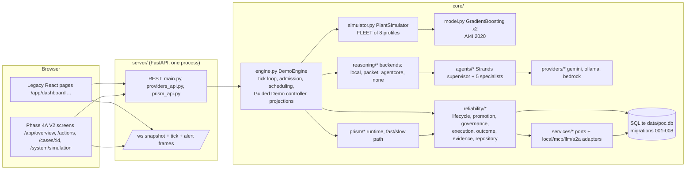
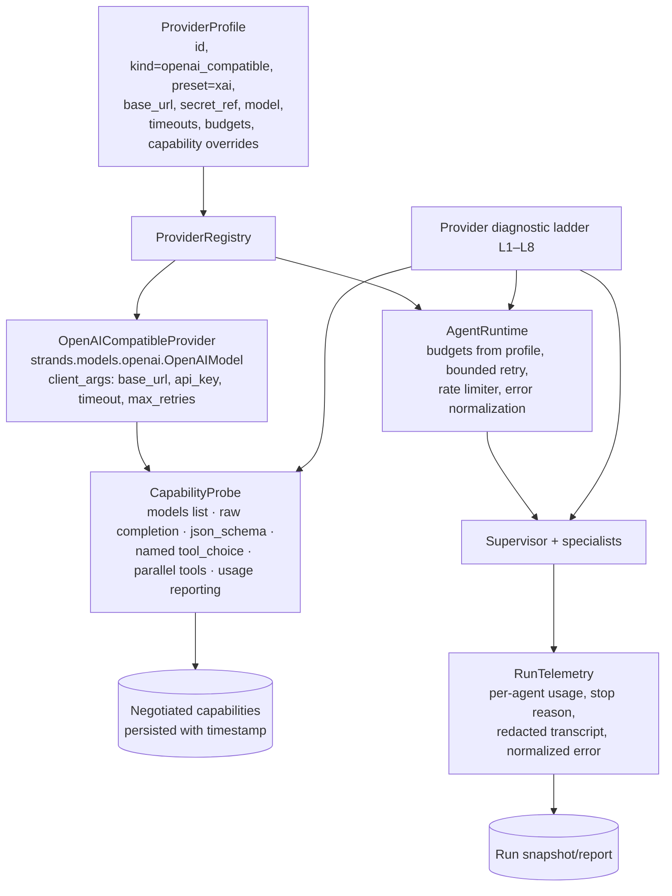
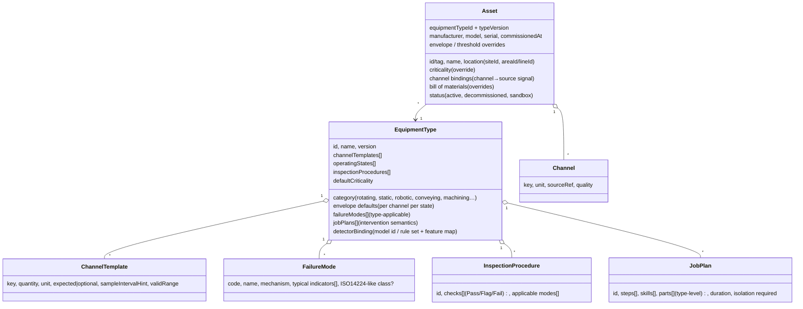
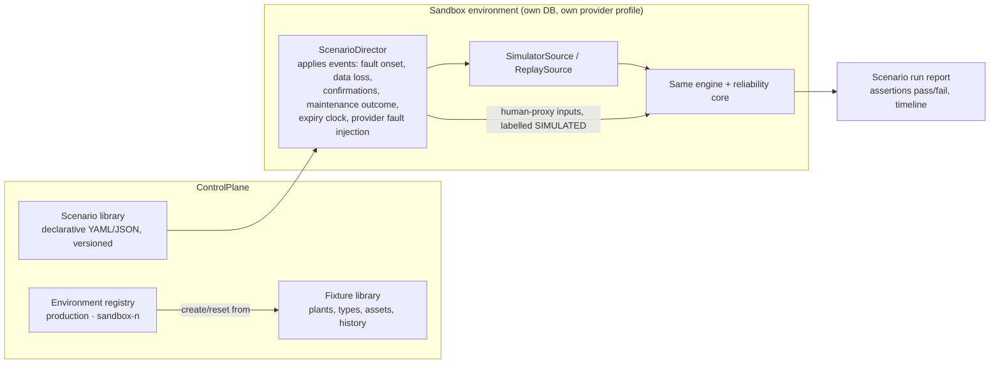
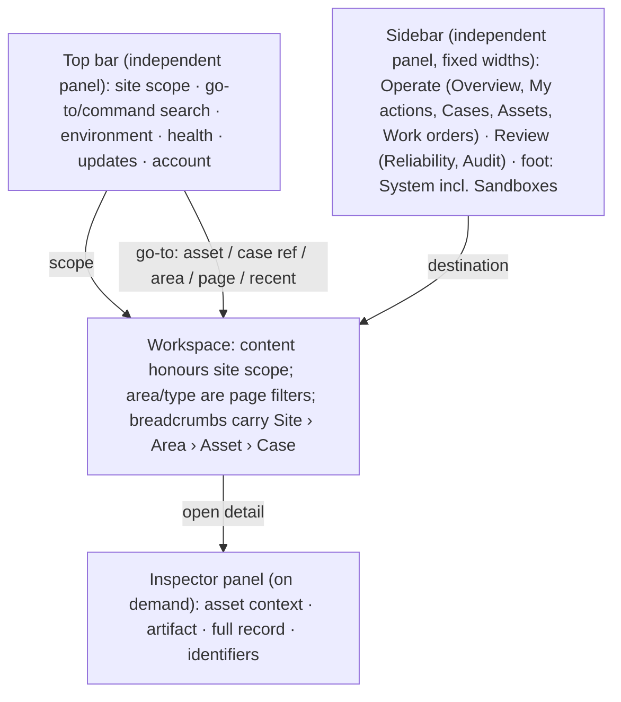
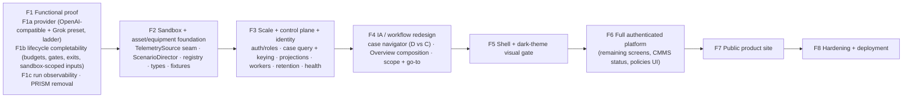

# OPERON V2 — F0: Functional, platform, domain and workflow architecture audit

Status: **read-only audit, uncommitted, awaiting product-owner review.** No application, backend or
frontend code was changed for this document. Phase 4A (`v2/phase4a-visual-gate`) is treated as a
prototype and evidence, not as frozen architecture.

**Evidence labels used throughout:**

| Label | Meaning |
|---|---|
| **[V]** | Verified current behaviour, with file:line, test, or runtime/measurement evidence |
| **[I]** | Inferred architectural issue (reasoned from verified code; not executed) |
| **[P]** | Proposed future behaviour |
| **[R]** | External research or reference (with the kind of evidence: documentation, package source, visual, search snippet) |

File references are relative to the repository root at commit `9f85a4e`.

---

## 1. Executive conclusion

OPERON has an unusually strong **governance core** and an unusually weak **platform around it**.

- **What is genuinely good [V]:**
  - The reliability layer (`core/reliability/*`) enforces a single phase graph (`state.py:12-38`).
  - Every write is a `BEGIN IMMEDIATE` transaction with a revision compare-and-set (`repository.py:145-189`).
  - Approval is bound to the exact requirement, intervention, hash, promotion and context revision (`lifecycle.py:643-698`).
  - Execution is claim-based and idempotent (`execution.py:107-110`, `lifecycle.py:730-861`).
  - Verification is a written policy over persisted scores (`outcome.py:38-197`).
  - Provenance travels with evidence.
  
  These are the product's real assets and should survive any rearchitecture.
- **What makes it not yet a working product [V]:**
  1. **No real model has a credible path through the lifecycle.**
     - The promotion gates demand zero model uncertainty (`promotion.py:508`), while the shared grounding prompt tells every model to "Expose uncertainty and missing information" (`agents/invocation.py:28`).
     - Confirmations must match the model's mechanism text character for character (`promotion.py:648-649`).
     - The token budget is 32k cumulative per agent, capped at 100k by validation (`agents/runtime.py:52`).
     - One self-corrected schema retry or one failed specialist escalates the case permanently (`orchestration.py:338-345, 476-484`; `lifecycle.py:463-468`).
     - The Guided Demo "works" only because it is scripted to the output shape of a deterministic advisory (`demo_scenario.py:157-173, 207-208, 253-255`).
  2. **Even a perfect model would stop at AWAITING_EVIDENCE.**
     - Diagnosis promotion requires a trusted technical confirmation (`lifecycle.py:522-528`).
     - The only entry points return 403 unless `OPERON_TRUSTED_SUBMISSIONS=1` (`server/main.py:202-207`).
     - No UI calls them.
     - Only the Guided Demo supplies confirmations, in-process and SIMULATED (`engine.py:655-681`).
  3. **Exceptions are terminal.**
     - ESCALATED, EXECUTION_FAILED and an expired approval have no production exit.
     - CANCELLED is unreachable.
     - Each of these blocks any new case on the asset until a full reset (`state.py:23`; `001_operon.sql:13-14`).
  4. **The plant is a hard-coded simulator, not data.**
     - Assets are seed rows that must match a code-level `FLEET` list (`seed_data.py:13-22`, `simulator.py:63-83`).
     - Every machine is the same 5-channel AI4I sensor bundle scored by one shared model.
     - The simulator is also the *actuator* the lifecycle calls on approve/reject/execute (`engine.py:279, 945, 1688, 1722`).
  5. **There is no identity.**
     - Actor and role are declared by the caller and default to `maintenance_approver` (`server/main.py:46-48`).
     - Approval dispatches immediately (`engine.py:1661`).
     - Destructive endpoints (`/api/reset`, `/api/demo/scenario`) are unauthenticated.
- **Therefore [P]: "make OPERON work with Grok" cannot be a provider-only task.**
  - F1 must deliver a **completable lifecycle under a real hosted model**. That means:
    - a generic OpenAI-compatible adapter (xAI Grok as the first preset);
    - provider-tuned budgets and retries;
    - gates reconciled with honest model output;
    - a governed (sandbox-labelled) confirmation/input path;
    - exits from dead-end states;
    - run-level observability.
  - Without the last four, F1's gate fails regardless of model quality.
- **Platform direction [P]:**
  - Treat the simulator as one `TelemetrySource` and one optional actuator.
  - Introduce an equipment-type/asset-instance model and a location hierarchy.
  - Make the Guided Demo one scenario in a sandbox.
  - Key cases by `incident_id` rather than asset.
  - Slim the live projection.
  - Only then redesign information architecture and visuals around the real shape of the data.
- **Phase 4A [P]:**
  - Keep its visual language, status grammar, provenance treatment, decision surface and backend-truth discipline.
  - Replace its giant lifecycle track, the permanent six-section index plus context rail, the fixed six-region Overview and the full-width demo banner.

---

## 2. Verified current architecture

### 2.1 Repository baseline

| Item | Value |
|---|---|
| Branch | `v2/phase4a-visual-gate` |
| HEAD | `9f85a4e` (equals `origin/v2/phase4a-visual-gate`) |
| Relation to `overhaul/v2` | 5 commits ahead of `19cc21a`; not merged |
| `main` | `0594d16` (untouched) |
| Working tree | Clean before this document |
| Backend size | about 19k lines of Python in `core/` and `server/` (`wc -l`) |
| Tests | 874 collected non-integration backend tests [V: `pytest --collect-only`]; frontend: legacy smoke (15 checks), Vitest 243, Playwright 11 (Phase 4A) |

### 2.2 Components [V]



### 2.3 Routes [V]

- **REST (`server/main.py`):**
  - `GET /api/health`, `GET /api/state`, `GET /api/incidents/{id}`, `GET /api/demo/artifacts/{id}`
  - `POST` to:
    - `/api/start`, `/api/stop`, `/api/reset`, `/api/demo/scenario`
    - `/api/approve/{equipment_id}`, `/api/reject/{equipment_id}` (legacy paths)
    - `/api/incidents/{id}/approval`, `/execute`, `/outcome`
    - `/api/incidents/{id}/confirmations/technical`, `/confirmations/resource`, `/drafts` (trusted-gated)
  - `GET /` and `/{path}` (SPA)
  - `WS /ws`
- **Providers (`server/providers_api.py:130-133`):** `GET /api/providers`, `POST /select`, `PUT /{kind}`, `POST /{kind}/test`.
- **PRISM (`server/prism_api.py:114-120`):** seven `/api/prism*` routes.
- **Missing:**
  - any asset, plant, line, equipment-type or channel API;
  - any case list or query API;
  - any user, auth or session API.
- **Frontend:**
  - Legacy: `/app/dashboard`, `machines`, `incidents`, `agent`, `maintenance`, `analytics`, `activity`, `notifications`, `profile`, `settings` (`frontend/src/App.jsx`).
  - Phase 4A: `/app/overview`, `/app/actions`, `/app/cases/:id`, `/app/system/simulation`, dev-only `/app/dev/specimen`.

### 2.4 Persistence [V]

- **Store:** SQLite `data/poc.db`, a new connection per call with `timeout=10` and no WAL (`db.py:162-173`).
- **Migrations:** forward-only SQL migrations `001`–`008` with a `schema_migration` ledger.
- **Startup:** `seed(reset=False)` (`server/main.py:95-100`). The DB persists across restarts unless `--reset-demo` is used (`run.py:1-9`). The `.gitignore` comment claiming it is "deleted each launch" is stale.
- **Master data (seed only):**
  - 1 plant (`US01`, `America/Chicago`), 1 line `LINE-A`, 8 equipment rows, 40 sensors;
  - 4 AI4I failure modes, 6 technicians, 7 parts, a bill of materials, 1 historical work order (`seed_data.py:13-185`).
- **Runtime in memory only:** simulator state, `histories` (90 points per asset), `alerts` keyed by asset, tick counter (`engine.py:111-160`).

### 2.5 Providers [V]

Covered in §3. Kinds are `none | gemini | ollama | bedrock` (`providers/base.py:23-24`), selected through `OPERON_AI_PROVIDER` or the UI. The reasoning backend is a separate switch (`OPERON_REASONING_BACKEND`, `config.py:138-143`).

### 2.6 Simulator [V]

- `PlantSimulator` with 8 hard-coded `AssetProfile`s (`simulator.py:48-83`). Four degrade (PWF, OSF, HDF×2) and four are healthy.
- Five features per asset: air temperature, process temperature, rotational speed, torque, tool wear (`simulator.py:128-148`). The model scores them each tick (`engine.py:727-753`).
- Tick = 1 s wall clock = 15 simulated plant minutes (`config.py:42-44`).

### 2.7 Assets, plant, users [V]

- **Assets:** §7.
- **Plant and line:** exist in the schema but are not projected. The fleet frame has no `plant_id` or `line_id` (`engine.py:838-850`).
- **Users and roles:** none on the server (`server/main.py:6-17`). The browser "sign-in" accepts any email plus an 8-character password and never reaches the server (`frontend/src/state/session.jsx:1-61`).

### 2.8 Demo mechanisms [V]

- **Guided Demo:**
  - `POST /api/demo/scenario` → `engine.start_guided_demo` → `reset(restart=False)`. This **wipes all transactional data** (`engine.py:561`, `db.py:190-195`).
  - It re-parameterises a simulator profile, then runs about 400 lines of special orchestration (`engine.py:549-715, 982-1062`) with its own ownership claims and a global `stop()` of the simulation loop (`engine.py:673-675`).
- **Legacy demo:** `OPERON_LEGACY_DEMO`, deprecated and off by default (`reliability/legacy.py`, `config.py:87`).

### 2.9 Integration abstractions [V]

- **Service ports:** `services/base.py:21-185` (inventory, workforce, scheduling, CMMS, notifications, governance, monitoring).
- **Adapter selection:** per domain via `SENTINEL_<DOMAIN>_ADAPTER` (`services/registry.py:45-53`). Bundled adapters: `local`, `mcp`, `llm`, `a2a`.
- **Validation bypasses the ports:** promotion and resource validation read SQLite directly (`reliability/resources.py:32-56`), so an external CMMS cannot be the source of truth yet.

### 2.10 What Phase 4A changed [V]

- **Added:** `frontend/src/v2/**` (tokens, status model, shell, 4 screens, specimen); Vitest, Playwright and the capture script; official IBM Plex and Tabler icons.
- **Small edits:** `App.jsx` (V2 routes; `/app` now lands on Overview), `main.jsx`, `LoginPage.jsx` (post-login destination).
- **One bug fix:** `state/useEngine.js` now ignores close events from superseded sockets.
- **Not changed:** backend, `frontend/dist/`.
- Phase 4A **consumed** the full WebSocket `read_model` embedded in every alert. That is convenient at 8 assets and one of the scale problems in §10.

---

## 3. Provider and inference lifecycle map

### 3.1 Current flow [V]

```mermaid
sequenceDiagram
  participant Tick as Engine tick / Guided Demo
  participant LC as LifecycleService
  participant PS as PromotionService
  participant BE as ReasoningBackend (local | packet | agentcore | deterministic)
  participant SUP as Strands Supervisor agent
  participant SP as Specialist agents (diagnostic, engineering, operations, critic, planner)
  participant P as ModelProvider (Gemini | Ollama | Bedrock)
  Tick->>LC: diagnose(incident)  [engine.py:1127/1195]
  LC->>PS: run_supervisor(stage = DIAGNOSIS)
  PS->>BE: preflight()  (failure → PromotionRefused RETRY; case stays INVESTIGATING)
  PS->>PS: start_run: freeze SpecialistContext ≤ 64 KB, write SupervisorRunSnapshot
  PS->>BE: supervise(context, bounds)
  BE->>SUP: invoke (12 turns, 32k total tokens, run timeout 240 s)
  SUP->>P: stream: system + packet + 6 tools + SupervisorDecision structured-output tool
  SUP->>SP: delegate_x → invoke_specialist (90 s, 32k tokens, tools + forced structured output)
  SP->>P: stream
  SP-->>SUP: assessment, or error recorded as exception TYPE NAME only
  SUP-->>BE: SupervisorDecision | exception | limit | timeout
  BE-->>PS: SupervisorResult (assemble_result unions all uncertainties into blockers)
  PS->>PS: _complete_run → SupervisorReport
  PS-->>LC: report
  LC->>LC: _settle → ESCALATED | NEEDS_EVIDENCE (→ AWAITING_EVIDENCE) | PROMOTE
  LC->>PS: promote_diagnosis (needs trusted confirmation + exact mechanism + zero uncertainties)
  Note over LC: draft (trusted /drafts) → INTERVENTION_REVIEW run → promote_intervention →<br/>request_approval (deterministic) → approve → execute → outcome (deterministic)
```

### 3.2 Step-by-step trace [V]

| Step | Where | Notes |
|---|---|---|
| Selection | `providers/registry.py:103-191` | `auto` tries Gemini, then Bedrock, never Ollama. `POC_FORCE_DETERMINISTIC` is captured once at import (`config.py:107`). `OPERON_REASONING_BACKEND=agentcore` **overrides the UI choice** (`reasoning/backend.py:223-230`). |
| Initialization | `providers/base.py:126-167` | No I/O at construction. Gemini key comes from env or a loopback-only session; it lives in memory only and is lost on restart (`registry.py:106-112`, `providers_api.py:107`). Bedrock is "configured" if any AWS credential source exists (`bedrock.py:66-84`). |
| Request construction | `promotion.py:304-382`; `agents/rendering.py:302-307` | Frozen `SpecialistContext`, hard cap 64,000 JSON bytes (`agents/contracts.py:167`). Measured model messages: 6.6k chars (diagnosis #1), 12.6k (#2), 18.4k (intervention review), plus prompts (~3.4k), tool schemas (2.6–4k each) and tool results up to 48 KB each (`agents/tools.py:23`). |
| Structured output | `agents/runtime.py:158-168` | Every agent is a Strands `Agent(structured_output_model=…)`, implemented as a forced tool call. **Tool calling with named `tool_choice` is mandatory.** Contracts are strict: `extra="forbid"`, strict numbers and booleans, cross-field validators (`agents/contracts.py:20-148, 227`). |
| Supervisor → specialists | `agents/supervisor.py:78-119`; `reliability/orchestration.py:431-484` | The model chooses delegation order. Bounds: 10 delegations, 12 iterations, 3 per role, 24 tool calls (`contracts.py:209-217`). |
| Result → durable state | `orchestration.py:194-263`; `lifecycle.py:458-471`; `promotion.py:474-691` | Deterministic assembly and gates (§4). |
| Approval, execution, verification | `lifecycle.py:599-908`; `outcome.py` | **Deterministic.** No model involvement after intervention review. |
| Persistence | `promotion.py:374-472` | `SupervisorRunSnapshot` (pre-call) and `SupervisorReport`. No transcripts, token usage or per-agent stop reasons are persisted. |
| Errors | `agents/runtime.py:166` (`retry_strategy=None`); `providers/errors.py:117-122` | No throttle retry on agent calls. Strands' `StructuredOutputException`, `MaxTokensReachedException` and `ContextWindowOverflowException` are not normalized. |
| Timeouts | `providers/base.py:102-103` | Connect 3 s, first token 30 s, invocation 90 s, **entire supervisor tree 240 s**. |
| Generation settings | `agents/runtime.py:43-44, 66` | `max_tokens=2500` and `temperature=0.1` are forced on every agent and override provider env settings. |

### 3.3 Where deterministic behaviour substitutes silently [V]

- **Guided Demo:** uses `DeterministicAdvisoryBackend` whenever `engine.runtime is None` (`engine.py:542-547`). That includes a configured provider whose backend failed to build. The demo is labelled "deterministic", but the user is not told their provider was bypassed.
- **PRISM slow path:** substitutes the deterministic advisory when `OPERON_REASONING_BACKEND=none`, even with a provider configured (`prism/operon.py:530-541`). This can drive diagnosis promotion behind an unauthenticated endpoint.
- **Governance and monitoring peers:** default to `llm` (`services/registry.py:47`) and fall back to deterministic on any exception, with no label or log (`services/adapters/gemini_peers.py:100-101, 129-130`).
- **Deterministic advisory skips shared assembly:** it builds `SupervisorResult` directly with empty blockers (`demo_scenario.py:157-173`). The scripted path therefore never exercises `assemble_result`, which real models go through.

### 3.4 Observability [V]

- **Exists:**
  - durable run snapshots and reports;
  - a bounded in-memory `_reasoning_diagnostics` ring (`engine.py:1001-1040`), not exposed by any API;
  - `python -m core.providers.status --probe`.
- **Missing:**
  - logging configuration (uvicorn runs at `warning`, `run.py:85`; INFO traces are dropped);
  - error detail for specialist failures (only the exception **type name** is recorded, `orchestration.py:476-484`);
  - token usage, transcripts, metrics, tracing exporter;
  - any test against a live model (`tests/conftest.py:13-60` forces deterministic; the `ScriptedModel` reports 20 tokens per turn, so budgets never trip).

---

## 4. Previous-provider failure analysis

Ranked by likelihood of having blocked a real-model lifecycle, independent of which vendor was used.

| # | Failure point | Evidence | Affects | Label |
|---|---|---|---|---|
| 1 | **Promotion requires zero uncertainty, contradicting the prompt.** Real models comply with "expose uncertainty" and are then refused. | `promotion.py:508, 581-597`; `invocation.py:28` | all | [V] |
| 2 | **Exact-string mechanism binding.** The confirmation must restate the model's free-text mechanism verbatim. | `promotion.py:648-649` | all | [V] |
| 3 | **Planner report required inside the DIAGNOSIS run**, while the supervisor prompt says DIAGNOSIS needs only diagnostic and critic. | `promotion.py:758-767`; `demo_scenario.py:253-255`; `supervisor.py:35` | all | [V] |
| 4 | **32k cumulative tokens per agent**, validator-capped at 100k. Multi-turn supervisors hit `LIMIT_EXHAUSTED` → ESCALATED. | `runtime.py:52, 60-62` | all hosted | [V] code; [I] trip point from measured sizes |
| 5 | **A self-corrected schema retry counts as failure.** A `SupervisorDecision` tool error sets `invalid_output`; any specialist tool error fails the specialist. | `orchestration.py:338-345`; `invocation.py:70-75, 98-99` | all | [V] |
| 6 | **One failure is permanent.** One failed specialist → BLOCKED → ESCALATED, which has no exit. | `orchestration.py:241-242, 476-484`; `lifecycle.py:463-468`; `state.py:23` | all | [V] |
| 7 | **No retries or rate limiting on agent calls**; 429s fail the run (Gemini free tier especially). | `runtime.py:166`; `core/gemini.py:43, 58-70` covers only `generate_json` | Gemini, hosted | [V] |
| 8 | **240 s for the whole multi-agent tree**; `max_tokens=2500` forced. Thinking models spend output tokens on reasoning. | `base.py:102-103`; `runtime.py:43-44` | hosted, thinking models | [V] code; [I] impact |
| 9 | **Provider defects:** Ollama ignores `tool_choice`, so forced structured output cannot be honoured; Bedrock bearer-token auth is reported as configured but rejected at agent creation; the Bedrock default model ID is a 2024 Claude 3.5 ID; the AgentCore package omits `core/providers/*` (the built zip fails to import); `OPERON_REASONING_BACKEND=agentcore` silently overrides the UI provider. | `strands/models/ollama.py:315-325`; `bedrock.py:24, 70-71, 125-137`; `scripts/agentcore/package_manifest.json`; `reasoning/backend.py:223-230` | Ollama, Bedrock, AgentCore | [V] (zip import reproduced in scratch) |
| 10 | **Observability hides causes.** Specialist failures are logged as type names; INFO logs dropped; no usage or transcript. | §3.4 | all | [V] |
| 11 | **The live path stops at AWAITING_EVIDENCE** whatever the model does. | `lifecycle.py:522-528`; `server/main.py:202-207` | all non-demo | [V] |

**Conclusion [I]:** the previous attempts most plausibly failed in OPERON's application gates and budgets (items 1–6), compounded by vendor-specific packaging (item 9) and the lack of diagnostics (item 10). The model was probably not the root cause. A Grok adapter alone would reproduce items 1–8 and 10–11.

---

## 5. Recommended F1 architecture: generic OpenAI-compatible provider, xAI Grok first

### 5.1 External facts [R]

- **Evidence quality:** `docs.x.ai` is blocked by this container's egress proxy, so these are search-result snippets from the official docs and from third-party SDK documentation. Re-verify against the live docs during F1.
- **Base URL and compatibility:** xAI documents an OpenAI-SDK-compatible API at `https://api.x.ai/v1` (search snippet, xAI docs/integrations).
- **Structured outputs:** supported via `response_format: json_schema`, and documented together with tools. The documentation lists **unsupported schema constraints**: `minLength`/`maxLength`, `minItems`/`maxItems`/`minContains`/`maxContains`, `pattern`. `anyOf` and `additionalProperties: false` are supported (search snippet of docs.x.ai structured-outputs).
  - **Implication [I]:** OPERON's Pydantic contracts use length bounds and `pattern` constraints, for example `ollama.py:45`, `runtime.py:40-41` and contract fields. Those constraints must stay **local validation** and not be sent as provider-enforced schema, or the request must strip unsupported keywords.
- **Function calling:** supported through Chat Completions. `tool_choice` details were not confirmed from primary docs in F0.
- **Do not assume [R/I]:** "OpenAI-compatible" providers differ in `tool_choice` support, `max_tokens` vs `max_completion_tokens`, sampling-parameter acceptance on reasoning models, `parallel_tool_calls`, streaming usage reporting and error shapes. Capabilities must be **negotiated and probed**, never assumed.

### 5.2 Design [P]



- **One provider kind, `openai_compatible`, built on Strands `OpenAIModel`.**
  - Strands' OpenAI model streams with usage, sends tools as OpenAI functions and supports named `tool_choice` [V: package source read by the audit].
  - The `openai` package is **not installed** today [V: `.venv` listing]; F1 adds it.
- **Presets are data, not classes.** `xai` sets the base URL, recommended timeouts and known capability defaults. A tightly coupled `GrokProvider` class is **not** justified: the seams (`base.py`, `registry.py`, `runtime.py`) are already provider-shaped. The problem is the hard-coded vendor branches, not a missing class.
- **Remove vendor branches** in `agents/runtime.py:17, 72-102` and `reasoning/backend.py:173-210`. The provider supplies its identity locator, endpoint and model factory.
- **Secrets:**
  - `secret_ref` points to an environment variable or a server-side secret store.
  - Never accept keys through an unauthenticated route.
  - Never echo them.
  - Persist only the reference.
- **Budgets per profile:** `max_tokens` (or `max_completion_tokens`), cumulative `max_total_tokens` (hosted default about 200k, validator raised), per-invocation, first-token and run timeouts (run default about 600 s for hosted tree runs), and turns.
- **Resilience:**
  - bounded retry with jitter for 429, 5xx and connection errors (`ModelRetryStrategy` or adapter `max_retries`);
  - per-profile rate limiter covering agent calls;
  - a run that fails for transport or budget reasons becomes **RETRY with backoff**, not ESCALATED.
- **Structured output:**
  - Prefer forced named tool (current contract) when `named_tool_choice` is probed true. Otherwise fall back to `json_schema` response format with local Pydantic validation.
  - Count a Strands validation retry that later succeeds as **success**; only the final object matters.
- **Error normalization:** map `openai.APIStatusError` (with status), `APITimeoutError`, `APIConnectionError`, `RateLimitError` and the Strands structured-output, max-tokens and context-overflow exceptions to `ProviderError` codes. Record code plus redacted message per delegation.
- **No silent substitution:**
  - If the selected provider cannot run, the case shows "Analysis unavailable: {reason}".
  - The deterministic advisory is selectable only explicitly, in sandbox, and is labelled on every artifact.

### 5.3 Provider diagnostic ladder [P]

Each level must pass before the next is attempted. Every level returns a typed result and a redacted log record.

| Level | Check | Distinguishes |
|---|---|---|
| L1 | Credentials resolve (secret present, well-formed); auth probe returns non-401/403 | Invalid or missing credentials |
| L2 | `GET {base}/models` reachable within connect timeout; TLS ok | Endpoint unreachable / DNS / proxy |
| L3 | Configured model present in the list (or a 1-token completion succeeds) | Model unavailable / not entitled |
| L4 | Raw completion: short prompt → text; usage reported | Raw completion works |
| L5 | Structured output: a small OPERON-shaped schema returns a valid object (both forced-tool and `json_schema` probes, recording which works) | Required structured output works |
| L6 | Tool behaviour: model calls a named tool with valid arguments; named `tool_choice` honoured; tool result round-trip | Required tool/function behaviour works |
| L7 | OPERON supervisor smoke: one DIAGNOSIS run on a frozen fixture packet completes with `MODEL_COMPLETED`, within budget, with all delegations recorded | OPERON supervisor works |
| L8 | Full lifecycle scenario (§23) in sandbox | Complete OPERON lifecycle works |

L1–L6 are a **System → Analysis → "Run diagnostics"** action plus a CLI (`python -m core.providers.status --ladder`). L7–L8 are an opt-in test harness (`OPERON_LIVE_PROVIDER=1`) that never runs in CI by default and never uses production data.

### 5.4 Proposed provider flow [P]

```mermaid
sequenceDiagram
  participant UI as System → Analysis
  participant API as /api/providers/{id}/diagnose
  participant L as Ladder runner
  participant X as api.x.ai/v1
  UI->>API: run ladder (authenticated admin)
  API->>L: profile id
  L->>X: L2 GET /models
  L->>X: L4 chat (1 token)
  L->>X: L5 json_schema probe
  L->>X: L6 tool probe (named tool_choice)
  L-->>API: capability record + per-level result + redacted logs
  API-->>UI: ladder table; failing level highlighted with remedy
```

---

## 6. Samsung PRISM: keep / rework / remove

PRISM is about 2,350 lines in `core/prism/`, plus migration `008`, seven routes, frontend state and 79 tests [V]. Its stated goal was "Samsung PRISM Theme 5" (`core/prism/__init__.py:1`).

- **Lifecycle and approval do not depend on PRISM** [V: `engine.py:1645-1661`].
- **PRISM depends on lifecycle and promotion, and on demo code:** its default backend imports `DeterministicAdvisoryBackend` from `demo_scenario.py` (`prism/operon.py:523-541`) [V].
- **Reverse couplings in the engine** [V]:
  - diagnosis suppression (`engine.py:1081-1088`);
  - snapshot field (`engine.py:1891`, scanning every session ever created: `prism/runtime.py:286-290`);
  - startup recovery (`engine.py:307-313`);
  - reset (`engine.py:362-364`).

| Component | Class | Why |
|---|---|---|
| Revision-based **operator instruction** ("redirect the investigation"), acknowledgement, superseded results kept | **KEEP (concept) / REWORK** | Real value for engineers. It should be an incident-scoped *engineer note / instruction* evidence type under the **incident** revision, not a parallel session revision system. |
| `fast_path.py` (canned acknowledgement plus a word count) | **REMOVE** | A `202 Accepted` with job id gives the same thing. |
| `runtime.py`, `coordinator.py`, `slow_path.py`, `testing.py` | **REMOVE/DEFER** | They duplicate lifecycle supersession (`promotion._complete_run` already rejects stale runs). |
| `prism/operon.py` production adapter | **REMOVE** | Gives an unauthenticated chat path into diagnosis **promotion**, including via the SIMULATED deterministic advisory (`prism/operon.py:220-258, 530-541`). |
| `recovery.py` (`retry_current_revision` auto-re-run on restart) | **REMOVE** (or `fail_only`) | Unattended, costed model calls after restart. |
| `fencing.py`, `idempotency.py`, effect-ledger pattern | **REWORK → fold into lifecycle tests and patterns** | Good patterns, already present as `execution_claim` and stale reasons. |
| `promotion.py` connection-injection seam (`:69-72`) | **KEEP** | Generic and harmless. |
| Provider `roles` / `build(role=)` | **KEEP (rename)** | Per-role model selection is generally useful (for example a cheaper critic). Rename away from fast/slow. |
| Migration 008 and tables | **UNCERTAIN** | Forward-only migrations: leave inert or add a drop migration. Product-owner and data-retention decision. |
| `server/prism_api.py` | **REMOVE** | No auth, no rate limit, costed model runs. |
| Frontend `state/prism.js`, PRISM parts of `agentRuntime.js`, engine-state PRISM slice | **REMOVE** | Only `AgentPage` uses them. |
| `pages/AgentPage.jsx` | **REWORK** | It mixes the PRISM composer with approval; the V2 case workspace replaces it. |
| `docs/PRISM_RUNTIME.md`, `README.md:350-365`, `scripts/prism_*.py`, Settings PRISM note | **REMOVE / archive** | Hackathon artefacts. |
| 79 PRISM tests | **REMOVE with the code**; port the fence and idempotency cases | — |

**Ordering [P]:** remove the frontend composer, then the API, then the engine couplings, then the package (decision on table 008). Do this **early in F1**: PRISM's substitution and unauthenticated promotion path would contaminate the F1 proof.

---

## 7. Asset / equipment domain audit

### 7.1 What "a machine" is today [V]

- **Three things that must agree:**
  - an `equipment` row: `equipment_id, line_id, equipment_name, equipment_class (free TEXT), criticality, product_tier` (`db.py:25-32`);
  - a hard-coded simulator `AssetProfile` in `FLEET` (`simulator.py:48-83`);
  - engine metadata loaded **once** at construction (`engine.py:122, 299-303`).
- **If they disagree:**
  - A DB asset without a profile gets no telemetry.
  - A profile without a DB row breaks the per-tick foreign-key insert for **every** asset in that tick (`db.py:166`, `engine.py:860-881`).
- **All 8 machines are the same AI4I sensor bundle under different labels**, scored by one shared GradientBoosting model pair (`simulator.py:128-148`, `model.py:37-125`).
  - The only per-asset model input is `product_tier` mapped to the AI4I product-quality code L/M/H (`simulator.py:141`, `dataset.py:46`). That is a dataset artefact repurposed as an asset attribute.
- **Failure modes are global.** The 4 AI4I modes apply to every asset, so a conveyor can be predicted to have "Tool Wear Failure" (`seed_data.py:71-88`).
  - `CLASS_DEFAULT_MODE` is only a fallback.
  - It contradicts the simulator: it says compressor = OSF while AC-COMP-01 degrades toward PWF (`seed_data.py:92` vs `simulator.py:64`).

### 7.2 Capability matrix [V]

| Capability | Today | Evidence |
|---|---|---|
| Add / remove / edit asset (UI or API) | **No** | Only `seed()` writes `equipment` (`seed_data.py:160-179`). No asset routes. MCP has read tools only (`mcp_app/server.py:104-108`). |
| Persist a new asset | Code edit in two files plus restart | `seed_data.py:13-22` and `simulator.py:63-83` |
| Assign plant / line / area | Schema has plant and line; all assets on `LINE-A`; no area level | `db.py:14-24`; `seed_data.py:160-167` |
| Equipment type | **No.** The class is a free string repeated in 5 places | `seed_data.py:14-21, 91-94`; `services/adapters/local.py:51`; `seed_data.py:38-43`; `frontend/src/primitives/index.jsx:122-133` |
| Configure sensors / channels | **No.** Fixed 5 | `seed_data.py:27-34`; `engine.py:754-756`; `dataset.py:21-23` |
| Operating envelope | **No.** Evidence reports `operating_limits` missing; legacy UI hard-codes bands including a non-existent "Vibration" channel | `evidence.py:516`; `features/Operation/AssetNominalBoard.jsx:13-19` |
| Thresholds | **Global constants**, not even env-configurable | `config.py:44-45` |
| Maintenance history | Read-only seed (one work order), no import | `db.py:87-106`; `seed_data.py:99-112` |
| Criticality | Per asset (seed only) | `db.py:30` |
| Failure modes per type | **No** | above |
| Inspection procedures | **No.** Free-text `recommended_action` per *mode*; the demo inspection is SIMULATED | `seed_data.py:75-87` |
| Diagnostic logic per type | **No.** Generic specialists over 5 generic evidence reads | `agents/diagnostic.py:7-16`; `investigation.py:30-39` |
| Work-plan semantics | Per-asset bill of materials; technician match by class string plus a hard-coded "rotating" set | `seed_data.py:58-67`; `services/adapters/local.py:51-77`; `resources.py:32-41` |
| Model behaviour per type | **No.** One model | `model.py` |

### 7.3 Minimum useful equipment model [P]

Borrowing from industrial references, without adopting their full weight:
- **AWS IoT SiteWise** separates the asset *model* (attributes, measurements, transforms, metrics, hierarchy definitions) from asset *instances* created from it [R: SiteWise concepts docs, search].
- **ISO 14224** gives per-equipment-class boundaries and failure-mode, mechanism and cause taxonomies [R: secondary sources, search].
- **ISA-95** separates the location and equipment hierarchy (Enterprise / Site / Area / Work centre / Work unit) [R: OPC Foundation and ServiceNow docs, search].



**Where each concern belongs [P]:**

| Concern | Configuration | Learned | External (integration) |
|---|---|---|---|
| Channel set, units | ✓ (type template, per-asset binding) | | Historian or OPC-UA tag names |
| Operating envelope, thresholds | ✓ (type default, asset override) | Baseline drift (later) | OEM data sheets |
| Failure modes, inspection procedures, job plans | ✓ (type-level, versioned) | | CMMS job plans (import) |
| Detector or model | ✓ binding | ✓ weights | ML registry (later) |
| Criticality | ✓ | | EAM criticality matrix |
| Maintenance history, parts stock, technicians | | | **CMMS / EAM** (local adapter for sandbox) |
| Manufacturer / model / serial | ✓ | | EAM asset register |

**Explicitly not now [P]:**
- component trees below asset (deferred until a customer needs subsystem-level cases);
- full ISO 14224 taxonomy import;
- per-type learned models (keep one detector per type or category, bound by a feature map).

---

## 8. Sandbox / simulation / scenario architecture

### 8.1 Definitions [P]

| Term | Meaning in OPERON |
|---|---|
| **Simulation** | A `TelemetrySource` that synthesises or replays readings over time for configured assets and channels |
| **Scenario** | A declarative, versioned script of conditions and events applied to a simulation and the surrounding world. Examples: fault onset, telemetry loss, approval timeout, technician confirmation, maintenance outcome, provider failure. Scenarios have expected-outcome assertions. |
| **Sandbox** | An isolated, disposable environment with its own data store, plant configuration and provider profile, created from a fixture, resettable to a known state, visibly labelled, and unable to touch production data or integrations |

### 8.2 What exists today [V]

- **One simulator, always on, wired into the engine as both source and actuator** (§9).
- **One guided scenario** (`operon.demo.guided-v1`), always `RECOVERS`. It starts by **wiping all transactional data** (`engine.py:561`). Its UI button has no confirmation (`v2/screens/Simulation.jsx:66`).
- **It runs a parallel controller:**
  - ownership claims (`engine.py:134-140, 982-1062`);
  - it pauses the whole simulation (`engine.py:675`);
  - it **bypasses the trusted-submission gate** by calling engine methods directly (`engine.py:657, 680` vs `server/main.py:204`);
  - it self-confirms whatever mechanism the advisory proposed (`demo_scenario.py:176-220`).
- **Missing scenario variety:**
  - telemetry loss (quality is always `GOOD`, `engine.py:755-756`);
  - false positives;
  - failed maintenance (exists only in tests);
  - approval expiry;
  - simultaneous incidents on purpose;
  - provider failure;
  - multiple incidents per asset.
- **SIMULATED provenance never gates** promotion, approval or closure (`promotion.py:653, 783`; `outcome.py:527-536`). That is acceptable *inside* a sandbox and unacceptable in production.

### 8.3 Proposed minimum architecture [P]



- **Same engine, different environment:**
  - The sandbox runs the production code path with its own store (separate SQLite file or schema).
  - The sandbox has its own provider profile: real Grok, a deterministic advisory, or a fault-injecting proxy.
- **The ScenarioDirector replaces the Guided Demo controller.**
  - It acts only through public commands: the same API a person would use, marked `actor_kind = scenario`.
  - It does not call engine internals and does not stop the world.
- **Scenario declaration:**
  - assets and types;
  - fault schedule per asset;
  - channel faults (dropout, stuck, noise, spike);
  - human-proxy actions (confirm mechanism, approve or reject after N minutes, or never);
  - maintenance outcome (recovers, persists, regresses);
  - clock control (fast-forward expiry);
  - provider faults (latency, 429, malformed output);
  - expected terminal states.
- **Guided Demo becomes the scenario `guided-v1`** in a disposable sandbox. It is never a production code path and never a data wipe.
- **Fixture strategy (small and generated, not huge files):**

| Fixture | Assets | Purpose |
|---|---|---|
| `tiny` | 3 (one type) | Unit, e2e, first-run demo |
| `demo-plant` | 8 (current classes as real types) | Normal demo |
| `multi-case` | 12, 3 simultaneous faults | Queue, attention, concurrency |
| `degraded-connectivity` | 8, dropouts plus a stale asset | Freshness and stale UI |
| `mixed-equipment` | 20 across 6 types, 2 areas | Type semantics, hierarchy |
| `fleet-stress` | 500 (generated) across 3 sites | Scale tests (not committed as data; generated by seed) |

Fixtures are **generators plus small seeds**, versioned with the schema. No large committed datasets.

---

## 9. Telemetry / data-source architecture

### 9.1 Today [V]

- **There is no ingestion path other than the in-process simulator.** No MQTT, OPC-UA, REST, file replay or historian code exists, and no route accepts readings.
- **The engine treats the simulator as the plant.** There are 27 `self.sim` references in `engine.py`. The engine:
  - reads `st.mode`, `st.prog` and `st.profile` for admission (`engine.py:767-771`);
  - sets `arrested` on admission (`:945`);
  - calls `respond_to_intervention` on execute and restart (`:279, 1688`);
  - sets `failing` on reject (`:1722`);
  - restores simulator state from checkpoints (`:256-257`).
- **Signal provenance is hard-coded** `PlantSimulator` / `SIMULATED` (`reliability/signals.py:28`).
- **Already decoupled (good):** evidence collection and outcome verification read only **persisted** `sensor_reading` and `health_score` rows (`freshness.py:107-160`). A real source writing those tables would work for the lifecycle [V/I].

### 9.2 Proposed seam [P]

```mermaid
flowchart LR
  subgraph Sources
    S1[SimulatorSource]
    S2[ReplaySource file/CSV/Parquet]
    S3[MQTT (Sparkplug B later)]
    S4[OPC-UA subscription]
    S5[REST/webhook ingest]
    S6[Historian connector (PI, etc.)]
  end
  Sources --> ING[Ingest service<br/>normalize Reading(asset, channel, ts, value, unit, quality, provenance)<br/>validate against channel template<br/>dedupe, late-data policy]
  ING --> TS[(Time-series store<br/>retention + downsampling)]
  ING --> DET[Detector pipeline (batched, off event loop)<br/>per equipment type binding]
  DET --> ADM[Admission policy<br/>(threshold + debounce + no-data rules)]
  ADM --> REL[Reliability core]
  REL --> ACTP[Actuator port<br/>SimulatorActuator only in sandbox;<br/>production: none — real work happens in CMMS]
```

**Rules [P]:**
- Admission must not read simulator internals.
- Signal provenance comes from the source.
- Readings carry **source timestamps**, which also resolves the X8 freshness gap.
- Quality flags (GOOD / SUSPECT / MISSING) are first-class.
- Only implement `SimulatorSource` and `ReplaySource` until a customer requires the others.

### 9.3 CMMS / EAM integration [V → P]

- **Ports and adapters exist** (`services/base.py`).
- **Authoritative execution goes through them:** `cmms().create_work_package` and `notifications()` (`lifecycle.py:845-848`, `execution.py:148-156`).
- **But master data is read directly from SQLite during validation** (`reliability/resources.py:32-56`; `evidence.py:836-843`), so an external CMMS cannot be the system of record for stock, technicians or bills of materials.
- **The local adapter's "send" is a row insert** (`services/adapters/local.py:99-141`).
- **Proposed:**
  - route all master-data reads through the ports;
  - add an explicit **work-order status ingestion** (completion, closure codes) from the CMMS; this is also the missing "maintenance completed" fact (G10);
  - keep `local` as the sandbox adapter.

---

## 10. Scale audit: removing the "8 machines" assumption

### 10.1 Measurements [V]

| Measure | Value | Evidence |
|---|---|---|
| Scoring cost | `predict` + `predict_mode` ≈ 2.2 ms per asset (single-row pandas frame per call), synchronous on the asyncio loop | timing in scratch with the repo model; `engine.py:731-733` |
| Tick frame | ≈ 540 B per asset | fixture frame 0: 7.9 KB for 8 assets |
| Snapshot | ≈ 11 KB per asset at the 90-point history cap, **plus 30–110 KB per case**. The alert embeds the full read model: events, evidence and agent runs; one alert is 106 KB in the fixtures. | `frontend/test/fixtures/demo-frames.json` frame 7: 124 KB |
| Telemetry rows | 6 per asset per tick, no retention or downsampling | `engine.py:754-758` |

### 10.2 Behaviour by scale [V/I]

| Area | 8 | 50 | 500 | 5,000 |
|---|---|---|---|---|
| Per-tick scoring on event loop | 18 ms OK | 110 ms | **1.1 s > 1 s tick, loop starved** | 11 s, broken |
| Telemetry rows/day (1 s tick) | ~4M | ~26M | ~260M | ~2.6B in one SQLite file |
| Tick broadcast per client | 4.6 KB/s | 27 KB/s | 270 KB/s | 2.7 MB/s |
| Snapshot (connect, reset, provider change, `/api/state`) | ~90 KB + cases | ~0.6 MB + cases | ~5.6 MB + cases | ~56 MB |
| One case per asset; `alerts` never pruned after CLOSED (`engine.py:118, 770`) | no recurrence | — | — | no history at any scale |
| Global reasoning lock (`engine.py:153-155`) | OK | N cases × model latency queue | broken | broken |
| Per-tick `_progress_lifecycle` fetch per case plus full read-model rebuild on change (all artifacts and events loaded, sliced in Python) (`engine.py:1260-1270`; `repository.py:253-257, 449-455`) | OK | OK | Med | High |
| WebSocket send is sequential `await` per client; one slow client stalls the loop (`engine.py:1911-1919`) | OK | Med | High | High |
| Frontend renders every asset (legacy `FleetStrip`, V2 `PlantBand`), keeps 90 points per asset in memory and copies histories each tick (`engineState.js:101-108`) | OK | Med | **Broken UX** | Broken |
| Single plant: `PLANT_NAME` string, no `plant_id`/`line_id` in frames, UI "Line (single, unnamed)" | OK | — | no grouping | multi-site impossible |
| Fixed classes (`ClassIcon`, `_ROTATING_CLASSES`, `CLASS_DEFAULT_MODE` → KeyError for an unknown class in Guided Demo, `engine.py:570`) | OK | Med | Med | Med |

### 10.3 Semantic scaling [P]

- **The unit of display changes with cardinality.** At ≤ ~20 assets list names. Beyond that:
  - aggregate by **site → area/line → condition**, showing worst member plus counts (the existing R-14 rule);
  - let the user filter by **equipment type**;
  - only abnormal or stale assets are enumerated individually, capped with "Show all n" or a link to a filtered Assets view.
- **Projection redesign:**
  - Subscriptions are scoped by site or area.
  - Tick frames carry deltas of condition changes only, not every value.
  - Snapshots carry summaries, never histories or read models.
  - Case detail is fetched by id and paginated.
  - SQL `LIMIT` replaces Python slicing.
  - Per-client bounded send queues.
- **Compute:** batched vectorised scoring off the event loop (worker), detector per type, bounded concurrent reasoning (per-case scheduling with a global concurrency cap and per-provider rate limit).
- **Storage:** time-series retention and downsampling. SQLite is acceptable for sandbox and single-site pilots. A server database (PostgreSQL, optionally TimescaleDB) is needed before multi-user or multi-site production [I].

---

## 11. Plant / facility / asset hierarchy

### 11.1 Recommendation [P]

```mermaid
flowchart TB
  ORG[Organization / tenant<br/>implicit; not a UI level until multi-tenant] --> SITE[Site / Plant<br/>REQUIRED · global scope]
  SITE --> AREA[Area / Line<br/>REQUIRED in model, OPTIONAL to configure<br/>(default 'Unassigned'); breadcrumb + filter]
  AREA --> ASSET[Asset<br/>REQUIRED · unit of context]
  ASSET -.optional, later.-> COMP[Component / subsystem]
  ASSET --> CH[Channel / sensor<br/>configuration, not navigation]
  TYPE[(Equipment type<br/>CLASSIFICATION, not location)] -. classifies .-> ASSET
  CRIT[(Criticality, tags)] -. classifies .-> ASSET
```

| Concept | Domain model | Visible as | Navigation role |
|---|---|---|---|
| Organization | yes (single implicit row) | nothing until multi-tenant | none |
| Site / Plant | **yes** | **global scope switcher** in the top bar | scope |
| Area / Line | **yes**, single level, optional nesting later | breadcrumb segment; Overview grouping; filter | context and filter, **not** a nav-rail level |
| Asset | **yes** | Assets list, asset page, case header | destination |
| Component | later | asset page section | none now |
| Channel | **yes** | asset configuration and telemetry | none |
| Equipment type | **yes (classification)** | filter facet, column, asset page attribute | **never** a location level |

Required queries [P]: all of them become filters over two independent axes (location scope × classification).
- "all compressors across plants" = type filter at org scope;
- "critical pumps in one facility" = site scope + type + criticality;
- "all cases in Machining" = area filter on Cases;
- fleet-wide reliability = org scope on Reliability.

---

## 12. Global navigation / top bar / scope

### 12.1 Today [V]

- **The Phase 4A header holds:** a name label, a static plant name, the freshness and analysis status line, Updates (linked to legacy), and the account menu (`frontend/src/v2/shell/WbShell.jsx`).
- **It has no scope switching, search or environment indicator.**

### 12.2 Research [R]

- **Atlassian navigation system** [R: official package docs read from the `@atlaskit/navigation-system` npm package].
  - Separate layout slots: banner, top nav (start, middle, end), side nav (header, scrolling content, footer; resizable and collapsible), main, and panel.
  - The panel "presents content alongside the main area"; at ≤ 1024 px it "becomes an overlay".
  - Guidance: "don't add elements to the top nav"; slot order fixes tab, screen-reader and skip-link order.
  - **Borrow:** fixed slot order and landmarks; restraint about top-nav contents; panel vs modal semantics.
  - **Do not copy:** Atlassian puts its side-nav toggle in the top-nav start area, and its "top nav start" visually joins the side nav when expanded. The product owner has asked for independent panels with the toggle in the sidebar's workspace-facing corner.
- **Grafana dashboard variables** [R: docs, search]: scope selectors at the top of a view change every panel's query.
  - **Borrow:** "scope is state that every module honours".
  - **Do not copy:** per-dashboard ad hoc variables; OPERON scope should be one global concept.
- **Datadog host map** [R: docs, search]: group by tag, then a second tag; colour by a metric; filter.
  - **Borrow:** grouping by an orthogonal classification (area, type) at large cardinality.
  - **Do not copy:** colour-by-continuous-metric hexagon walls. OPERON's colour budget reserves hue for abnormal states.

### 12.3 Proposal [P]

```text
┌ [■ OPERON] │ Site: Plant US01 ▾ │ ⌕ Go to asset, case or page…  (Ctrl K) │        │ SANDBOX │ ● Live · Analysis ok │ 🔔 │ JD ▾ ┐
└──────────────────────────────────────────────────────────────────────────────────────────────────────────────────────────────┘
```

| Element | Belongs globally? | Why |
|---|---|---|
| Site scope switcher (recent, favourites, "All sites") | **Yes** | Every list, count and Overview depends on it |
| Go-to / command search (assets, cases by reference, areas, pages; recent destinations) | **Yes** | It replaces drilling through hierarchy to move between machines. Phase 3's "no global search" (R5) was justified by 8 assets and is reversed by the scale requirement. |
| Environment badge (Production / Sandbox name) | **Yes**, always visible, never colour-only | Prevents acting in the wrong environment |
| Data and analysis health (one compact indicator; detail popover) | **Yes**, compact | A genuinely global state. Per-page freshness repeats only where values differ (Phase 3 R-18). |
| Updates | Yes (icon) | personal |
| Account (identity, role, theme, sign out) | Yes | personal |
| Area / line selector | **No.** Breadcrumb plus page filter | Varies by page |
| Simulation controls, provider selection, demo strip | **No.** System / Sandbox pages; environment badge only | Operational chrome stays operational |

**Proposed navigation model [P]:**



---

## 13. Platform / control-plane gap analysis

| Capability | Exists? | Real OPERON use case | Priority |
|---|---|---|---|
| Provider / model configuration with diagnostics ladder | Partial (no OpenAI-compatible, no ladder) | Prove and operate real analysis | **NOW (F1)** |
| Lifecycle exit commands (resume, cancel, retry dispatch, re-request approval, reconcile) | Graph only, no callers | Cases otherwise dead-end | **NOW (F1)** |
| Governed confirmation input (technical, resource) | API gated off, no UI | Any non-demo case needs it | **NOW (F1, sandbox-scoped)** |
| Run observability (usage, errors, transcripts, exported diagnostics) | Minimal | Debug model runs | **NOW (F1)** |
| Sandbox environments plus scenario library | One wiping Guided Demo | Safe exercise, demos, regression | **SOON (F2)** |
| Asset registry (CRUD, versioned) | No | Configure a real plant | **SOON (F2)** |
| Equipment-type management | No | Semantics per class | **SOON (F2)** |
| Channel / sensor configuration and data sources | No | Real ingestion | **SOON (F2 seam, F3+ connectors)** |
| Site / area hierarchy management | Schema only | Multi-line, multi-site | **SOON (F2/F3)** |
| Users, authentication, roles | None | Approval authority is meaningless without it | **SOON (F3).** **Must precede any non-local deployment.** |
| Policies / governance configuration (thresholds, approval roles, TTL, outcome policy) | Constants | Plants differ | **SOON (F3)**, read-only view earlier |
| Integrations (CMMS adapters, status ingestion) | Ports exist, partial | Real work orders | **LATER (F6+)**, local adapter until then |
| Platform health (loop liveness, queue depth, DB, provider) | `/api/health` flag only | Operate the service | **SOON (F3)** |
| Audit log (cross-case, system events) | Per-case journals only | Accountability | **SOON (F3/F4)** |
| Onboarding (first-run: create site, pick fixture or connect source) | No | Self-serve trials | **LATER (F6)** |
| API / access tokens | No | Integrations | **LATER** |
| Multi-tenant organization admin | No | Not needed for pilots | **NOT NEEDED** now |
| Public product site | No | Marketing | **LATER (F7)**, after capabilities are real |

**Public layer [P, not designed now]:**
- **Pages:** Home, Platform, How it works, Capabilities / use cases, Integrations, Governance and security, Demo (links to a sandbox scenario, not a recording), Docs, Sign in.
- **Constraint:** it may only claim what F1–F6 have verified.

---

## 14. Case-workflow UX: research and alternatives

### 14.1 Measured problem [V: Playwright geometry on the Phase 4A case page, fixture replay, 1440 × 900]

| Region | Size |
|---|---|
| Header + demo banner + case header (title, title block, 8-node track, caption) | **327 px of 900 (36 %)** before any case content |
| Nav rail / section index / context rail | 224 / 184 / 320 px |
| Document column | **711 px wide**. Visible working area ≈ 711 × 573 px, **≈ 31 % of the viewport** |
| Document length | 4,414 px |
| Decision surface | Starts **3,101 px** down; is **1,082 px** tall (taller than the viewport) |
| At 1920 × 1080 | The column grows to 1,191 px, but the 327 px header and both rails stay |

**Duplicated journey information [V]:**
- The 8-node track (`components/StageTrack.jsx`) and the six-item index (`screens/CaseWorkspace.jsx`) both encode "where we are".
- The title block repeats Stage and Waiting on.
- The condensed sticky bar repeats them again.
- The next-step block repeats the deadline and owner.
- Freshness appears in the header, the title block row and every title block.

### 14.2 What the lifecycle really is [V]

- **The 8 stages are a projection** of 14 phases with loops:
  - AWAITING_EVIDENCE ↔ INVESTIGATING;
  - NOT_RECOVERED → INVESTIGATING (`outcome.py:117-119`);
  - repeated diagnosis revisions (`promotion.py:683`) and repeated drafts.
- **Exceptions occur at any stage.**
- **Late evidence can invalidate an approval** (`promotion.py:729-735`).
- **It is not a linear wizard.**

### 14.3 External patterns [R]

| Source (evidence type) | Problem it solves | Borrow | Do not copy |
|---|---|---|---|
| **IBM Carbon progress indicator** (official usage docs, search) | Shows completed, current and future steps of a *linear* task | Carbon's own rule: **do not use it when steps can be completed in any order or the number of steps changes conditionally**. OPERON's lifecycle loops, so a giant 8-node stepper is contraindicated by the reference that inspired it. | The full stepper |
| **Salesforce Lightning Path** (developer docs, search) | Compact horizontal stage path with **"key fields + guidance for success" for the *current* stage** below it; has a non-linear variant | A stage-focused workspace: compact position plus the current stage's work | Chevrons; sales-funnel semantics; click-to-advance stage (OPERON stages advance only by backend facts) |
| **ServiceNow process flow formatter** (docs, search) | Graphical stage summary at the top of a record; checks previous stages | Stage summary is *derived from conditions*, not clicked | A wide top bar that competes with content |
| **Siemens iX workflow steps** (Phase 2 research `02` row 108: DIRECT) | Vertical stage list with open, success, done, warning, error | A **vertical** progress list can double as navigation | Wizard semantics |
| **PagerDuty / AWS Incident Manager** (docs, search) | Incident page = status + timeline + actions; the timeline is the record | Record as a filterable timeline in a panel | Chat-ops styling |
| **NN/g progressive disclosure** (secondary summaries of Nielsen's guidance, search) | Show what the current step needs; reveal the rest on demand | "Information density ≠ simultaneity" | Hiding safety-relevant state |
| **Atlassian panel** (package docs) | Supporting content beside main; resizable, collapsible; overlay ≤ 1024 px | An on-demand context **panel** rather than a permanent rail | Resizable panes (OPERON prefers fixed tokens) |

### 14.4 Alternatives

```text
A. Unified vertical case navigator          B. Compact stage header + content tabs/nav
┌──────────┬───────────────────────┐        ┌──────────────────────────────────────┐
│ ✓ Detect │                       │        │ AC-COMP-01 · Investigation ·          │
│ ● Invest.│  current stage        │        │ Awaiting inspection · 2/8  ▮▮▯▯▯▯▯▯   │
│   ↳ ◆ insp│  workspace           │        ├──────────────────────────────────────┤
│ ○ Plan & │                       │        │ Summary  Evidence(7·1)  Investigation │
│   decide │                       │        │ Plan  Work  Record                   │
│ ○ Work & │                       │        ├──────────────────────────────────────┤
│   verify │                       │        │  selected section (one at a time)    │
│ ─ Record │                       │        │                                      │
└──────────┴───────────────────────┘        └──────────────────────────────────────┘

C. Current-stage workspace + on-demand inspector     D. (found) Stage-grouped navigator + pinned decision
┌───────────────────────────────┬───────────┐        ┌──────────┬──────────────────────────────┐
│ header: identity + stage chip │           │        │ CASE     │ header: identity · stage chip │
│ ───────────────────────────── │ Inspector │        │ ● Now    │ ┌ Required now ────────────┐ │
│ What's needed now (task)      │ (closed   │        │ Evidence │ │ (decision / inspection / │ │
│ Supporting evidence (inline)  │  until    │        │  7 · 1 ! │ │  nothing — waiting on X) │ │
│ History: collapsed            │  opened)  │        │ Analysis │ └──────────────────────────┘ │
│                               │           │        │ Plan     │ section content              │
└───────────────────────────────┴───────────┘        │ Work     │                              │
                                                     │ Record   │       [Inspector on demand] │
                                                     └──────────┴──────────────────────────────┘
```

| Criterion | A unified navigator | B compact header + nav | C stage workspace + inspector | D stage-grouped nav + "Now" |
|---|---|---|---|---|
| Removes the duplicate journey display | ✓ | ✓ | ✓ | ✓ |
| Honest about loops and exceptions | ✓ (loop shown nested) | ✓ (text) | ✓ (text) | ✓ (nested + text) |
| Non-linear evidence review | ✓ | ✓ | ~ (evidence via inspector) | ✓ |
| Action dominance | ~ | ~ | **✓✓** | **✓✓** |
| Horizontal space | −184 px rail | full width | full width minus closed inspector | −~200 px rail |
| Scales to more stages and sections | ✓ | ~ | ✓ | ✓ |
| Risk | Navigator mixes "where the case is" with "where I am" | Tabs hide simultaneity; the track still competes | Evidence may feel remote | Novel; needs testing |

**Recommendation [P]: prototype D against C in F4. D is the hypothesis.**

- **One left case navigator** replaces both the track and the index.
  - The first item, **"Now"**, is the current-stage workspace: the required action, or "nothing required: waiting on X since T".
  - The other items are content sections, each carrying state: done ✓, current ●, requires action ◆ (decision cue), open requests (count), not started (dimmed, lower weight).
  - Lifecycle position is a **single text line** in the header: "Investigation · Awaiting inspection · Stage 2 of 8". An optional 8-tick micro-bar is non-interactive and decorative-free.
  - Loops and exceptions are stated in text ("Reinvestigating after non-recovery, 2nd time").
- **The decision surface lives in "Now"** when a decision is required. It is not 3,000 px down a document.
- **Context (asset condition, identifiers, full record, artifact detail) moves to an on-demand inspector panel** with a fixed width token. It is not a permanent rail.
- **Rejected:** A on its own (its navigator conflates stage with location) and B (tabs plus track keeps two journey displays).

---

## 15. Workspace and progressive disclosure

**Principle [P]: information density ≠ information simultaneity.**

| Space consumer (Phase 4A) [V] | Recommendation [P] |
|---|---|
| Nav rail 224 px permanent | Fixed expanded and collapsed tokens (§17); collapsed by default on case pages ≤ 1440 if F5 screenshots confirm |
| Section index 184 px + track 8 nodes | Merged into one case navigator (§14) |
| Context rail 320 px permanent | **On-demand inspector**, closed by default; opened by identifiers, asset condition, artifacts, full record |
| Title block 6 cells + condensed bar + next-step block | One **compact case identity row** (asset tag, name, case ref, stage line, waiting on, deadline). The title block stays for pages where comparison matters (asset, Overview). |
| Full-width demo banner | **Environment badge** in the top bar plus a thin hatched edge on the workspace. One banner only for active outages. |
| Freshness in header + every title block | One global indicator; value-level marks only where a value's freshness differs (Phase 3 R-18 kept) |
| All six sections simultaneously expanded | Current-stage workspace expanded; others summarised in the navigator; the Record is a timeline in the inspector |

Do **not** solve it by shrinking type or spacing. Phase 4A's density tokens are reasonable [I].

---

## 16. Overview information architecture

### 16.1 Today [V]

- Six fixed regions: band, Requires attention, Active cases, Watch, Work in progress, Recent outcomes (`screens/Overview.jsx`).
- In the Phase 4A active capture, three of the six were empty, using about 40 % of the board's right column.
- The band lists every asset (`Overview.jsx:43-78`).

### 16.2 Proposal [P]

- **Priority-composed and adaptive.**
  1. **Status statement** (always): what needs a person, plus data health. "Can't confirm" when stale.
  2. **Requires attention** (always; empty state is one line).
  3. **Exceptions and degraded data** (only when present; never hidden): stale or no-data assets, analysis unavailable, dispatch failures.
  4. **Active cases** (when any).
  5. **Plant condition:**
     - ≤ ~20 assets: the current band;
     - larger fleets: **grouped by area → condition**, worst member plus counts, abnormal assets enumerated;
     - type facet available.
  6. **Nominal summary line** collapses empty categories: "Nothing in watch · no work in progress · 1 verified recovery this run".
- **Fleet-scale representation:**
  - a condition × area matrix (counts), each cell linking to a filtered Assets view;
  - Datadog-style grouping by orthogonal tags, but without continuous colour.
- **No layout shift rule (Phase 3):** applies to *section order*, not to reserving empty space.

---

## 17. Shell geometry

### 17.1 Today [V]

- Header 48 px spans full width (`styles/shell.css`).
- The rail is 224 / 56 px. It collapses automatically below 1280 and on user toggle; the **toggle sits at the rail foot, below System** (`shell/WbShell.jsx` `Rail`).
- The sheet fills the rest.
- The preview pane is 380 px; the drawer is 420 px.
- The case page adds 184 + 320 px rails.
- Demo and disconnect banners push the sheet down.

### 17.2 Product-owner constraints

The top bar and the sidebar are **independent panels**: no L-shape. The top bar keeps its height regardless of the sidebar. The sidebar has explicit expanded and collapsed widths. The collapse toggle moves to the sidebar's **upper-right (workspace-facing) corner** and stays in that conceptual location in both states.

### 17.3 Proposed geometry tokens (for the F5 visual gate) [P]

| Token | Value | Notes |
|---|---|---|
| `shell.topbar.height` | 48 | fixed; never depends on sidebar state |
| `shell.sidebar.width.expanded` | 240 | fixed; stable across pages |
| `shell.sidebar.width.collapsed` | 56 | icon column; tooltips |
| `shell.sidebar.row.height` | 32 (primary) / 28 (secondary) | stable |
| `shell.sidebar.toggle` | 28 × 28 at top-right inner corner, 8 px inset | same anchor in both states (in collapsed state centred within 56) |
| `shell.gap` | 0 with 1 px rules, or 8 px gutters between panels (prototype both) | panel independence can be expressed by rules or by gutters |
| `panel.inspector.width` | 400 (min 360, max 480, stepwise tokens, not free drag) | docked ≥ 1440; overlay drawer below (to re-test CH-2's 1280) |
| `workspace.min.width` | 720 | below this the inspector becomes modal |
| `banner.max` | one at a time; 36 px | outages only |

---

## 18. Dark theme research direction

### 18.1 Today [V]

- `#0F1415` base, `#1A1F21` sheet, `#DDE2E4` text.
- Sheet hue about 197°, saturation 12 %. It reads cool and blue-graphite, as the product owner observed.

### 18.2 References [R: primary token values read from official npm packages]

- **Radix Colors 3.0.0:** six neutral scales; guidance is to pick a neutral by accent hue, or pure gray for neutrality.
  - gray: 1 `#111111`, 2 `#191919`, 3 `#222222`, 12 `#EEEEEE`
  - slate (blue): `#111113` / `#18191B`
  - **sand (warm/yellow):** `#111110` / `#191918` / `#222221`, 11 `#B5B3AD`, 12 `#EEEEEC`
  - mauve, olive similar
- **GitHub Primer dark:** `#0D1117` / `#151B23`, cool.
- Vercel Geist and Linear could not be fetched (egress blocked); they were not used.

### 18.3 Candidates for a later screenshot comparison [P; contrast computed in F0]

| Candidate | base / sheet / raised | text / secondary / tertiary | sheet:base step | text on sheet | tertiary on raised | control border on raised | critical on sheet |
|---|---|---|---|---|---|---|---|
| A current cool graphite | `#0F1415` / `#1A1F21` / `#1F2426` | `#DDE2E4` / `#B5BCBE` / `#868D90` | 1.12 | 12.74 | 4.65 | 3.20 | 4.86 |
| B neutral near-black | `#111111` / `#191919` / `#222222` | `#E4E4E4` / `#B4B4B4` / `#8C8C8C` | 1.07 | 13.83 | 4.73 | 3.12 | 5.14 |
| C warm black (Radix sand-like) | `#111110` / `#191918` / `#222221` | `#E6E5E1` / `#B5B3AD` / `#8E8C86` | 1.07 | 13.96 | 4.74 | 3.13 | 5.14 |
| D softer warm-black | `#161514` / `#1E1D1B` / `#272623` | `#E8E6E1` / `#B9B6AF` / `#918E87` | 1.08 | 13.50 | 4.63 | 3.16 | 4.92 |

**Observations [I]:**
- B–D improve text and status contrast over A.
- B–D **reduce the sheet/base step** from 1.12 to about 1.07–1.08, the exact problem Phase 3.1 R-25 corrected.
  - Hierarchy must therefore come from rules, the raised surface and type, not tone alone.
  - Warm candidates may need a slightly larger step, e.g. base `#121110`.
- Warmth should stay below about 5 % saturation, or it reads brown.
- Decide only from side-by-side captures of the same states (Overview, case "Now", decision, specimen) at equal brightness.

---

## 19. Additional problems discovered independently

Severity × dependency. **[V]** unless marked.

| # | Problem | Evidence | Severity | Depends on / blocks |
|---|---|---|---|---|
| 1 | **No authentication or authorization.** Approver id and role are caller-declared (defaults satisfy the role check); approval dispatches immediately. | `server/main.py:6-17, 46-48`; `lifecycle.py:681-683`; `engine.py:1661`; `state/session.jsx` | Critical | Blocks any non-local deployment and any claim of governed approval |
| 2 | **Unauthenticated, unconfirmed destructive wipes.** `/api/demo/scenario` and `/api/reset` delete all incidents and audit records. Body-less POSTs are CSRF-able; `/ws` has no Origin check; no `TrustedHostMiddleware` (DNS rebinding against loopback). | `engine.py:361-363, 561`; `Simulation.jsx:66`; [I] for CSRF / rebinding | Critical | #1 |
| 3 | **Live cases dead-end at AWAITING_EVIDENCE** (confirmation API disabled; no UI) | `lifecycle.py:522-528`; `server/main.py:202-237` | Critical for F1 | F1 gate |
| 4 | **Terminal dead ends:** ESCALATED, EXECUTION_FAILED, expired approval; CANCELLED unreachable; each blocks the asset's admission key | `state.py:9-38`; `001_operon.sql:13-14`; `lifecycle.py:620-634, 869` (no callers) | High | F1 gate |
| 5 | **Engine loop dies silently** on any exception in `_advance` (only `CancelledError` handled); `/api/health` still reports ok | `engine.py:716-722`; `server/main.py:105-110` | High | Ops |
| 6 | **Server-side request forgery and data exfiltration:** `PUT /api/providers/ollama {base_url}` is unauthenticated (only `api_key` is loopback-gated); `/test` then calls that host; with Ollama active, case evidence goes there | `providers/ollama.py:45`; `server/providers_api.py:100-113` | High | #1 |
| 7 | **SIMULATED provenance never gates** promotion, approval or closure; a demo self-confirmation can close a case as "verified" | `promotion.py:653, 783`; `outcome.py:527-536`; `demo_scenario.py:176-220` | High (production) | Sandbox separation |
| 8 | **Simulator is the actuator for real lifecycle events** (reject → failing; execute → recovering; restart re-applies the response and can flip outcomes) | `engine.py:279, 945, 1688, 1722`; `test_engine_lifecycle.py:448-450` | High | TelemetrySource seam |
| 9 | **"Maintenance completed" is never a fact.** Recovery is simulated as immediate on dispatch; observation starts at dispatch | `simulator.py:111-123`; `engine.py:1688`; `outcome.py` | High (truthfulness) | CMMS status ingestion |
| 10 | **One incident per asset per process:** `alerts[eid]` never pruned after CLOSED, so a recurrence cannot open a case until restart | `engine.py:118, 770` | High | Case keying |
| 11 | **Scale hot paths on the event loop** (scoring, SQLite I/O, sequential sends, read-model rebuilds) | §10 | High at ≥ 50–500 assets | F3 |
| 12 | **Provider secrets and selection live only in memory**; lost on restart; loopback check fragile behind proxies and in Docker | `registry.py`; `providers_api.py:58-60` | Medium | F1 |
| 13 | **Unlabelled deterministic fallbacks** (peers, Guided Demo when the backend fails to build, PRISM) | §3.3 | Medium | F1 |
| 14 | **No logging config, metrics, tracing, backups or retention**; telemetry tables unbounded (`sensor_reading` has no primary key) | `run.py:85`; `db.py:39-44` | Medium | F3 |
| 15 | **Mixed time bases:** 1 s tick = 15 plant minutes, while approvals, windows and TTLs are wall clock; plant timezone seeded but unused; `block_schedule` uses naive `datetime.now()` | `config.py:42-44`; `services/adapters/local.py:85` | Medium | Sandbox clock design |
| 16 | **Illustrative business numbers shown as outcomes** (`business` constants, `oee_after = baseline + 0.031`) still flow in snapshots | `config.py:52-72`; `engine.py:1696, 1861-1876` | Medium (credibility) | — |
| 17 | **Single-process assumptions** (global engine, in-memory locks, simulator); multiple workers would duplicate telemetry and race admissions | `server/main.py:36`; `engine.py:152` | Medium | F3 / F8 |
| 18 | **Deployment config stale or unsafe:** `render.yaml` free plan with an ephemeral DB, public unauthenticated reset, legacy service name; Docker runs as root with unpinned `uv:latest`; heavy optional dependencies (boto3, strands, genai, ollama, mcp, a2a) are core dependencies | `render.yaml`; `Dockerfile`; `pyproject.toml` | Medium | F8 |
| 19 | **UI stage mapping misattributes waiting-on:** DIAGNOSIS_VALIDATED is labelled "Approver" (it is actually trusted resource confirmation + `/drafts`); READY "Dispatch (system)" (needs `POST /execute` after restart); EXECUTION_FAILED "Approver" (no API) | `frontend/src/v2/model/status.js:69-92` vs `promotion.py:776-829` | Medium (truthfulness) | F4 |
| 20 | **Committed `frontend/dist`** is out of sync with Phase 4A source; FastAPI serves the old UI | `.gitignore` exception `!frontend/dist/` | Low | F6 |
| 21 | **Naming debt:** `DemoEngine`, `POC_*`, `SENTINEL_*`, "Samsung PRISM" strings in the UI | various | Low | cleanup |
| 22 | **Accessibility gaps** inherited by any long document: decision controls 3,000 px down; stage track looks like checkboxes; no axe audit yet | §14.1; Phase 4A report | Medium | F4/F5 |
| 23 | **Test reality gap:** 874 backend tests, but agents use a `ScriptedModel` reporting 20 tokens per turn; no live-model, load, auth, loop-crash or dead-end-exit tests | `tests/conftest.py`; `test_strands_agents.py:31-65` | High (for confidence) | F1 harness |

---

## 20. Backend / data / API gaps

| Area | Gap | Proposed (phase) |
|---|---|---|
| Provider | `openai_compatible` kind, capability probe, ladder API, profile persistence with secret references | F1 |
| Lifecycle commands | `POST /api/cases/{id}/resume`, `/cancel`, `/retry-dispatch`, `/reconcile`, `/request-approval`, `/return-to-planning`; all authenticated, with rationale | F1 (resume, cancel, re-request); F3 (rest) |
| Inputs | Technical and resource confirmation UI and API under an explicit sandbox or authenticated trust boundary | F1 (sandbox), F3 (authenticated) |
| Case query | `GET /api/cases?site&area&type&stage&waiting_on&attention&cursor` | F3 |
| Case keying | Cases keyed by `incident_id` in engine and projections; multiple cases per asset over time | F2/F3 |
| Projection | Summary snapshot, delta ticks, scoped subscriptions, no embedded read models, no histories in snapshots | F3 |
| Assets | Registry CRUD (site, area, asset, channels) with versioning; equipment types | F2 |
| Telemetry | Ingest API and `TelemetrySource` port; source timestamps (closes X8); quality flags; retention | F2 (seam), F3 (retention) |
| Work orders | Status ingestion (completed, closed), so verification can start at completion | F6 |
| Identity | Users, sessions, roles; server-side actor on every command | F3 |
| Config | Thresholds, approval TTL and outcome policy per site or type, versioned | F3 |
| Observability | Structured logs, run telemetry, `/api/runs/{id}` diagnostics, loop liveness in health | F1 (run diagnostics), F3 (platform) |
| Environments | Sandbox create, reset, delete; scenario run API | F2 |

---

## 21. Migration risks

| Risk | Why | Mitigation [P] |
|---|---|---|
| **Breaking the governance core while refactoring the engine** | `engine.py` (1,919 lines) mixes tick loop, Guided Demo, projections, PRISM and simulator actuation | Extract by seam (`TelemetrySource`, ScenarioDirector, projection service) behind the existing 874 tests; never rewrite `core/reliability/*` and the engine together |
| **Test suite encodes demo assumptions** (`ScriptedModel`, simulator response on restart asserted as intended) | Tests will fail for the right reasons | Classify failing tests as "demo assumption" vs "regression" in each PR |
| **Data migration to an asset registry** | Seeds become data; `FLEET` disappears | Generate registry rows from current seeds; keep IDs (`AC-COMP-01`) stable |
| **Removing PRISM tables** | Forward-only migrations | Leave inert first; drop only after a release |
| **Case keying change** | Frontend reducer and legacy pages key by `equipment_id` | Projection carries both keys during transition; retire legacy pages in F6 |
| **SQLite → server DB** | Locking semantics, `BEGIN IMMEDIATE` patterns | Keep SQLite for sandbox; introduce a repository abstraction before moving; do not move in F1 |
| **Gate relaxation weakening governance** | Changing zero-uncertainty and exact-match rules | Replace with explicit, typed equivalents (uncertainty severity; mechanism by hypothesis id), not removal; record each gate change in the decision log |
| **Hosted-model cost and data exposure** | Real evidence leaves the plant | Sandbox-only data in F1; redaction policy; per-profile spend cap |
| **Phase 4A drift** | Phase 4A screens assume embedded read models and the current shell | Keep Phase 4A unmerged as a reference branch; port primitives, not screens |

---

## 22. Proposed roadmap after F0



**Changes to the proposed ordering, with reasons:**

1. **F1 is wider than "provider proof".**
   - Repo evidence shows the lifecycle cannot complete for *any* model without gate and budget reconciliation, a confirmation path and dead-end exits (§4, §19 #3–4).
   - F1 is split into F1a (provider), F1b (lifecycle completability) and F1c (observability), and the gate covers all three.
2. **PRISM removal moves into F1**, because its deterministic substitution and unauthenticated promotion path would contaminate the F1 proof (§6).
3. **Identity moves from "hardening" (F8) to F3.**
   - Approval authority is the product's core claim, and §19 #1–2 and #6 are critical.
   - **No deployment beyond localhost until F3 lands.**
4. **F4 (IA) after F2/F3 data foundations.** The case navigator, Overview aggregation and scope switcher depend on hierarchy, case keying and multi-case data.
5. **The F5 visual gate stays separate** so the dark-theme and shell decisions are made on real F4 layouts.

**Proposed vs current platform architecture [P]:**

```mermaid
flowchart TB
  subgraph Clients
    WEB[Authenticated web app<br/>scope + go-to · case navigator · inspector]
    PUB[Public site (F7)]
  end
  subgraph API["API + realtime (authenticated)"]
    REST[Commands & queries<br/>cases, assets, types, sites, providers, sandboxes]
    RT[Scoped realtime: summaries + deltas]
  end
  subgraph Core
    ING[Ingest + detectors (workers)]
    REL[Reliability core (unchanged authority)]
    ORCH[Analysis orchestration<br/>provider profiles · budgets · retries · run telemetry]
    SCN[Scenario director (sandbox only)]
    REG[Registry: sites, areas, assets, types, channels]
    IDP[Identity & roles]
  end
  subgraph Stores
    OPS[(Operational DB)]
    TSD[(Time-series, retention)]
    SEC[(Secret refs)]
  end
  SRC[Telemetry sources: simulator · replay · MQTT/OPC-UA (later)] --> ING
  CMMS[CMMS/EAM adapters] <--> REL
  WEB --> REST & RT
  REST --> REL & REG & ORCH & SCN & IDP
  ING --> TSD & REL
  ORCH --> LLM[OpenAI-compatible providers (xAI first)]
  REL --> OPS
```

---

## 23. Exact F1 acceptance criteria: "OPERON works with Grok"

**Environment:**
- a **sandbox** environment (own DB, fixture `demo-plant`);
- provider profile `xai` via the generic `openai_compatible` adapter;
- a model chosen at F1 start and recorded (model ID and the date's capability probe).

**No deterministic advisory may be involved at any step.** Every model artifact records provider, model and run ID.

### 23.1 Hard gate

All items must pass, run three times on separate days, with all three runs reported.

| # | Criterion | Pass condition | Evidence required |
|---|---|---|---|
| 1 | Provider health | Ladder L1–L6 pass; capability record persisted | Ladder report |
| 2 | Credentials | Key from an environment or secret reference only; never in API responses, logs or snapshots | Grep of logs and responses; secret scan |
| 3 | Model availability | Configured model listed or callable | L3 |
| 4 | Structured output | Every agent's **final** output validates against its contract; schema-retry counts recorded | Run telemetry |
| 5 | Supervisor | Completes DIAGNOSIS with `MODEL_COMPLETED` within configured budgets | Run report |
| 6 | Specialists | Diagnostic and critic (DIAGNOSIS) and engineering, operations and critic (INTERVENTION_REVIEW) each `SUCCEEDED` with non-empty, cited assessments | Delegation records |
| 7 | Diagnosis | A hypothesis recommended; NEEDS_EVIDENCE or PROMOTE reached by gates, not by scripting | Lifecycle events |
| 8 | Evidence request handling | Model-requested evidence acquired *or* a human evidence request raised, and the case waits visibly (AWAITING_EVIDENCE with waiting-on) | Events + UI |
| 9 | Human input | A technical confirmation is entered **through the UI** by an identified sandbox actor (labelled sandbox / declared), matched to the hypothesis **by ID**, and investigation resumes | Event + artifact provenance |
| 10 | Critic / review | Critic verdict recorded; residual uncertainty represented by the agreed typed field (not a silent pass) | Assessment |
| 11 | Planning | Draft bound from model planner output + resources; INTERVENTION_REVIEW promotes | Promotion record |
| 12 | Approval preparation | Requirement created with exact binding; decision surface shows consequences from backend fields only | Requirement + screenshot |
| 13 | Actual approval path | Approval via the decision surface (UI), recorded with actor and role, binding verified | ApprovalDecision |
| 14 | Dispatch / work | Execution claim → CONFIRMED receipt via the local CMMS adapter; work order created | Receipt + WO |
| 15 | Verification | Scenario-driven telemetry recovery → VERIFIED_RECOVERY → CLOSED (basis labelled per scenario), **and** a second run where non-recovery returns the case to investigation | Outcome records |
| 16 | Durable state | Every transition persisted; case replays identically from DB after restart | Restart test |
| 17 | Timeout and error behaviour | Injected 429, timeout and malformed output each produce RETRY or labelled failure, **never** a silent deterministic fallback, and the case remains recoverable (resume) | Fault-injection runs |
| 18 | Restart | Kill the process mid-supervisor-run and mid-dispatch; on restart the run is marked interrupted (not auto-re-run without policy) and dispatch reconciles | Restart runs |
| 19 | Fallback separation | With the provider disabled, the UI says "Analysis unavailable"; no deterministic advisory output appears in non-sandbox mode | Screenshot + events |
| 20 | Provenance / audit | Every artifact carries provider, model, run ID, prompt or contract version, token usage; the record shows human vs model vs application actions | Artifact dump |
| 21 | Cost / latency budget | Full lifecycle within agreed limits (to set at F1 start: e.g. ≤ 15 min wall, ≤ N tokens) | Run telemetry |
| 22 | Repeatability | 3 of 3 runs pass; any flake root-caused | Run log |

### 23.2 Diagnostics required when a step fails

- **Per run:** run ID, stage, input revision, provider, model, capability record, timestamps per agent, token usage per agent, stop reason, normalized error code, redacted request and response excerpts (configurable), and the gate that refused, with its reason string.
- **Per lifecycle step:** the event, the actor, the gate check results (all `check_results`), and the reason for any RETRY, NEEDS_EVIDENCE or ESCALATED.
- **Platform:** loop liveness, queue depth, provider rate-limit state.
- **Access:**
  - `GET /api/runs/{id}` (authenticated) and a CLI dump;
  - logs at INFO with structured JSON;
  - **no secrets, ever**.

---

## 24. Questions requiring product-owner decision

1. **F1 scope:** accept that F1 includes lifecycle completability (gates, budgets, exits, sandbox-scoped confirmation input) and PRISM removal, not only the Grok adapter?
2. **Gate semantics:**
   - May "zero uncertainty" become typed uncertainty with severity (blocking vs residual)?
   - May confirmation match a hypothesis by ID instead of exact text?
3. **Human input in F1:** may sandbox confirmations be entered by a *declared* sandbox identity before real auth exists (F3), clearly labelled?
4. **Escalation exits:** which commands exist in F1 (resume and cancel minimum) and who may use them (role to be enforced from F3)?
5. **Model choice and budget:** which Grok model, what spend cap and what latency target for F1?
6. **Data policy:** may sandbox case data (simulated) be sent to xAI? What redaction applies before real plant data is ever used?
7. **PRISM tables:** leave inert or drop?
8. **Global search:** confirm reversing Phase 3 R5 (go-to / command search becomes global).
9. **Hierarchy:** confirm Site (required) + Area/Line (optional, single level) + Asset, with equipment type as classification.
10. **Case workspace:** approve prototyping D (stage-grouped navigator with "Now") against C in F4.
11. **Deployment:** confirm "no non-local deployment before F3 identity".
12. **Dark theme:** approve the four-candidate screenshot comparison for F5 (A current, B neutral, C warm black, D softer warm black).
13. **Legacy pages:** retire at F6, or earlier as V2 equivalents land?
14. **Datastore:** stay on SQLite until a multi-user pilot, or plan PostgreSQL in F3?

---

## Appendix A — Phase 4A pattern classification

| Pattern | Class | Note |
|---|---|---|
| Instrument & Record character; ruled sections; instrument tags | **KEEP** | |
| Drawing Sheet (light) | **KEEP** (R-9 confirmed in captures) | |
| Instrument (dark) `#1A1F21` | **NEEDS PROTOTYPE** | §18 four-candidate comparison |
| IBM Plex (official packages) | **KEEP** | |
| Status grammar, owned shapes ≥ 14 px, provenance marks | **KEEP** | |
| Decision violet on person glyph and role word (CH-1) | **KEEP** pending the recognition test | |
| Governed decision surface (content, binding token, inactive states) | **KEEP / REFINE** | Move into "Now"; shorten via progressive disclosure of consequences detail |
| Work vs verification distinction; backend-truth discipline; receipt-time freshness (X8) | **KEEP** | X8 closes with source timestamps (§9) |
| Giant 8-node lifecycle track | **REPLACE** | Stage text line + optional micro-bar |
| One long scrolling case document + permanent six-section index | **REPLACE** | Stage-grouped navigator with "Now" (§14) |
| Permanent 320 px context rail | **REPLACE** | On-demand inspector |
| Title block on the case page | **REFINE** | Compact identity row on cases; keep title blocks for asset and Overview |
| Fixed six-region Overview | **REPLACE** | Priority-composed modules (§16) |
| Full-width demo banner | **REPLACE** | Environment badge + edge marker |
| Duplicated freshness and state labels | **REFINE** | One global indicator |
| Queue + docked/modal preview (CH-2) | **KEEP / NEEDS PROTOTYPE** | Re-test the boundary with the new shell tokens |
| Shell proportions (224 rail, toggle at foot) | **REPLACE** | §17 tokens; toggle at the top-right corner |
| Embedded read models in WebSocket alerts | **REPLACE** | Fetch by ID; summary projections |

---

## Appendix B — Inputs and method

- **Code inspected:**
  - `core/` (engine, simulator, model, dataset, seed_data, db, config, providers, agents, reasoning, reliability, services, prism, demo_scenario, migrations)
  - `server/` (main, providers_api, prism_api)
  - `mcp_app/`, `a2a_app/`, `agentcore_app/`
  - `frontend/src/` (legacy state and pages, V2)
  - `tests/`, `run.py`, `render.yaml`, `Dockerfile`, `pyproject.toml`, `docs/`
  - design docs `01`–`09`
- **Runtime and tests (F0):**
  - 874 backend tests collected; 339 provider and reasoning tests run, all passed (read-only);
  - scoring and frame-size measurements in a scratch environment;
  - AgentCore built-zip import reproduced failing in scratch;
  - Phase 4A case-page geometry measured with Playwright against fixture replay;
  - dark-candidate contrast computed.
- **External research:**
  - Official npm packages read locally: `@radix-ui/colors` 3.0.0, `@primer/primitives` 11.10.0, `@atlaskit/navigation-system` 11.2.0.
  - Search-result evidence:
    - xAI docs (structured outputs, OpenAI compatibility)
    - Carbon progress indicator
    - Salesforce Path
    - ServiceNow process flow
    - PagerDuty / AWS Incident Manager
    - Datadog host map
    - Grafana variables
    - AWS IoT SiteWise asset models
    - ISA-95
    - ISO 14224
    - NN/g progressive disclosure
  - **Blocked by egress:** docs.x.ai, radix-ui.com, vercel.com, cdn.jsdelivr.net (noted where relevant).
