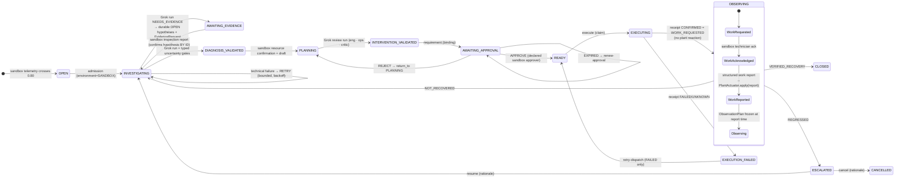
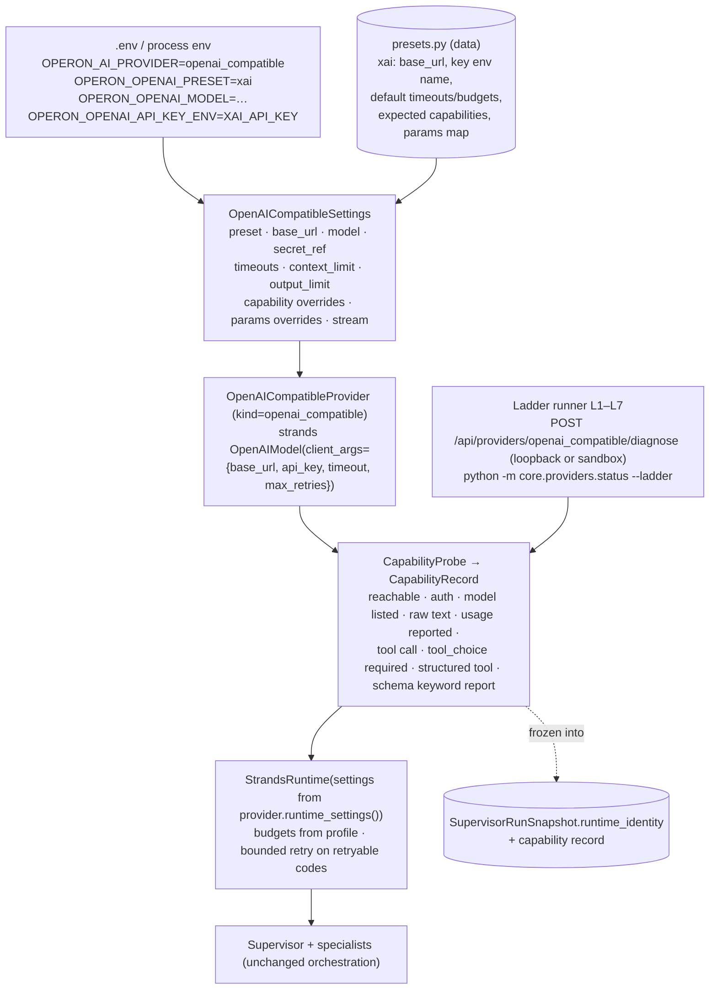
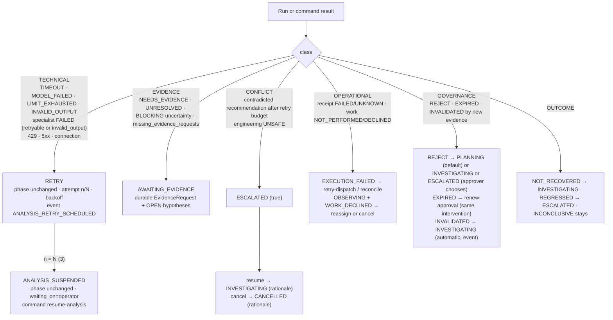
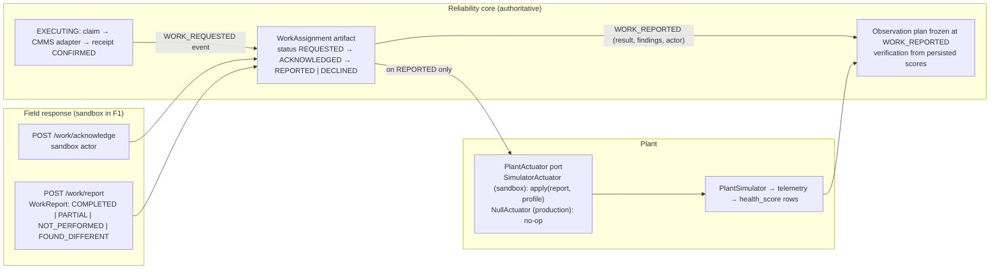

# OPERON V2 — F1A: Architecture reconciliation and functional recovery plan

Status: **planning gate, uncommitted, awaiting product-owner review.** No application code was changed.
This document plans F1; it does not implement it. Evidence base: the F0 audit (`10-functional-platform-architecture-audit.md`)
re-checked against the code at `9f85a4e` where F1 depends on it.

Labels: **[V]** verified in code this phase (file:line at `9f85a4e`) · **[F0]** taken from the audit without re-verification ·
**[P]** proposed · **[D]** needs a product-owner decision (collected in §19).

Baseline [V]: branch `v2/phase4a-visual-gate`, HEAD `9f85a4e` = `origin/v2/phase4a-visual-gate`; 5 commits ahead of
`origin/overhaul/v2` (`19cc21a`), 16 ahead of `origin/main` (`0594d16`, untouched). Working tree: only the two untracked
design documents (`10-…` and this file). The F0 audit is **not committed** (by instruction). No other modifications.

---

## 1. Executive decision

**F1 is "a real model completes one governed sandbox lifecycle", not "add Grok".** The code confirms F0: with every provider
defect fixed, a live model still cannot pass today's gates (honest uncertainty is refused, mechanism text must match
verbatim, one technical failure escalates permanently, and the live confirmation path is disabled). F1 therefore has
five inseparable parts, each small:

1. **Provider:** one generic `openai_compatible` provider with xAI as a data preset, a capability probe and a diagnostic ladder.
2. **Contracts and gates:** typed uncertainty with severity; durable hypothesis identity instead of text equality; budgets per profile.
3. **Recovery semantics:** technical failures retry; governance exceptions return to planning; only true escalation reaches ESCALATED; `resume`, `cancel`, `retry-dispatch`, `renew-approval` become callable commands over transitions the graph already allows.
4. **Work boundary:** a `WorkAssignment` with acknowledge/report, a `PlantActuator` port, and verification that starts only after a work report. The simulator stops reacting to dispatch.
5. **Sandbox truth:** environment label on every incident, a declared sandbox actor on every human command, run telemetry with no silent fallback, PRISM off by default.

Everything else named in the new platform direction (§2A–2H of the brief) is a **seam to preserve**, not work to do.
The smallest correct F1 is estimated at **seven slices (§20)**, touching about 20 backend modules and no frontend screens
beyond labels.

---

## 2. F0 conclusions: accepted, refined, challenged

| # | F0 conclusion | Status | Evidence this phase |
|---|---|---|---|
| 1 | Promotion demands zero uncertainty while the prompt asks for it | **Accepted, mechanism refined.** Free-text `uncertainties` become `blockers` in `assemble_result` (`orchestration.py:219`), so the run's disposition is `UNRESOLVED` → `_settle` returns `NEEDS_EVIDENCE` (`lifecycle.py:469-470`) → **AWAITING_EVIDENCE, not ESCALATED**. If a confirmation exists, `_audit_result` still refuses (`promotion.py:508`), again as NEEDS_EVIDENCE. The honest-model failure mode is an **endless INVESTIGATING ↔ AWAITING_EVIDENCE loop**, never a visible escalation. | [V] |
| 2 | Exact-string mechanism binding | **Accepted and sharpened.** `promotion.py:648-649` compares `confirmation.confirmed_mechanism == selected.mechanism`. The confirmation is written while the case waits, but promotion happens in a **new** run with new report-local keys and freshly generated text; only the Guided Demo passes because it copies the previous report's text (`demo_scenario.py:190-204`). A live model paraphrases, so this gate fails on the second run almost by construction. | [V] |
| 3 | Planner required inside the DIAGNOSIS run | **Accepted.** `start_run` supports only `DIAGNOSIS` and `INTERVENTION_REVIEW` (`promotion.py:337-353`); `_binding` needs `maintenance_plan_key` from a report (`promotion.py:748-760`); the review stage requires a draft that itself needs the plan. The plan can only come from the diagnosis run. | [V] |
| 4 | Budgets: 32k cumulative, 100k cap, 2500 max_tokens, 240 s run | **Accepted.** `runtime.py:43-52`, `base.py:102-103`. | [V] |
| 5 | One self-corrected schema retry counts as failure | **Accepted** for the supervisor (`orchestration.py:338-341`) and specialists (`invocation.py:70-75, 98-99`). | [V] |
| 6 | One failure is permanent | **Accepted** (`_settle`: every non-`MODEL_COMPLETED` completion and every `BLOCKED` disposition → ESCALATED, `lifecycle.py:458-467`). | [V] |
| 7 | No retry on agent calls | **Accepted** (`retry_strategy=None`, `runtime.py:166`). The engine does have a scheduling-level backoff for `PromotionRefused RETRY` (`engine.py:1092-1125`), which F1 can reuse. | [V] |
| 9 | Vendor packaging defects | Taken from F0; irrelevant once the generic provider exists. | [F0] |
| 11 | Live path stops at AWAITING_EVIDENCE | **Accepted** (`server/main.py:202-207`). | [V] |
| 19.4 | "Dead-end states have no exits" | **Challenged in part.** The graph already allows ESCALATED → INVESTIGATING/CANCELLED and EXECUTION_FAILED → READY/INVESTIGATING/ESCALATED/CANCELLED (`state.py:23-27`). The service already has `retry_execution` (`lifecycle.py:869-882`), `reconcile` (`:884-905`), and `request_approval` **re-issues after EXPIRED** (`:620-625`, tested at `test_reliability_lifecycle.py:350`). What is missing is **callers**: no engine or API command invokes them, nothing performs ESCALATED → INVESTIGATING, and nothing ever writes CANCELLED. F1's recovery work is therefore mostly command plumbing, not state-machine surgery. | [V] |
| 19.8/9 | Simulator is the actuator; recovery is immediate on dispatch | **Accepted and extended.** `engine.execute` calls `sim.respond_to_intervention` on receipt (`engine.py:1688`); restart re-applies it from the fresh profile and **can flip a PERSISTS scenario into recovery** (`engine.py:279`; asserted as intended in `test_engine_lifecycle.py:448-450`). Rejection sets the simulator to `failing` (`engine.py:1722`). | [V] |
| §5.2 | "Named `tool_choice` is mandatory" | **Challenged.** Strands registers the output model as an ordinary tool, lets the model call it freely, and only if the turn ends without it **forces once with `tool_choice={"any": {}}`** (`_structured_output_context.py:87`, `event_loop.py:366-374`), which the OpenAI adapter sends as `"required"` (`strands/models/openai.py:355`). The provider must support tools and `tool_choice: required`; a *named* choice is not required. Streaming is default but switchable (`stream` config, `openai.py:508-509`). | [V] |
| §5.2 | Generic OpenAI-compatible provider, presets as data | **Accepted** (§4). `openai` is not installed (`ModuleNotFoundError`); Strands 1.54.0 ships `strands.models.openai.OpenAIModel` with `client_args` (`base_url`, `api_key`, `timeout`, `max_retries`). | [V] |
| §23 | Three passing runs on separate days | **Challenged** (§12.3). Separate days measure provider drift, an operations property; F1 proves function. | [P] |
| §6 | Remove PRISM in F1 | **Narrowed** (§9): disable, isolate and leave inert; no package or table removal in F1. | [P] |

Additional verified facts that shape the plan [V]:

- `HypothesisSuggestion.key` is already a report-local identity (`contracts.py:33-39`); durable `Hypothesis` records are created only at promotion (`promotion.py:665-677`). Durable identity therefore has to be created **earlier**, when the run parks the case.
- `TrustedTechnicalConfirmation` already carries `source`, `actor_id` and `provenance` (`models.py:382-392`); `Evidence.provenance` is `OBSERVED | SIMULATED | DERIVED` (`:179`); `Incident.mode` is `LIVE | DETERMINISTIC | MIXED` (`:73`); reasoning provenance is `LIVE | INJECTED | SIMULATED` (`reasoning/provenance.py`). The vocabulary exists; it is not joined up.
- Artifacts and events are JSON rows (`incident_artifact.body_json`, `incident_event.payload_json`, no `CHECK` on kind or type; `001_operon.sql:16-33`). New artifact kinds and event types need **no migration**. Only `incident.phase` is constrained (`:4-7`), so **adding a phase would need a table rebuild**. This drives §6 and §7 toward events, not phases.
- Admission is released only by CLOSED/CANCELLED (`ix_incident_active_admission`), and the engine never prunes `alerts[eid]` (no `pop`/`del` in `engine.py`), so even a cancelled case blocks its asset until restart.
- The test suite blocks all network access (`tests/conftest.py:48-66`) and forces the deterministic mode; live validation needs a separate, explicitly gated harness.

---

## 3. Minimal F1 scope

### 3.1 The lifecycle F1 must complete

The brief's target sequence maps onto the existing graph without new phases. Three things change inside it: the parked
case gains durable hypotheses (so a human can confirm by identity), OBSERVING gains a work sub-state carried by events,
and the actuator is separated from the plant.



**Diagram A.** Solid arrows exist today; the labels in italics-free text name what F1 adds on each edge. Phases are unchanged.
The work sub-states are **events** (§7), not phases.

### 3.2 In scope (the smallest set that makes the diagram true)

| Area | F1 delivers | Why it cannot be dropped |
|---|---|---|
| Provider | `openai_compatible` provider, `xai` preset, capability probe, ladder L1–L7 API + CLI, `openai` dependency | No Grok without it |
| Contracts | typed `Uncertainty`; `durable_hypothesis_id` on suggestions; durable OPEN `Hypothesis` at park time; confirmation by hypothesis id | Gates 1 and 2 otherwise fail every live run |
| Budgets | profile-owned budgets; validator caps raised; bounded retry on retryable codes; schema self-correction counted as success | Gates 4, 5, 7 |
| Settle semantics | `_settle` classifies technical vs evidence vs true escalation; bounded automatic RETRY; `ANALYSIS_SUSPENDED` after N attempts | Gate 6 |
| Commands | `resume`, `cancel`, `retry-dispatch`, `renew-approval`, REJECT with `return_to`; `alerts` pruned on terminal phases | Recoverable states; asset not blocked forever |
| Sandbox inputs | technical confirmation (by id), resource confirmation and draft binding through an API gated by **sandbox mode**, each with a declared sandbox actor | The live path otherwise stops at AWAITING_EVIDENCE |
| Work boundary | `WorkAssignment` artifact; `acknowledge` and `report` commands; `PlantActuator` port with `SimulatorActuator` (sandbox) and `NullActuator`; verification waits for a work report | The brief's hard rule: dispatch ≠ recovery |
| Provenance | `Incident.environment`; `ActorRef` on confirmations, decisions, work events; production refuses SIMULATED at gates | Sandbox records unmistakable |
| Observability | `RunTelemetry` artifact per run; `GET /api/incidents/{id}/runs/{run_id}`; INFO JSON logging; no fallback without a label | Diagnosable failures; gate evidence |
| PRISM | off by default behind `OPERON_PRISM=1`; engine couplings guarded | Removes the deterministic substitution path from the proof |
| Frontend | **labels only**: sandbox badge text, work sub-state line, "Analysis suspended" reason. No redesign | Truthfulness of what the tester sees |

### 3.3 Deliberately out of scope

See §17. In one line: anything the brief lists under 2A–2H, F2–F8, or §14 of the brief.

---

## 4. Proposed provider abstraction

### 4.1 Minimum correct abstraction [P]

The existing boundary (`ModelProvider`, `ProviderRegistry`, `RuntimeSettings`, `ProviderError`) is sound. What breaks
genericity is the `Literal["gemini","ollama","bedrock"]` and the vendor branches in `provider_for_settings`
(`runtime.py:17, 72-102`) and `runtime_settings_for` (`reasoning/backend.py:173-186`). F1 replaces the branches with
two provider methods and adds one provider kind.



**Diagram B.** One provider kind; the preset is data; capabilities are probed and frozen into each run's identity.

Configuration fields (all non-secret except the key, which is only ever an **environment variable name**):

| Field | Source | Notes |
|---|---|---|
| `kind` | fixed `openai_compatible` | one class, no `GrokProvider` |
| `preset` | env / Settings | `xai` first; `generic` for any other endpoint |
| `base_url` | preset default; env override | **not updatable through the API** in F1 (§13) |
| `api_key_env` | preset default (`XAI_API_KEY`), env override | the provider reads `os.environ[api_key_env]`; `CredentialStatus.source="environment"`; never persisted, never echoed |
| `model` | env / Settings | no default frozen in code for xAI; chosen from the live `/models` list at F1.3 (brief §4) |
| `timeouts` | preset default (hosted: connect 5, first token 60, invocation 300, run 900) | `TimeoutPolicy`, overridable |
| `context_limit`, `output_limit` | preset default or probe | used to size `max_total_tokens` and `max_tokens` |
| `capabilities` | probe result with optional overrides (`force_true`/`force_false`) | `Capabilities` gains `tool_choice_required`, `usage_in_stream`, `json_schema_response`, `reasoning_params` |
| `params` | preset map | e.g. `max_tokens` vs `max_completion_tokens`; reasoning parameters; sampling params dropped for reasoning models |
| `stream` | preset default true | Strands `OpenAIModel` honours `stream=False` |

Budgets move from `RuntimeSettings` defaults to the profile: hosted defaults `max_tokens` 8k (validator cap → 32k),
`max_total_tokens` 200k (cap → 1M), `max_turns` 12. The validator caps are raised, not removed.

**Retry [P]:** `StrandsRuntime` receives a `ModelRetryStrategy` (Strands) or the OpenAI client's `max_retries` for
`rate_limited`, `timeout`, `provider_unreachable` and 5xx, bounded (3 attempts, jitter), and a per-profile token bucket
for requests per minute. Retries are counted in telemetry (§10). A **structured-output self-correction that succeeds is
success**: `invalid_output` is set only when the final structured output is absent or invalid.

**Error normalization [P]:** `normalize_exception` gains a branch for the `openai` SDK (`APIStatusError.status_code`,
`APITimeoutError`, `APIConnectionError`, `RateLimitError`) and for Strands `StructuredOutputException` (→ new code
`invalid_output`, not retryable at transport level) and `MaxTokensReachedException` (→ `output_truncated`). Two new
`ProviderErrorCode`s; the rest map onto existing codes.

### 4.2 Diagnostic ladder [P]

The brief's ladder is adopted with one reorder: reachability is tested before credentials, because a 401 proves the
endpoint is reachable and an unreachable endpoint cannot say anything about credentials.

| Level | Check | Pass evidence | Failure says |
|---|---|---|---|
| L1 | Configuration present: preset resolves, model non-empty, `api_key_env` names a set variable | config dump without secret | which field is missing |
| L2 | Endpoint reachable: `GET {base_url}/models` within connect timeout, TLS ok (any HTTP status) | status, latency | DNS / proxy / TLS / timeout |
| L3 | Credentials accepted: the same call returns 2xx | masked key fingerprint (last 4) | 401/403 |
| L4 | Model available: configured model in the list, or a 1-token completion succeeds | model id, list size | `model_not_found` with the list |
| L5 | Raw completion: short prompt → text; usage present (streamed and non-streamed) | tokens in/out | missing usage → `usage_in_stream=false` recorded, not failed |
| L6 | Structured output: a 6-field OPERON-shaped Pydantic model via the Strands structured-output tool, first unforced then forced (`tool_choice: required`); **schema-keyword report**: which contract keywords (`minLength`, `pattern`, `maxItems`…) the endpoint rejected | validated object; keyword report | which path failed and the provider's error text (redacted) |
| L7 | Tool round-trip: model calls a named tool with valid arguments, receives a tool result, continues; `tool_choice: required` honoured | transcript metadata | tool arguments invalid / choice ignored |
| L8 | Supervisor smoke: one DIAGNOSIS run on the frozen fixture packet completes `MODEL_COMPLETED` within budget | run telemetry | normalized error + stop reason per agent |
| L9 | Lifecycle (§12) | gate report | failing criterion |

L1–L7 run from `python -m core.providers.status --ladder` and from `POST /api/providers/openai_compatible/diagnose`
(loopback or sandbox mode only). L8–L9 are the live harness (§11 F). Each level returns a typed `LadderStep` with
`status`, `evidence`, `remedy`; the whole result is redacted and persisted under `data/diagnostics/`.

**What L6 must settle before any contract is sent to xAI [P]:** F0 recorded that xAI's `json_schema` response format
rejects length and pattern keywords. Strands sends the output model as a **tool parameter schema**, which may or may not
be validated the same way; nobody knows until L6 runs. If keywords are rejected, F1 strips them from the *transmitted*
schema (Pydantic `json_schema` post-processing in the provider) and keeps them as **local validation** when the object
comes back. No contract constraint is loosened.

---

## 5. Agent contract and promotion redesign

### 5.1 What evidence must OPERON actually have before promoting a diagnosis? [P]

Keep the strong gates (`promotion.py:624-663`): a recommended hypothesis with uncontradicted support that includes
non-model technical evidence; a trusted confirmation **of that hypothesis**; critic ACCEPT of the exact inputs; fresh
frozen packet. Replace two brittle *proxies*:

| Today | Problem | Replacement |
|---|---|---|
| `not assessment.uncertainties` for every assessment (`:508`) and for critics (`:590`) | Treats any honesty as a blocker | `not blocking(assessment.uncertainties)`; MATERIAL uncertainties must be acknowledged by the critic and are carried to the approver |
| `confirmation.confirmed_mechanism == selected.mechanism` (`:648-649`) | Text equality across runs | `confirmation.hypothesis_id == selected.durable_hypothesis_id` and `failure_mode_code` consistency |

Classification the gates must distinguish (brief §5):

| Situation | Typed representation | Effect |
|---|---|---|
| Acceptable uncertainty | `Uncertainty(severity=RESIDUAL)` | recorded in `confidence_basis`; no gate |
| Material uncertainty | `Uncertainty(severity=MATERIAL)` | critic must list it in `acknowledged_uncertainties`; copied into `ApprovalRequirement.conditions` so the approver sees it; no block |
| Unresolved evidence that blocks | `Uncertainty(severity=BLOCKING, resolvable_by=EvidenceNeed)` or `missing_evidence_requests` | `NEEDS_EVIDENCE` → AWAITING_EVIDENCE with a durable `EvidenceRequest` and durable OPEN hypotheses |
| Conflicting evidence | `contradicting_evidence_ids` non-empty on the recommended hypothesis, or critic `contradictions` | gate refuses; after the retry budget, **ESCALATED** (true human review) |
| Insufficient evidence | no hypothesis recommended; critic `NEEDS_EVIDENCE` | NEEDS_EVIDENCE, as above |
| Provider/schema failure | `termination_reason` ≠ `MODEL_COMPLETED`, `invalid_output`, specialist `FAILED` with a retryable or `invalid_output` code | **RETRY** (§6), never NEEDS_EVIDENCE, never ESCALATED on the first attempts |

### 5.2 Contract changes [P]

```text
Uncertainty            { statement: Text, severity: RESIDUAL|MATERIAL|BLOCKING, resolvable_by: EvidenceNeed|None }
SpecialistAssessment   uncertainties: tuple[Uncertainty, ...]          # was Observations (free text)
CriticAssessment       acknowledged_uncertainties: References           # statements it has weighed
HypothesisSuggestion   durable_hypothesis_id: Reference | None          # links to an OPEN Hypothesis artifact
SpecialistContext      artifacts may include Hypothesis                 # OPEN hypotheses are shown to the next run
TrustedTechnicalConfirmation  hypothesis_id: Identifier (replaces confirmed_mechanism as the binding key;
                              confirmed_mechanism stays as human text), actor: ActorRef
schema_version 1 → 2 with a lenient upgrader: a string uncertainty from a v1 payload becomes BLOCKING (conservative).
```

**Durable hypotheses at park time [P]:** when `_settle` returns NEEDS_EVIDENCE and the report has a `candidate_diagnosis_key`,
`LifecycleService.diagnose` persists one `Hypothesis(status=OPEN)` per competing suggestion (mechanism, support,
falsification tests, `evidence_request_ids`) in the same checkpoint as the AWAITING_EVIDENCE transition, and records
the mapping `run_id/key → hypothesis_id` in the event payload. The next run's context includes those artifacts; the
diagnostic prompt instructs: "when a competing hypothesis matches an OPEN durable hypothesis, set
`durable_hypothesis_id`; otherwise leave it null". At promotion the selected suggestion must carry a
`durable_hypothesis_id` equal to the confirmation's `hypothesis_id`, and the promoted `Hypothesis` **supersedes** the
OPEN one (`supersedes_id`). If the model recommends a hypothesis that was not confirmed, the gate refuses with
`NEEDS_EVIDENCE: confirmed hypothesis is not the recommended one` and the case parks again with the new OPEN set.

**Planner in the diagnosis run:** unchanged in F1. The supervisor prompt already describes the full workflow
(`supervisor.py:45-48`); F1 adds one sentence making the planner mandatory for a DIAGNOSIS run that will be bound.
Splitting planning into its own stage is a real improvement but not required for the proof; listed in §19.

**Budgets and failure handling** are in §4.1 and §6. **Rate limiting:** per-profile token bucket in `StrandsRuntime`.
**Escalation semantics:** §6.

---

## 6. Error and recovery semantics

### 6.1 Classification [P]



**Diagram D.** Only CONFLICT, REGRESSED and an approver's explicit choice reach ESCALATED.

### 6.2 Transition table (smallest state-machine change) [P]

| Error | Automatic retry | Manual retry | Resume from checkpoint | Invalidates previous result | Human intervention | Cancel |
|---|---|---|---|---|---|---|
| Provider timeout / 429 / 5xx / connection | yes, ≤3 with backoff (engine scheduler, `_reasoning_retries`) | `resume-analysis` after suspension | the run snapshot stays; a **new run** starts (runs are immutable) | no | after N | yes |
| Malformed structured output | Strands self-correction once; then counts as INVALID_OUTPUT → technical retry | same | same | no | after N | yes |
| Specialist failed | same as above | same | same | no | after N | yes |
| Budget exhausted | **no** automatic retry with the same budget; one retry with the next budget tier if the profile defines one | `resume-analysis` after raising budget | same | no | yes | yes |
| Insufficient / blocking uncertainty | no | sandbox inspection report | AWAITING_EVIDENCE → INVESTIGATING (exists) | no | yes (technician) | yes |
| Conflicting evidence | no | `resume` after review | ESCALATED → INVESTIGATING | current diagnosis stays until superseded | yes | yes |
| Receipt FAILED | no | `retry-dispatch` (exists as `retry_execution`) | EXECUTION_FAILED → READY | no | yes | yes |
| Receipt UNKNOWN | no | `reconcile` then manual | never replayed (`:869-882`) | no | yes | yes |
| Work declined / not performed | no | `reassign` (new WorkAssignment) | stays OBSERVING | no | yes | yes |
| Approval REJECT | no | — | AWAITING_APPROVAL → PLANNING / INVESTIGATING (graph exists) | current intervention consumed (new draft required) | yes | yes |
| Approval EXPIRED | no | `renew-approval` (exists as `request_approval`) | stays AWAITING_APPROVAL | no | yes | yes |
| Invalidated by new technical evidence (`promotion.py:729-735`) | automatic transition to INVESTIGATING with event | — | — | approval requirement INVALIDATED | no | yes |

Rules [P]:

- **Resume is never a state write.** Every command above is `LifecycleService.<command>(incident_id, expected_revision, actor, rationale)` → `repository.transition` (graph-validated, `repository.py:transition`) plus an event with `actor` and `rationale`. No command sets artifacts, pointers or phases directly.
- **CANCELLED** is reachable from every active phase (graph already allows it) via `cancel`; it releases admission. The engine prunes `alerts[eid]` and `incidents[eid]` on CLOSED and CANCELLED so the asset can open a new case.
- **`_settle` becomes a pure classifier returning one of `PROMOTE | NEEDS_EVIDENCE | RETRY | ESCALATED`** with a typed reason (`category`, `code`, `attempt`), and `diagnose`/`review_draft` apply the table. The retry budget is durable (count of `ANALYSIS_RETRY_SCHEDULED` events for the current revision), so restarts do not reset it.
- **Suspension is not a phase.** `ANALYSIS_SUSPENDED` is an event plus a projection field (`analysis: {state: "suspended", reason, attempts}`); the UI shows "Analysis suspended: {reason}" in the existing status line.

---

## 7. Work / field-response boundary

### 7.1 Separation [P]



**Diagram C.** Work requested, acknowledged and reported are facts about people. Plant response is a fact about the
asset. Verified recovery is a fact OPERON derives from persisted scores. None implies another.

### 7.2 Design decisions

- **No new phase.** `EXECUTING → OBSERVING` stays the receipt transition (`lifecycle.py:record_receipt`). OBSERVING carries a `work` sub-state from events; the projection exposes `work: {assignment_id, status, assignee, acknowledged_at, reported_at}`. Reason: `incident.phase` is `CHECK`-constrained (`001_operon.sql:4-7`); adding a phase means a SQLite table rebuild plus every stage map; events are additive and already the audit record.
- **`WorkAssignment` artifact** (JSON, no migration): `intervention_id`, `intervention_hash`, `receipt_id`, `external_ids` (work order), `worker_ref` (today a `technician_id` from the binding; **not** a user account), `channel` (`operon.sandbox` now; later `operon.inbox`, `email`, `webhook`…), `status`, `requested_at`, `acknowledged_at`, `reported_at`, `actor` per transition. Created by the executor in the same checkpoint as the receipt. This is the seed for internal and external workers (brief 2B): the channel and `worker_ref` are opaque to the lifecycle.
- **`WorkReport`** is submitted as `Evidence(kind="work_report")` (one new kind in the Literal) with `source_capability="operon.report_work"`, `source_system=VALIDATOR`, provenance `SIMULATED` in the sandbox, `derived_from_ids` = the assignment, payload: `result`, `performed_steps[]` (checked against the intervention's steps), `findings` text, `parts_used`, `performed_at`, `actor`. Because it is evidence, freshness, provenance DAG and the inspector already know how to show it.
- **Verification waits for the report.** `OutcomeVerifier.verify` returns disposition `AWAITING_WORK` (no outcome, stays OBSERVING) until a `work_report` with result `COMPLETED` or `PARTIAL` exists; the `ObservationPlan` is frozen with `observation_start = after(reported_at)` instead of the receipt time (`outcome.py:observation_start`). `NOT_PERFORMED`/`DECLINED` → event `WORK_DECLINED`, verification stays `AWAITING_WORK`, commands `reassign` or `cancel`.
- **`PlantActuator` port** (`core/services/base.py`): `apply(asset_id, report) -> ActuationRecord`. `SimulatorActuator` maps `COMPLETED` → profile `intervention_response` (`RECOVERS` → recovering, `PERSISTS` → unresponsive), `PARTIAL` → profile-defined, `NOT_PERFORMED` → no change. `NullActuator` for production. The engine calls the port **only from the WORK_REPORTED handler**; `engine.execute` no longer touches the simulator (`engine.py:1688` removed), `reject` no longer sets `failing` (`:1722` removed; a scenario may do it later), and restart recovery (`:279`) **replays durable work reports** through the actuator instead of calling `respond_to_intervention`, so a restart can no longer flip an outcome.
- **Not another demo shortcut.** The Guided Demo in F1 keeps working by acting through the same public commands (it already calls engine methods for confirmations, `engine.py:657, 680`); it must additionally post an acknowledgement and a `COMPLETED` work report with `actor.kind=SCENARIO`. It gets no private path.

### 7.3 Sandbox field interface (F1 API) [P]

| Command | Body | Gate | Effect |
|---|---|---|---|
| `POST /api/incidents/{id}/work/acknowledge` | `assignment_id`, `expected_revision`, `actor` | sandbox mode | `WORK_ACKNOWLEDGED` |
| `POST /api/incidents/{id}/work/report` | `WorkReport`, `expected_revision`, `actor` | sandbox mode | evidence + `WORK_REPORTED` + actuator |
| `POST /api/incidents/{id}/inspections` | `TrustedTechnicalConfirmation` (by `hypothesis_id`), `actor` | sandbox mode | replaces `/confirmations/technical` semantics; the old route stays for compatibility and gains the same actor requirement |
| `POST /api/incidents/{id}/confirmations/resource`, `/drafts` | as today + `actor` | sandbox mode | unchanged otherwise |

A single sandbox page is *not* required for the proof; the harness and the CLI exercise these. A minimal "Sandbox field
response" panel on the existing Simulation page is a stretch goal with no new design.

---

## 8. Provenance and sandbox model

### 8.1 Keep the repo's two axes; add the two missing ones [P]

| Axis | Existing | F1 adds |
|---|---|---|
| What the data describes | `Evidence.provenance: OBSERVED | SIMULATED | DERIVED`; `ModelSignal.input_provenance`; `Outcome.basis` | nothing (sufficient) |
| Who reasoned | reasoning provenance `LIVE | INJECTED | SIMULATED`; `Incident.mode LIVE | DETERMINISTIC | MIXED` | `Incident.mode` actually maintained: LIVE when every promoted run is LIVE, MIXED otherwise |
| **Who acted** | `actor_id` strings | `ActorRef { id, kind: SANDBOX_DECLARED | AUTHENTICATED (reserved) | SCENARIO | SYSTEM | MODEL, label, role }` on approval decisions, confirmations, work events, lifecycle commands |
| **Where** | none | `Incident.environment: SANDBOX | PRODUCTION | LEGACY` (default LEGACY for pre-F1 rows) set at admission from `OPERON_ENVIRONMENT`; projected and shown |

Mapping to the brief's list: REAL = `OBSERVED`; SIMULATED = `SIMULATED`; USER_ENTERED/SANDBOX_ACTOR = `actor.kind=SANDBOX_DECLARED`
(the observation it reports keeps its own provenance, SIMULATED in a sandbox); MODEL_DERIVED = reasoning `LIVE` plus
run id on the artifact; SYSTEM_DERIVED = `DERIVED` with `source_system=VALIDATOR`.

### 8.2 Does simulated evidence cross gates it should not? [V → P]

Yes: F0's finding stands. `promotion.py:653` and `:783` check only that the confirmation's provenance *matches* its
evidence; `outcome.py:527-536` labels the basis SIMULATED but still CLOSES. In a sandbox this is correct. F1 adds the
production refusal: when `incident.environment == PRODUCTION`, `submit_technical_confirmation`, `submit_resource_confirmation`,
`promote_diagnosis`, `promote_intervention` and the outcome commit refuse any SIMULATED input with a typed
`PromotionRefused("simulated evidence is not admissible in production")`. In F1 nothing runs in PRODUCTION; the test
proves the refusal exists.

### 8.3 Sandbox identity [P]

`ActorRef.kind=SANDBOX_DECLARED` is accepted only when `OPERON_ENVIRONMENT=sandbox`. The server stamps `label="Sandbox
identity (declared, unauthenticated)"` on every record it writes and the projection repeats it. Roles stay the existing
strings (`maintenance_approver`, `technician`, `dispatcher`); the role check in `decide_approval` is unchanged. Real
identity replaces this in F3 by adding `AUTHENTICATED` and refusing `SANDBOX_DECLARED` outside sandboxes.

---

## 9. PRISM runtime isolation

What must be inert for F1 to be a genuine OPERON proof [V → P]:

| Coupling | Evidence | F1 action |
|---|---|---|
| Deterministic substitution behind PRISM's slow path when the backend is `none` or the provider is unusable | `prism/operon.py:523-541` | unreachable when PRISM is off |
| Seven unauthenticated `/api/prism*` routes that can drive promotion | `server/prism_api.py` | registered only when `OPERON_PRISM=1` |
| Engine constructs `PrismRuntime`, recovers sessions at start, resets, and **suppresses normal diagnosis** while a PRISM run is active | `engine.py:161-183, 307-313, 362-364, 1081-1088, 1891` | guarded by the flag; `prism.overview()` in the snapshot becomes `{"enabled": false}` |
| Frontend PRISM state (legacy Agent page) | `frontend/src/state/prism.js` | untouched; it shows "unavailable" (legacy pages are not retired, decision 13) |
| Migration `008` and tables | forward-only | untouched; inert |
| 79 PRISM tests | `tests/test_prism_*.py` | run with the flag set in their fixtures; still pass |

Nothing is deleted. Removal is a later decision (§19).

---

## 10. Observability requirements

Minimum run telemetry, persisted as a `RunTelemetry` artifact (JSON) per run, keyed by `run_id`, written by the local
backend as the run proceeds (progress) and finalized with the report [P]:

| Field | Source |
|---|---|
| `provider`, `preset`, `model`, `base_url_host`, `capability_record` | provider / probe |
| `backend`, `provenance` (`LIVE` / `INJECTED` / `SIMULATED`), `deterministic_fallback: false` (always false in F1; a true value is a gate failure) | `reasoning/provenance.py` |
| `agents[]`: role, key, started_at, ended_at, duration_ms, usage in/out/total (from Strands metadata), stop_reason, structured_output_attempts, tool_calls, normalized `error_code`, redacted `error_message` (≤400 chars) | `SupervisorRun.notify` hooks + `AgentResult.metrics` |
| `retries[]`: attempt, category, code, delay | engine scheduler |
| `settle`: category, code, disposition, phase_before, phase_after, attempt | `_settle` |
| `correlation`: incident_id, run_id, input_revision, snapshot_id, report_id | existing |

Rules: **no `reasoningContent` deltas are stored** (dropped at the stream handler); no prompts or transcripts by default;
`OPERON_RUN_EXCERPTS=1` stores bounded, redacted request/response excerpts (first and last 2 KB) for debugging in the sandbox
only. Access: `GET /api/incidents/{id}/runs/{run_id}` (sandbox or loopback) and `python -m core.reasoning.dump --run`.
Logging: `run.py` gains `--log-level` with INFO JSON lines to `data/logs/operon.jsonl` when `OPERON_ENVIRONMENT=sandbox`.
The existing in-memory `_reasoning_diagnostics` ring (`engine.py:1001-1040`) is exposed read-only at `GET /api/diagnostics/scheduler`.

---

## 11. Test architecture

Existing tests stay green and keep their value; they are **necessary, not sufficient**. New layers:

| Layer | Module(s) | Doubles | Asserts |
|---|---|---|---|
| A. Provider contract | `tests/providers/test_openai_compatible.py`, `test_ladder.py` | `respx`/`httpx.MockTransport` fake OpenAI server with switches (no tools, no `required`, rejects `pattern`, drops usage, 429 then 200, slow first token) | config → client args; each ladder level passes/fails for the right reason; capability record; keyword stripping; error normalization; secret never in any dict |
| B. State machine | `tests/test_recovery_commands.py` | none (SQLite) | every row of §6.2: `resume`, `cancel`, `retry-dispatch`, `renew-approval`, REJECT `return_to`, invalidation event, admission released after cancel, alerts pruned; graph refuses the rest |
| C. Agent contract | `tests/test_contracts_v2.py`, extend `test_promotion.py` | `ScriptedModel` | typed uncertainty gates (RESIDUAL passes, MATERIAL needs critic ack, BLOCKING parks); durable hypotheses created at park; confirmation by id promotes with paraphrased mechanism text; v1 payload upgrade; schema self-correction counted as success; LIMIT/TIMEOUT → RETRY not ESCALATED; N retries → suspended |
| D. Work / field response | `tests/test_work_boundary.py` | `SimulatorActuator`, `NullActuator` | dispatch produces no simulator change; ack/report events; `AWAITING_WORK` until report; plan starts at report time; `NOT_PERFORMED` → declined path; restart replays reports deterministically (the `:448-450` assertion is inverted on purpose) |
| E. Lifecycle integration | extend `test_engine_lifecycle.py` | `ScriptedModel` + sandbox actors | the full Diagram A path offline, including one NOT_RECOVERED loop, one REJECT → PLANNING, one expiry renewal, one fault injection per technical class |
| F. Real Grok sandbox validation | `tests/live/test_xai_lifecycle.py` | **none** | §12; skipped unless `OPERON_LIVE_PROVIDER=openai_compatible` and the key env is set; the conftest network block is lifted **only for the preset host** |

The live harness writes `design/v2/evidence/f1/<run_id>/` with: the ladder result, every `RunTelemetry`, the event log,
the list of HTTP calls (host, path, status, bytes, duration; no bodies), the transmitted packet digests, every structured
output, the state transitions and the final outcome. That directory is the gate evidence; it contains no secret and no
chain of thought.

---

## 12. Grok validation procedure

1. **Pre-flight (human, documented in the run folder):** read the live xAI docs for base URL, current models, structured output and tool support, context and output limits, parameter differences; pick the model; record the date. Nothing is frozen in code.
2. **Secrets:** `XAI_API_KEY` set in the shell or `.env` (gitignored); never pasted into chat, never in `.env.example` beyond the variable name.
3. **Ladder:** `python -m core.providers.status --ladder` must pass L1–L7; the capability record is saved.
4. **Sandbox:** `OPERON_ENVIRONMENT=sandbox OPERON_PRISM=0 OPERON_AI_PROVIDER=openai_compatible OPERON_OPENAI_PRESET=xai` with the `demo-plant` seed on a fresh DB; the Guided Demo is **not** used.
5. **Lifecycle run (L9):** the harness drives one degrading asset; every human step is performed through the sandbox API with a declared actor and recorded; the work report is `COMPLETED` on a `RECOVERS` profile.
6. **Failure-to-recover run:** same with a `PERSISTS` profile → `NOT_RECOVERED` → INVESTIGATING, then `cancel`.
7. **Fault-injection run:** a proxy in front of the preset host injects one 429, one 30 s stall, one malformed tool argument; expected: retries recorded, no escalation, no deterministic output anywhere.
8. **Restart run:** kill the process during the second specialist and again between receipt and work report; expected: run marked `CANCELLED` with its partial audit (`promotion.py:413-425` already does this), no auto re-run, work state intact, outcome unchanged.
9. **Repeat** step 5 until three consecutive passes on the same commit and model (§12.3).
10. **Report:** the run folders plus a one-page summary; the summary states what hit xAI (counts, bytes) and confirms nothing deterministic ran.

### 12.3 Repeatability criterion [P]

Replace "three runs on separate days" with:

- **3 consecutive passes** of step 5 on the same commit, model and capability record, in one validation session;
- **1 pass each** of steps 6, 7 and 8;
- **1 additional pass of step 5 after any code change** to the modules in §14 before the gate is declared met;
- a flake that passes on re-run is a **failure** until root-caused and either fixed or documented as provider nondeterminism with the telemetry attached.

Model drift across days is real but belongs to the operations and hardening phase (F8), where a scheduled smoke run of the
ladder plus L8 catches it.

---

## 13. Exact acceptance criteria: "OPERON works with Grok"

All criteria must hold on the runs of §12. **No deterministic advisory, injected model or Guided Demo controller may
participate in any counted run.** Each run's telemetry proves it (`provenance=LIVE`, `deterministic_fallback=false`).

| Group | # | Criterion | Evidence |
|---|---|---|---|
| Provider | P1 | Ladder L1–L7 pass; capability record persisted and frozen into every run snapshot | ladder file, snapshots |
| | P2 | Key comes from an environment variable; grep of logs, API responses, snapshots, telemetry and the evidence folder finds no secret | grep report |
| | P3 | Configured model listed or callable; model id recorded with date | L4, run folder |
| | P4 | Every agent's **final** structured output validates against its contract; attempts recorded; unsupported keywords stripped only from the transmitted schema | telemetry |
| Reasoning | R1 | DIAGNOSIS run completes `MODEL_COMPLETED` within profile budgets; diagnostic, critic and planner `SUCCEEDED` | report, telemetry |
| | R2 | The run ends NEEDS_EVIDENCE with ≥1 competing hypothesis persisted as OPEN durable `Hypothesis` and a durable `EvidenceRequest` | artifacts |
| | R3 | ≥1 `Uncertainty` with severity appears in the record; a MATERIAL one is acknowledged by the critic and appears in the approval conditions; none is silently dropped | artifacts, requirement |
| | R4 | Second DIAGNOSIS run links the recommended suggestion to the confirmed `hypothesis_id` and promotes; mechanism text differs from the first run's or the test proves equality was not used | promotion record, gate checks |
| | R5 | INTERVENTION_REVIEW run: engineering, operations, critic `SUCCEEDED`, exact draft hash reviewed, promotion by gates | promotion record |
| Governance | G1 | Requirement bound to requirement/intervention/hash/promotion/revision; approval through the API with `actor.kind=SANDBOX_DECLARED` and the sandbox label on the record | decision artifact |
| | G2 | An expired requirement is renewed by `renew-approval` and the renewed one approves (clock-advanced run) | events |
| | G3 | REJECT with `return_to=PLANNING` lands in PLANNING with a consumed intervention, not ESCALATED | events |
| Work | W1 | Receipt CONFIRMED creates a `WorkAssignment` and **no simulator state changes** at dispatch | assignment, simulator mode log |
| | W2 | Acknowledge and report by a declared sandbox technician recorded as events with actor | events |
| | W3 | The actuator is invoked only on WORK_REPORTED; the `NOT_PERFORMED` path leaves the plant unchanged and verification `AWAITING_WORK` | actuation record |
| Verification | V1 | Observation plan `observation_start` ≥ `reported_at`; `VERIFIED_RECOVERY` → CLOSED on the RECOVERS profile with `basis=SIMULATED` | plan, outcome |
| | V2 | PERSISTS profile → `NOT_RECOVERED` → INVESTIGATING; `cancel` releases admission; a new case can open on the asset | events, admission |
| Durability | D1 | Every transition persisted; after restart the projection is identical and no dispatch, run or actuation is replayed | restart diff |
| | D2 | Restart mid-run leaves a `CANCELLED` report with partial delegations and no automatic re-run | report |
| | D3 | Every artifact of model origin carries provider, model, run id, contract version and usage; `Incident.environment=SANDBOX` and `mode=LIVE` | artifact dump |
| Failure handling | F1 | Injected 429 → retry recorded → success; injected stall → `timeout` → RETRY, case stays INVESTIGATING; injected malformed output → self-correction or `invalid_output` → RETRY; three forced failures → `ANALYSIS_SUSPENDED`, then `resume-analysis` works | telemetry, events |
| | F2 | With the provider disabled, the API and projection say "Analysis unavailable: {reason}"; no deterministic advisory output exists in the DB | projection, DB query |
| | F3 | PRISM routes absent (404) and `prism.enabled=false` in the snapshot | HTTP check |
| Repeatability | X1 | §12.3 satisfied; every run folder present | folders |

---

## 14. Files and modules likely to change

| Area | Files | Nature |
|---|---|---|
| Provider | `core/providers/openai_compatible.py` (new), `presets.py` (new), `base.py` (kinds, `Capabilities`, `runtime_settings()`), `registry.py` (kind, env, updatable fields), `errors.py` (openai + strands codes), `status.py` (ladder CLI), `server/providers_api.py` (diagnose route; base_url not updatable) | add / edit |
| Runtime | `core/agents/runtime.py` (generic provider, budgets, retry, rate limit), `core/reasoning/backend.py` (remove branches, telemetry hooks), `core/reasoning/provenance.py` (kind labels) | edit |
| Contracts | `core/agents/contracts.py` (Uncertainty, ids, v2 upgrader), `core/agents/invocation.py` (self-correction, prompt line), `core/agents/supervisor.py` (prompt lines), `core/agents/diagnostic.py` (prompt) | edit |
| Gates | `core/reliability/promotion.py` (uncertainty, hypothesis id, production refusal), `orchestration.py` (blocking classification, `invalid_output` semantics), `assessments.py` | edit |
| Lifecycle | `core/reliability/lifecycle.py` (`_settle` classifier, park-time hypotheses, commands, work handlers, renew), `state.py` (no graph change expected), `models.py` (ActorRef, environment, WorkAssignment, RunTelemetry, work_report kind, event types), `outcome.py` (AWAITING_WORK, start at report), `execution.py` (assignment at receipt) | edit |
| Work / plant | `core/services/base.py` (`PlantActuator`), `core/services/adapters/local.py` (`SimulatorActuator`, `NullActuator`), `core/services/registry.py`, `core/simulator.py` (unchanged API; `respond_to_intervention` called only by the actuator) | add / edit |
| Engine | `core/engine.py` (remove `:1688`, `:1722`, `:279` actuation; replay reports; prune alerts; PRISM guard; retry classification; command plumbing; environment at admission) | edit (largest risk) |
| API | `server/main.py` (sandbox gate, actor on commands, new routes: inspections, work, lifecycle commands, runs, diagnostics) | edit |
| Demo | `core/demo_scenario.py` (confirm by id; ack + report through commands; `actor.kind=SCENARIO`) | edit |
| Config | `core/config.py` (`OPERON_ENVIRONMENT`, `OPERON_PRISM`, provider env), `.env.example`, `run.py` (`--log-level`) | edit |
| Deps | `pyproject.toml` (`openai`), `uv.lock` | add |
| Frontend (labels only) | `frontend/src/v2/model/status.js` (work sub-state, suspended), `frontend/src/v2/shell/WbShell.jsx` (environment badge text) | minimal |
| Tests | §11 modules; `tests/conftest.py` (live gate) | add |
| Docs | `docs/PROVIDERS.md`, `docs/DEMO.md` (xAI preset, sandbox mode), `.env.example` | edit |

Not changed: `core/reliability/repository.py` transaction model, `governance.py`, `freshness.py`, `evidence.py`
(except the new kind), migrations `001`–`008`, Phase 4A screens, `core/prism/*`.

---

## 15. Database and schema changes

**No table or column changes are required.** Everything F1 adds is a JSON artifact kind, a JSON event type, or a field in
`incident.state_json`:

| Change | Mechanism | Migration |
|---|---|---|
| `WorkAssignment`, `RunTelemetry` artifacts; `work_report` evidence kind | `incident_artifact(kind, body_json)` | none |
| Events `WORK_REQUESTED`, `WORK_ACKNOWLEDGED`, `WORK_REPORTED`, `WORK_DECLINED`, `ANALYSIS_RETRY_SCHEDULED`, `ANALYSIS_SUSPENDED`, `ANALYSIS_RESUMED`, `INCIDENT_CANCELLED`, `APPROVAL_RENEWED` | `incident_event(event_type TEXT)` | none |
| `Incident.environment`, maintained `Incident.mode` | `state_json` with defaults | none |
| Contract `schema_version` 2 with v1 upgrader | artifact bodies | none |
| Optional `009_f1_indexes.sql`: index on `incident_event(incident_id, event_type)` | performance only | optional, forward-only, additive |

The sandbox validation runs on a **fresh database**. Existing `data/poc.db` files keep working because every new field
has a default and old reports are upgraded on read.

---

## 16. Risks

| # | Risk | Likelihood | Mitigation |
|---|---|---|---|
| 1 | **Engine edits regress the governance core.** `engine.py` is 1,919 lines mixing loop, demo, projections, PRISM and actuation | high | slice order (§20) puts engine changes last; each slice runs the full 874 tests; actuation removal is three call sites with tests inverted deliberately |
| 2 | xAI rejects tool parameter schemas with OPERON's keywords, or ignores `tool_choice: required` | medium | L6/L7 probe before any lifecycle attempt; schema stripping with local validation; fallback to `json_schema` response format is **not** planned in F1 (would require a Strands model subclass); if `required` is ignored, F1 stops and reports |
| 3 | Grok output sizes exceed 64 KB packet or budgets; reasoning tokens consume `max_tokens` | medium | profile budgets; `output_truncated` code; telemetry shows where; evidence packet caps unchanged |
| 4 | Durable-hypothesis linking: the model fails to set `durable_hypothesis_id` | medium | prompt instruction plus a deterministic fallback that proposes the link when `failure_mode_code` and ≥50 % of supporting evidence ids match, recorded as `link_basis=application`; owner decision whether this fallback is acceptable (§19) |
| 5 | Retry classification masks a real defect as "technical" and loops | low | hard cap N=3 per revision, durable count, suspension event, visible reason |
| 6 | Verification waiting for a work report breaks the existing engine tests and Guided Demo | certain, intended | tests updated with the new semantics; demo posts the report through the public command |
| 7 | Sandbox API gate (`OPERON_ENVIRONMENT=sandbox`) misused as a production trust boundary | medium | the gate is named for what it is; production refuses `SANDBOX_DECLARED` and SIMULATED; documented in `.env.example`; no deployment in F1 |
| 8 | Cost and data: packets of sandbox evidence (6–18 KB per message, F0) go to xAI | certain | synthetic data only (decision 8); per-run spend cap from usage; redaction hook present but unused |
| 9 | `openai` SDK and Strands version coupling | low | pin `openai` compatible with `strands-agents==1.54.0`; contract tests in layer A |
| 10 | Phase 4A UI shows stale stage semantics (`status.js:69-92`, F0 #19) during F1 | certain | labels only; full fix in F4 |

---

## 17. Explicit F1 non-goals

Not in F1: platform rebuild; authentication or RBAC (declared sandbox identity only); workspaces or scopes; Slack, Teams,
email, SMS, webhook or any communication adapter; Jira, ServiceNow or CMMS beyond the local adapter; feed, notices or
inbox; public website; asset CRUD or registry; equipment taxonomy or hierarchy (the `demo-plant` seed is used as is);
PostgreSQL; projection or scale work; new screens, shell geometry, dark theme or any redesign; multi-surface work;
PRISM package or table removal; retiring legacy pages; a dedicated `GrokProvider`; any `json_schema` response-format path;
any deployment.

Seams F1 **does** leave for those phases: `PlantActuator` and the work events (2A, 2B, 2D), `ActorRef.kind` (F3 identity),
`WorkAssignment.channel`/`worker_ref` (2B, 2C), `Incident.environment` (sandbox phase F2), `RunTelemetry` (platform health),
typed events (2E feed vs audit), generic provider profile (per-role models later).

---

## 18. Reconciled F2–F8 roadmap

The provisional sequence is accepted with three adjustments.

| Phase | Content | Adjustment and dependency |
|---|---|---|
| F1 | Functional recovery and real Grok lifecycle (this plan) | includes PRISM isolation and the work/actuator seam |
| F2 | Plant/asset/equipment domain, sandbox environments, scenario director, telemetry source seam, replay source, case keying by `incident_id`, alert pruning generalized, fixtures | **Add case keying here**, not F3: multi-case data is what F3's scope model and F4's IA are designed against |
| F3 | Identity, operational scope, work model (internal/external dispatch, assignments, inbox), communication and work-management adapter **architecture**, feed/audit/inbox foundations | **Split the gate:** authentication and server-side actors must be *implemented* before anything else in F3 is exposed; the adapter families may stay as designs with one local adapter each. F3 is the deployment precondition |
| F4 | IA and surfaces: Control Center, technician/field, asset/machine, line/plant, scope navigation, Overview, case workspace (prototype D vs C), work inbox | depends on F2 hierarchy and F3 scope; technician surface consumes the F1 work events |
| F5 | Visual and shell gate (geometry tokens, dark candidates A–D, responsive surfaces) | unchanged; must run on F4 layouts |
| F6 | Full authenticated platform implementation, legacy page retirement | unchanged |
| F7 | Public product website | unchanged; may claim only what F1–F6 verified |
| F8 | Hardening, scale (projections, workers, retention, PostgreSQL decision), deployment, scheduled provider smoke runs | **Move the persistence decision here explicitly** (decision 14); drift monitoring (§12.3) lands here |

One ordering risk to flag: F4 designs a technician surface while F3 defines the work model. If F3 slips, F4 should ship
Control Center and asset surfaces first and hold the technician surface.

---

## 19. Decisions still requiring product-owner approval

1. **Hypothesis identity fallback (risk 4):** may the application propose the durable-hypothesis link when the model omits it (by failure mode and evidence overlap, labelled `link_basis=application`), or must the gate refuse until the model links explicitly?
2. **Uncertainty severity assignment:** the model assigns severity. Should the critic be allowed to **raise** a severity (RESIDUAL → MATERIAL) in its acknowledgement, and should MATERIAL uncertainties always appear in approval conditions?
3. **REJECT default:** `return_to=PLANNING` by default with INVESTIGATING and ESCALATED as explicit choices. Confirm, and confirm that a rejected intervention is consumed (new draft required).
4. **Retry budget:** N=3 attempts per revision, backoff 10 s / 60 s / 300 s, then suspension. Confirm or set.
5. **Verification waits for a work report:** accept `AWAITING_WORK` as the F1 semantics (no observation until a `COMPLETED`/`PARTIAL` report). Alternative: observation starts at the receipt but the outcome cannot commit before a report. The first is recommended as the honest one.
6. **Planner stage:** keep the planner inside the DIAGNOSIS run for F1 (recommended) or add a `PLANNING` run stage now?
7. **Sandbox gate naming:** `OPERON_ENVIRONMENT=sandbox` replaces `OPERON_TRUSTED_SUBMISSIONS` for the F1 input routes; the old flag remains honoured for one phase. Confirm.
8. **Base URL immutability:** the API cannot change `base_url` in F1 (environment only, presets define the host). Confirm.
9. **Model and spend:** choose the Grok model at F1.3 from the live list; set a per-run token ceiling and a session spend cap for the validation.
10. **Repeatability criterion (§12.3):** confirm replacing "separate days".
11. **PRISM:** confirm "disable and isolate" for F1; removal timing deferred.
12. **Frontend labels:** allow the three label-only changes in §3.2, or keep F1 strictly backend plus harness.
13. **Guided Demo in F1:** keep it working through the new commands (recommended) or freeze it until F2's scenario director.

---

## 20. Implementation slices (proposed sequence; not to be executed now)

Dependency analysis moves the provider work **after** contracts and before the work boundary, and puts observability
**before** lifecycle integration so that every integration failure is already diagnosable. The engine is touched in the
last two slices only.

| Slice | Objective | Likely files | Tests | Exit criterion | Rollback risk |
|---|---|---|---|---|---|
| **F1.1 Contracts and gate semantics** | typed `Uncertainty`; `durable_hypothesis_id`; park-time OPEN hypotheses; confirmation by id; `_settle` classifier with RETRY/suspension; `ActorRef`; `Incident.environment`; production refusal of SIMULATED | `contracts.py`, `models.py`, `promotion.py`, `orchestration.py`, `lifecycle.py` (`_settle`, `diagnose`), `invocation.py`, `supervisor.py`, `demo_scenario.py` (confirm by id) | layer C; existing `test_promotion.py`, `test_reliability_lifecycle.py` updated | all 874 + new pass; ScriptedModel lifecycle promotes with paraphrased mechanism text; LIMIT/TIMEOUT → RETRY | low: pure core, no engine; v1 payloads upgrade |
| **F1.2 Recovery commands** | `resume`, `cancel`, `retry-dispatch`, `renew-approval`, REJECT `return_to`, invalidation event; API routes with actor and rationale; admission release and alert pruning | `lifecycle.py`, `server/main.py`, `engine.py` (pruning only) | layer B | every §6.2 row tested; graph unchanged | low–medium: small engine touch |
| **F1.3 Provider abstraction, xAI preset, ladder** | `openai_compatible` provider; presets; capability probe; ladder L1–L7 (CLI + route); error normalization; budgets and retry in runtime; vendor branches removed; `openai` dependency | `core/providers/*`, `runtime.py`, `reasoning/backend.py`, `providers_api.py`, `status.py`, `pyproject.toml`, `.env.example`, docs | layer A with the fake server; existing `test_providers.py`, `test_provider_api.py` | ladder passes against the fake in every switch combination; no secret in any output; Gemini/Ollama/Bedrock tests still pass | low: additive kind; branches replaced behind existing tests |
| **F1.4 Observability** | `RunTelemetry` artifact; hooks in the local backend; `/runs/{run_id}`; scheduler diagnostics route; INFO JSON logging; no reasoning content stored | `reasoning/backend.py`, `orchestration.py` (notify), `models.py`, `server/main.py`, `run.py`, `config.py` | unit tests on telemetry assembly; redaction tests | a ScriptedModel run yields complete telemetry; grep proves no `reasoningContent` | low |
| **F1.5 Work / field-response boundary** | `WorkAssignment`; ack/report commands and evidence kind; `PlantActuator` port and adapters; verifier `AWAITING_WORK` and report-time start; engine actuation removed and restart replay; Guided Demo posts ack/report | `models.py`, `execution.py`, `lifecycle.py`, `outcome.py`, `services/*`, `engine.py`, `demo_scenario.py`, `server/main.py` | layer D; `test_engine_lifecycle.py` and `test_outcome.py` updated with inverted assertions | dispatch changes no simulator state; verification only after report; restart cannot flip an outcome | **medium–high**: engine and outcome edits; keep behind the actuator port so the old call sites can be restored in one commit |
| **F1.6 Lifecycle integration and PRISM isolation** | `OPERON_PRISM` guard; sandbox gate replacing trusted flag; environment at admission; label-only UI; full offline Diagram A path with fault injection | `engine.py`, `server/main.py`, `prism_api.py` registration, `config.py`, `status.js`, `WbShell.jsx` | layer E; PRISM tests under the flag | offline end-to-end incl. NOT_RECOVERED, REJECT → PLANNING, expiry renewal, three fault classes | medium |
| **F1.7 Real Grok validation** | live harness; pre-flight documentation; runs of §12; evidence folders; gate report | `tests/live/*`, `conftest.py`, `design/v2/evidence/f1/*`, summary doc | layer F | §13 all pass under §12.3 | none to code; cost and time |

Each slice is independently mergeable to `overhaul/v2` (not `main`) behind flags that default to today's behaviour,
except F1.5, whose new verification semantics are the intended behaviour change and are documented in its commit.

---

*End of F1A plan. Stop: no implementation, no commit, no push until review.*
