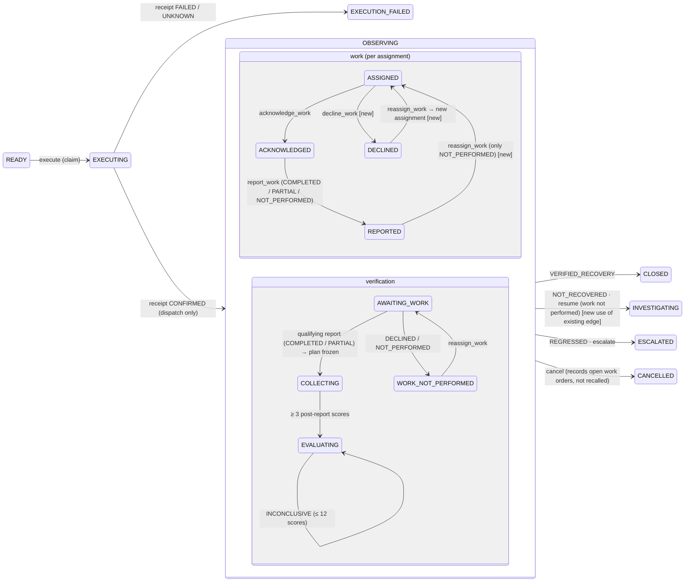

# OPERON V2: F1.2 plant work, dispatch, recovery and verification plan

**Status: approved on 2026-10-09 with refinements (§0). Implementation is in progress on `v2/f1-2-plant-work`.**
Where §0 and the decision table in §9 differ, §0 wins. Progress is tracked in
`design/v2/handoff/F1.2-implementation-ledger.md`.

**Authority.** This plan implements the F1.1 product-owner decision "The PlantActuator and simulator refactor
is F1.2" (`handoff/F1.1-session-checkpoint.md` §2) and its deferred items (§0.4 item 4). It refines F1A
(`11-…` §7, slice "F1.5 Work / field-response boundary", which F1.1 partly delivered).

**Evidence.** Code read at `c2273a1` on branch `v2/f1-2-plant-work`, worktree `C:\Dev\operon-v2-backend`.

**Labels.**
- **[V]** verified in code, with file:line at `c2273a1`.
- **[P]** proposed.
- **[D]** needs a product-owner decision (collected in §9).

---

## 0. Approved refinements (product owner, 2026-10-09)

| # | Decision | Final ruling |
|---|---|---|
| D1 | Durable simulated-plant state (migration 009) | Approved. Restart must be deterministic and must preserve the plant's condition. Tests cover open cases and ordinary assets. |
| D2 | A PARTIAL report unlocks verification | Approved with conditions. Only a qualifying, meaningful report can unlock verification (policy in §0.1). Empty, administrative, declined, unperformed or unsupported reports never start observation. A qualifying report is still not proof of recovery. |
| D3 | The server-recorded report time is the boundary | Approved. `performed_at` is kept as an attributed claim. Ordering and restart must not allow observation to start early. |
| D4 | Cases started under verification version 1 | Revised: an explicit, conservative compatibility strategy (§0.3). No evidence upgrade, no retroactive work, no silent closure, no destructive reset, and no "use a fresh database" as the migration answer. |
| D5 | Value counted only after verified recovery | Approved. Dispatch counts are kept separately. The duplicate `resolved` message is fixed without breaking existing consumers. |
| D6 | Simulated field crew | Approved with conditions:<br>- local and sandbox only;<br>- acts only through the normal validated, audited work commands;<br>- never in production;<br>- never presented as real physical work.<br>When the crew is disabled, the case truthfully waits for work. |
| D7 | `decline_work`, `reassign_work`, narrow `resume` | Approved with conditions. State, revision, authorization, idempotency and provenance are enforced. No contradictory terminal reports. Reassignment never discards history. |
| D8 | All lifecycle simulator writes go through PlantActuator | Approved. Legitimate simulator controls stay. The production no-actuator reports NOT_SUPPORTED, never successful execution. |
| D9 | Overdue and stalled are derived flags | Approved. No automatic transitions in F1.2. |
| D10 | Legacy demo left untouched | Approved only if it is isolated from the V2 verified workflow, documented, and the isolation is demonstrated by tests. Escalate otherwise. |

### 0.1 Work-report eligibility policy `operon-work-eligibility-1` (D2)

A report unlocks verification only when **all** of the following hold:

1. It is the single report on the **current** assignment of the executed dispatch (the CONFIRMED receipt), and the case is in OBSERVING. A superseded assignment never qualifies.
2. The assignment was acknowledged before the report.
3. `result` is COMPLETED or PARTIAL.
4. `asset_intervened` is `true`: the reporter attests that physical work was performed on the asset.
5. `performed_at` is present. It is not earlier than the assignment (the dispatch) and not later than the server recording time plus 60 s of clock skew.
6. A COMPLETED report covers every assignment instruction; omitting the list means all of them. A PARTIAL report names a non-empty set of completed instruction indices **and** has non-empty `findings` stating what remains. An assignment without instructions can qualify only as COMPLETED.

| Report | Handling |
|---|---|
| Meets conditions 1–6 | Recorded and **eligible**. It freezes the observation plan but is still not recovery. |
| NOT_PERFORMED, or COMPLETED/PARTIAL with `asset_intervened=false` (administrative only) | Recorded truthfully and **ineligible**. Verification shows `WORK_NOT_PERFORMED`. Next steps: `reassign_work`, `resume`, `escalate` or `cancel`. |
| Invalid or contradictory input:<br>- missing or invalid attestation;<br>- bad instruction indices;<br>- a COMPLETED report that is not complete;<br>- PARTIAL without findings;<br>- `performed_at` out of bounds;<br>- a second report;<br>- a superseded or unknown assignment;<br>- a case not in OBSERVING;<br>- an inadmissible actor. | **Refused.** Nothing is written. |

Eligibility is computed from the immutable report and assignment, so it is the same after a restart.

### 0.2 Verification boundary and ordering (D3)

- `observation_start` is the first whole second after `WorkReport.created_at`. That timestamp comes from the server clock inside the report transaction.
- The claimed `performed_at` is stored on the report with its actor. It is copied to the plan as `work_performed_at_claimed`, as context only, never as a boundary.
- The plan validator requires `observation_start > work_reported_at ≥ receipt confirmed_at`.
- The engine records the report and applies the simulated plant effect synchronously, with no tick in between. So no score stamped at or after the boundary can come from the plant as it was before the work. Scores stamped in or before the report second are excluded by the boundary itself.
- After a restart, the plan is re-derived from the durable report, and pending plant effects are applied before the first tick.

### 0.3 Compatibility for cases started under version 1 (D4)

The classification is **derived when read** from durable records. Nothing is rewritten.

| Durable situation | Classification | Verification | Allowed commands |
|---|---|---|---|
| CLOSED, INVESTIGATING or ESCALATED with an `operon-outcome-1` Outcome | history | The outcome is shown with its policy version and never re-evaluated. | as today |
| OBSERVING, an `operon-outcome-1` plan for the executed receipt, and no outcome | `LEGACY_RECEIPT_BOUND_PLAN` | `BLOCKED`. The v1 plan is never evaluated again. | `resume` (→ INVESTIGATING, intervention consumed), `escalate`, `cancel` |
| OBSERVING, a CONFIRMED receipt but no WorkAssignment at all (dispatched before F1.1) | `LEGACY_NO_WORK_ASSIGNMENT` | `BLOCKED` | `resume`, `escalate`, `cancel` |
| OBSERVING, an assignment from the F1.1 era, and no plan yet | not legacy | normal version 2 (`AWAITING_WORK`) | all work commands |

For a BLOCKED legacy case:
- `verify_outcome` returns the disposition `BLOCKED` and writes nothing.
- The projection shows `verification = {state: "BLOCKED", code, reason, policy_version: "operon-outcome-1", plan_id, allowed_commands}` and `reconciliation_required: true`.
- Work commands are refused with the same reason. Migration 007 allows only one plan per receipt, so a version 2 plan cannot be attached to that dispatch.
- `resume`, `escalate` and `cancel` are audited `LIFECYCLE_COMMAND`s that carry the legacy classification.
- Restart: the same durable records give the same classification, and nothing is written at startup.
- If the asset has no durable plant state (a database from before migration 009), its simulated condition is restored from its last persisted telemetry as a deterministic estimate and held. It is never reset to healthy.

---

## 1. Workspace

| Item | Value |
|---|---|
| Worktree | `C:\Dev\operon-v2-backend` |
| Branch | `v2/f1-2-plant-work` (local only, no upstream, not pushed) |
| HEAD | `c2273a1df593a9f02418f0f4f9c5a297921d05e3` = `origin/v2/integration-f1-routing` |
| Working tree | clean, apart from this uncommitted document |
| Original checkout | `C:\Dev\operon` is untouched: still on `v2/frontend-route-isolation`, with its 32 preserved `frontend/dist` entries |
| Other worktrees | `C:\Dev\operon-integration` (`v2/integration-f1-routing`) and `C:\Dev\operon-v2-frontend` (`v2/f4-frontend-next`, the F4 session) |

---

## 2. Existing architecture (as built)

### 2.1 Current execution and recovery flow [V]

```text
AWAITING_APPROVAL ──decide_approval(APPROVE)──► READY
  engine.approve → engine.execute (engine.py:1661-1718)
READY ──LifecycleService._claim (BEGIN IMMEDIATE; execution_claim IN_FLIGHT)──► EXECUTING      lifecycle.py:906-954
  cmms().create_work_package(…, authorization)   [no lock held]                                 lifecycle.py:1026-1051
  ├─ exception → receipt FAILED/UNKNOWN → EXECUTION_FAILED (never replayed)                     lifecycle.py:1038-1045
  └─ success  → receipt CONFIRMED + WorkAssignment + WORK_ASSIGNED, one transaction → OBSERVING  lifecycle.py:967-1024
engine.execute, after the receipt:
  self.sim.respond_to_intervention(eid)   ◄── DISPATCH DRIVES THE SIMULATED PLANT                engine.py:1705
  alert.result = {outcome: "DISPATCHED", recovered_value, oee_after, …}                          engine.py:1708-1713
  broadcast "resolved" ×2                                                                        engine.py:1714-1716
every tick: _progress_lifecycle → lifecycle.verify_outcome for each OBSERVING case               engine.py:1271-1302
  OutcomeVerifier.verify: lineage → ObservationPlan frozen with
     observation_start = receipt.completed_at + 1 s   ◄── VERIFICATION STARTS FROM THE RECEIPT     outcome.py:55-61, 303-315
  → health_score window → evaluate() → Outcome + CLOSED / INVESTIGATING / ESCALATED               outcome.py:418-557
acknowledge_work / report_work: audited facts only; never consulted by verification             lifecycle.py:1267-1300
restart: OBSERVING → sim.respond_to_intervention(eid) on a FRESH simulator (prog = 0)           engine.py:270-286
```

### 2.2 Modules and responsibilities [V]

| Module | Role in this boundary |
|---|---|
| `core/reliability/state.py` | Phase graph. OBSERVING → CLOSED or INVESTIGATING (+ ESCALATED / CANCELLED via the loop at `:30-32`). |
| `core/reliability/lifecycle.py` | Claim, receipt, `WorkAssignment` at receipt, recovery commands, ack/report work, projection. |
| `core/reliability/outcome.py` | Deterministic policy `operon-outcome-1`; plan bound to the receipt; outcome committed together with the phase. |
| `core/reliability/models.py` | `WorkAssignment`, `WorkReport` (COMPLETED / PARTIAL / NOT_PERFORMED), `ObservationPlan`, `Outcome`, `ActorRef`, event literals. |
| `core/reliability/repository.py` | Artifact store. `WORK_OWNED_TYPES` refuses public writes of work records (`:56, :403`). |
| `core/reliability/actors.py` | Server-assigned actor kinds. Production refuses every human kind. |
| `core/engine.py` | Tick loop, admission, simulator mutations (27 `self.sim` references), Guided Demo, WebSocket projection. |
| `core/simulator.py` | `PlantSimulator`. Modes `degrading`, `arrested`, `recovering`, `unresponsive`, `failing`. State is in memory only. |
| `core/services/*` | CMMS / notification ports. `create_work_package` commits WO, parts, labour and notification in one transaction (`adapters/local.py:170-248`). |
| `server/main.py` | Work routes `…/work/{id}/acknowledge` and `…/work/{id}/response` (sandbox gate), `/commands/*`, `/execute`, `/outcome`. |
| `core/migrations/007_outcome_verification.sql` | Unique indexes: one `ObservationPlan` per receipt, one `Outcome` per plan. |

PRISM (`core/prism/*`, `server/prism_api.py`) has **no** coupling to execution, work or outcome [V].

---

## 3. Gap analysis

| # | Capability | Status | Evidence / gap |
|---|---|---|---|
| 1 | Dispatch: claim, receipt and idempotency | **Implemented** | `lifecycle.py:906-1051`. FAILED and UNKNOWN are never replayed. Reconciliation runs after 30 s. |
| 2 | Work assigned at confirmed dispatch | **Implemented** | `WorkAssignment` + `WORK_ASSIGNED` written atomically with the receipt (`lifecycle.py:1008-1014`). |
| 3 | Acknowledge, then report | **Partial** | Exists and is audited (`lifecycle.py:1267-1300`). Missing pieces:<br>- no decline;<br>- no reassignment;<br>- no idempotent replay;<br>- no `performed_at` bounds;<br>- the phase and the assignment are not checked to be current;<br>- one report per assignment is not enforced durably. |
| 4 | Work facts consulted by verification | **Missing** | The verifier never reads `WorkReport` (`outcome.py` has no reference). |
| 5 | Observation boundary | **Wrong for F1.2** | The boundary is derived from the receipt (`outcome.py:305, 312, 326`; `models.py:690`). |
| 6 | Execution boundary (PlantActuator) | **Missing** | The engine calls `sim.respond_to_intervention` on dispatch (`engine.py:1705`) and on restart (`:281`). Other direct simulator writes:<br>- `arrested` at admission (`:954`);<br>- `failing` on an escalating reject (`:1744`);<br>- re-hold after an outcome (`:1316, :1319`);<br>- release on cancel (`:1835`). |
| 7 | Simulated execution clearly labelled | **Simulated, unlabelled at runtime** | Docstrings say "SIMULATED". The incident record has no fact stating "the simulated plant was told to recover because of report X". |
| 8 | Restart truthfulness | **Defect** | A fresh `PlantSimulator()` has `prog = 0`. `_recover_lifecycle` sets modes only. Effects:<br>- every held asset reads **healthy** after a restart;<br>- a `PERSISTS` case re-applies `unresponsive` at `prog = 0` and is then verified as recovered;<br>- `test_engine_lifecycle.py:468-470` asserts this as intended. |
| 9 | Dispatch-time value claims | **Untruthful** | `_business_summary` counts DISPATCHED alerts as `events_prevented` and sums `recovered_value` before any verification (`engine.py:1927-1930`). |
| 10 | Dispatch WebSocket messages | **Partial** | `resolved` is sent twice (`engine.py:1714-1716`). The frontend reducer ignores `msg.alert` (`frontend/src/state/engineState.js:122-127`), so V2 keeps the pre-dispatch phase until the next `alert`, `outcome` or snapshot. |
| 11 | Work and verification sub-state in the projection | **Partial** | `lifecycle.work[]` exists but no consumer reads it. There is no verification sub-state, so V2 maps OBSERVING to "Verifying" by phase alone (`frontend/src/v2/model/status.js:34-39`). |
| 12 | Guided Demo after approval | **Relies on the coupling** | Closure depends on dispatch-driven recovery (`tests/test_demo_scenario.py:154-160`). The fixture generator does too (`frontend/test/make_fixtures.py:48-49, 132-133`). |
| 13 | Missing acknowledgement, overdue work, stalled verification | **Missing** | Not visible anywhere. The only existing budget is the post-score count (12 scores). |
| 14 | Legacy demo path (`OPERON_LEGACY_DEMO`) | **Coupled by design** | Approval sets `recovering` (`engine.py:1862`). This path is opt-in and deprecated. |

---

## 4. Proposed architecture

### 4.1 Invariant and boundaries [P]

**Dispatch ≠ work performed ≠ plant response ≠ recovery ≠ verified recovery.**

| # | Boundary | Durable fact | Writer | Can it cause the next? |
|---|---|---|---|---|
| 1 | Dispatch | `ExecutionReceipt` CONFIRMED, CMMS rows | executor | Creates a work *request* only |
| 2 | Acceptance | `WORK_ACKNOWLEDGED` or `WORK_DECLINED` | assignee actor | No |
| 3 | Execution | Physical work happens outside OPERON. In the sandbox it is simulated: `PlantActuation` applied **only** from a qualifying report | `PlantActuator` | In the sandbox only, and only into the simulated plant |
| 4 | Work reporting | `WorkReport` + `WORK_REPORTED` | assignee actor | Opens the verification gate. It is never evidence of recovery. |
| 5 | Recovery assessment | `ObservationPlan` frozen **after** the report; outcome `Evidence` read from persisted scores | verifier | — |
| 6 | Independent verification | `Outcome` decided from persisted `health_score` rows only | verifier | Never reads the receipt, the actuation or the report content as evidence |
| 7 | Closure or escalation | phase change committed together with the `Outcome` | lifecycle | — |

### 4.2 State model: phases unchanged, sub-states derived [P]

No new phase. The `incident.phase` CHECK constraint (`001_operon.sql:4-7`) would need a table rebuild, and F1.1 decided "events over phases". OBSERVING carries two **derived, recomputable** sub-states.



`verification.state` in the projection takes one of these values:
- `NOT_STARTED`
- `AWAITING_WORK`
- `WORK_NOT_PERFORMED`
- `COLLECTING`
- `EVALUATING`
- `VERIFIED_RECOVERY`, `NOT_RECOVERED` or `REGRESSED`
- `BLOCKED` (the lineage is invalid, the plan is a pre-F1.2 plan, or reconciliation is required)

It also carries the flags `stalled`, `ack_overdue` and `report_overdue`. None of these is stored as state. Each is recomputed from artifacts, events and a cheap score count.

### 4.3 Durable work lifecycle [P]

| Command | Precondition | Effect | Event | Route |
|---|---|---|---|---|
| `acknowledge_work` (exists) | OBSERVING; assignment **current** and ASSIGNED | ACKNOWLEDGED | `WORK_ACKNOWLEDGED` | `POST …/work/{assignment_id}/acknowledge` (exists, sandbox gate) |
| `decline_work` **new** | OBSERVING; current; ASSIGNED; `reason` required | DECLINED. No actuation. | `WORK_DECLINED` | `POST …/work/{assignment_id}/decline` (sandbox gate) |
| `report_work` (exists, hardened) | OBSERVING; current; ACKNOWLEDGED; `performed_at` within [assigned_at, now + 60 s] for COMPLETED/PARTIAL | `WorkReport` + REPORTED. **No phase change. No outcome.** | `WORK_REPORTED` | `POST …/work/{assignment_id}/response` (exists; the name avoids "report", per `test_engine_lifecycle.py:331-332`) |
| `reassign_work` **new** | OBSERVING; no plan; current assignment DECLINED or REPORTED NOT_PERFORMED; optional `assignee_reference` validated with `require_qualified_technician` | new `WorkAssignment` for the **same receipt**. The old one records `superseded_by`. | `WORK_REASSIGNED`, `WORK_ASSIGNED` | `POST …/commands/reassign_work` (actor + rationale, like `retry_execution`) |
| `resume` (extended) | OBSERVING; no plan; current work DECLINED or NOT_PERFORMED | → INVESTIGATING; intervention consumed; payload lists open external work-order refs | `LIFECYCLE_COMMAND` | `/commands/resume` (exists) |
| `cancel` and `escalate` (exist) | unchanged | the payload adds `open_work[]` with external refs and "not recalled: no CMMS cancel capability" | unchanged | unchanged |

**Concurrency.** Every command is one `BEGIN IMMEDIATE` transaction with an `expected_revision` CAS (exists). Defence in depth: unique index **one `WorkReport` per assignment** (§4.9).

**Idempotency.** The ack, decline, response and reassign bodies take an optional `request_key` (client-generated, ≤ 128 characters).
- It is stored in the event payload together with a content digest.
- It is checked **before** the revision CAS.
- Same key and same digest: `200 {replayed: true}` with the original ids, and no write.
- Same key and a different digest: 409.
- Without a key, behaviour is as today.

**Late facts.** Work commands are refused once the case has left OBSERVING or the assignment is no longer current. The refusal carries an explicit reason. Recording late field facts belongs to the F3 work model.

**Identity.** The acting `ActorRef` is recorded, but it is not bound to `assignee.reference` (a roster id, not an account) until F3 identity exists. This is stated in the projection label.

### 4.4 Plant execution boundary [P]

New module `core/plant.py`:

```python
PlantCause = Literal["ANALYSIS_HOLD", "HOLD_RELEASED", "WORK_PERFORMED", "RUN_TO_FAILURE", "HOLD_REAPPLIED"]

class PlantEffect:          # what OPERON asks the (simulated) plant to do, and why
    cause: PlantCause; equipment_id: str; report: WorkReport | None

class PlantActuator(Protocol):
    kind: Literal["simulator", "none"]
    def apply(self, effect: PlantEffect) -> ActuationRecord | None

class SimulatorActuator:    # sandbox / unspecified; the ONLY writer of simulator modes on lifecycle paths
class NullActuator:         # production (forced): a real plant changes on its own; OPERON writes nothing
```

**`SimulatorActuator` mapping** (deterministic, profile-driven):

| Effect | Simulator mode |
|---|---|
| `WORK_PERFORMED` with COMPLETED | `profile.intervention_response`: RECOVERS → `recovering`, PERSISTS → `unresponsive` |
| `WORK_PERFORMED` with PARTIAL | `profile.partial_response` (new field, default PERSISTS) |
| NOT_PERFORMED or DECLINED | never actuated; the plant stays held |
| `ANALYSIS_HOLD`, `HOLD_REAPPLIED` | `arrested` (today's behaviour, now named as a demo hold) |
| `HOLD_RELEASED` | the profile mode (today's `_release_asset_hold`) |
| `RUN_TO_FAILURE` | `failing` (today: explicit escalating reject only) |

**Engine rewiring.**
- `execute` no longer touches the simulator. `engine.py:1705` is removed; `status_override = "SCHEDULED"` stays, because it is truthful.
- Every lifecycle-path `self.sim.set_mode` goes through `self.actuator.apply(…)`.
- The legacy demo path is untouched [D].

**Actuation record.** After `report_work` commits, the engine applies `WORK_PERFORMED` outside any lock. It then calls `lifecycle.record_actuation(incident_id, report_id, record)`, which writes:
- a `PlantActuation` artifact: `cause`, `report_id`, `assignment_id`, `response_profile`, `mode_before`, `mode_after`, `actuator`, `provenance: SIMULATED`;
- a `PLANT_ACTUATION_RECORDED` event (SYSTEM actor).

The record is unique per `report_id`. A failure writes `PLANT_ACTUATION_FAILED` (event only) and stays pending. `PlantActuation` is a work-owned type: the public `add_artifact` refuses it, and **the verifier never reads it**.

**Durable simulated-plant state** [D1]. Table `simulator_asset_state`, one row per asset:
- `mode`, `prog`, `tick`;
- profile overrides: `scenario`, `start_tick`, `ramp_ticks`, `intervention_response`, `partial_response`;
- `updated_at`.

It is written after each tick and immediately after each effect, *before* the `PlantActuation` artifact. The engine restores it at construction and `reset` clears it. Rationale: a real plant does not reset when OPERON restarts. Without this table, gap 8 makes the F1.2 invariant false across restarts. Once healthy telemetry appears at `prog = 0`, any later report verifies as recovery.

### 4.5 Recovery assessment and independent verification [P]

- **Policy version `operon-outcome-2`.** The evaluation thresholds are unchanged. The boundary is now the work report. `ObservationPlan` and `Outcome` keep accepting `operon-outcome-1` (history) and add optional `work_assignment_id`, `work_report_id`, `work_result` and `work_reported_at`. These are dropped from serialization when absent, so pre-F1.2 hashes are unchanged.
- **Order in `OutcomeVerifier.verify`.** Existing lineage refusals stay first; tests at `test_outcome.py:384, 419, 429, 451` depend on that. Then `qualifying_work(conn, incident, receipt)`, which requires all of:
  - the current assignment of that receipt;
  - REPORTED with COMPLETED or PARTIAL [D2].

  If there is no plan and no qualifying report, the verifier returns disposition **`AWAITING_WORK`** and writes nothing.
- **Boundary.** `observation_start = first whole second after WorkReport.created_at` (server-recorded) [D3]. The plan validator requires `observation_start > work_reported_at ≥ confirmed_at`. The claimed `performed_at` is recorded as context only. The baseline is unchanged: the pre-intervention model signal from the promoted diagnosis packet.
- **Pre-F1.2 plans.** An OBSERVING case with an `operon-outcome-1` plan and no outcome is **BLOCKED** with `reconciliation_required` [D4]. It can be cancelled or escalated, and it never closes from the receipt. Unique index `ix_observation_plan_receipt` (007) still holds: there is one plan per receipt, frozen from the first qualifying report.
- **Independence.** The decision reads only persisted `health_score` and `sensor_reading` windows (unchanged). The report is a **gate and a boundary, never evidence**. The two combinations below are valid recorded outcomes, and each is tested:
  - COMPLETED + NOT_RECOVERED → INVESTIGATING;
  - healthy telemetry with no report → no outcome.
- **Engine.** `_verify_outcome` treats `AWAITING_WORK` like `OBSERVING`, so it is a no-op. `POST /outcome` returns `ok` with that disposition.

### 4.6 Audit and provenance chain [P]

| Layer | Durable record | Actor / provenance | Status |
|---|---|---|---|
| Requested action | `Intervention` + `PromotionRecord(intervention)` | model run and application gates | exists |
| Authorized action | `ApprovalRequirement` + `ApprovalDecision(APPROVE)` | `actor_kind` (SANDBOX / DECLARED / SCENARIO) | exists |
| Dispatched action | `ExecutionClaim`, `ExecutionReceipt` CONFIRMED, CMMS rows | `TRUSTED_EXECUTOR`, adapter | exists |
| Assigned work | `WorkAssignment`, `WORK_ASSIGNED` | SYSTEM | exists |
| Acknowledged / declined | `WORK_ACKNOWLEDGED` / `WORK_DECLINED` | `ActorRef` + label | ack exists; decline new |
| Reported work | `WorkReport`, `WORK_REPORTED` | `ActorRef`; `provenance` SIMULATED in a sandbox | exists, hardened |
| Simulated plant effect | `PlantActuation`, `PLANT_ACTUATION_RECORDED` | SYSTEM, `actuator`, SIMULATED | **new** |
| Observed asset response | `health_score` / `sensor_reading` → outcome `Evidence` (`required_for=outcome`) | `SIMULATED` / `MODEL_PRODUCED` origins | exists |
| Verification plan | `ObservationPlan` v2 + `OBSERVATION_PLANNED` (+ `work_report_id`) | application | extended |
| Verified outcome | `Outcome` + `OUTCOME_RECORDED` + phase change | application; `basis` SIMULATED / OBSERVED | extended |

### 4.7 Failure behaviour [P]

| Case | Behaviour |
|---|---|
| Failed dispatch | Unchanged: EXECUTION_FAILED, no assignment, no actuation. Then `retry_execution`, `resume` or `cancel`. |
| Adapter timeout or hang | Unchanged: IN_FLIGHT → reconcile after 30 s → UNKNOWN → EXECUTION_FAILED. Never replayed. |
| Duplicate requests | Dispatch: claim idempotency key (exists). Work: `request_key` replay. Receipts: the semantic-duplicate rule (exists). Actuation: unique per report. |
| Stale revisions | The CAS refuses with 409. Only identical keyed replays bypass it. |
| Work rejection | `decline_work` → DECLINED → `WORK_NOT_PERFORMED`. Then `reassign_work`, `resume`, `escalate` or `cancel`. The plant is never actuated. |
| Missing acknowledgement | No automatic transition. Derived `ack_overdue` (now > `window_start`, or `assigned_at` + grace) is shown. Humans decide. |
| Missing or contradictory evidence | A report must be current, made in OBSERVING, acknowledged first, unique, and carry a bounded `performed_at`. Telemetry, not the report, decides recovery. |
| Incomplete work | PARTIAL freezes the plan; `work_result` is recorded on the plan and the outcome [D2]. NOT_PERFORMED freezes no plan. |
| Failed recovery | NOT_RECOVERED → INVESTIGATING (intervention consumed); REGRESSED → ESCALATED. The plant is re-held through the port. |
| Verification timeout | 12-score budget → NOT_RECOVERED (exists). No scores arriving → derived `stalled`; no automatic transition. |
| Restart during execution | §4.8. |
| Simulator failure | An actuator exception gives `PLANT_ACTUATION_FAILED`, stays pending, and is retried once at restart. Verification stays independent and reports what the telemetry shows. The projection shows the simulator fault next to it. |

### 4.8 Restart behaviour [P]

| Crash point | Durable state | On restart |
|---|---|---|
| During the adapter call | claim IN_FLIGHT | unchanged: reconcile → UNKNOWN → EXECUTION_FAILED; never replayed |
| After the receipt | receipt, assignment, simulator state (held) | OBSERVING / `AWAITING_WORK`; the plant is still held; no actuation |
| After acknowledgement | event | ACKNOWLEDGED |
| After the report, before actuation | report, no `PlantActuation` | pending actuation applied **once** (keyed by report id) |
| After actuation | simulator state persisted before the artifact | the plant continues from its persisted `prog` and mode; nothing is re-applied |
| During observation | plan and evidence | the plan is identical (derived from `report.created_at`); the outcome is idempotent (unique per plan) |
| After the outcome | CLOSED / INVESTIGATING / ESCALATED | final; no re-admission of CLOSED |

The `PERSISTS` restart flip (`test_engine_lifecycle.py:468-470`) is inverted on purpose.

### 4.9 Persistence and migration [P]

`core/migrations/009_f1_2_plant_work.sql` is additive, forward-only and does no backfill [D1]. It contains:
1. the `simulator_asset_state` table;
2. `ix_work_report_assignment`: UNIQUE on `json_extract(body_json,'$.assignment_id') WHERE kind='WorkReport'`;
3. `ix_plant_actuation_report`: UNIQUE on `json_extract(body_json,'$.report_id') WHERE kind='PlantActuation'`;
4. an index on `incident_event(incident_id, event_type)`, used by `_work_states`.

Everything else is new JSON artifact kinds, event types and optional fields, which need no migration. Tests that pin the migration count are updated: `test_incident_state.py:161, 177-180, 249` and `test_prism_migration.py:26`.

---

## 5. Implementation sequence

Milestones are committed locally, one or more commits each. The full backend suite runs at the end of every milestone.

| Milestone | Content | Exit |
|---|---|---|
| **M0 Guard tests** | Target-behaviour tests written first as `xfail(strict=True)`: invariants, restart flip, dispatch without actuation, verification gated by a report. Characterization tests pin unchanged dispatch, receipt and approval rules. | Suite green; strict xfails document the change |
| **M1 Work lifecycle (core)** | Models:<br>- events `WORK_DECLINED`, `WORK_REASSIGNED`, `PLANT_ACTUATION_RECORDED/FAILED`;<br>- `PlantActuation`;<br>- optional plan and outcome fields.<br>Commands: `decline_work`, `reassign_work`, the extended `resume`, hardened `report_work`, `request_key`.<br>Lifecycle: `_work_states` v2, `qualifying_work`.<br>Projection: `work` v2, `verification`.<br>Migration 009. | Layer-B work tests pass; no engine change |
| **M2 Verification v2 (core)** | `operon-outcome-2`; `AWAITING_WORK`; report-bound plan and outcome; v1 plans BLOCKED. `test_outcome.py` helpers updated: `observing()` → ack + report; `boundary()` from the report. | Every outcome test is green with "F1.2 (intentional change)" notes |
| **M3 Plant boundary (engine)** | `core/plant.py`; simulator `partial_response`, `snapshot()/restore()`; durable simulator state; engine:<br>- remove `:1705` and `:281`;<br>- route every lifecycle simulator write through the port;<br>- actuation after the report;<br>- restart replay of pending actuations. | No dispatch-driven plant change; the restart matrix passes |
| **M4 Field response and contracts** | `SimulatedFieldCrew` [D6]: SCENARIO actor, deterministic per profile, acts only through `lifecycle_command`. The Guided Demo continues after approval through it.<br>Routes: decline, reassign, `request_key`.<br>WebSocket: dispatch sends an `alert` (phase `dispatched`) plus one compatibility `resolved` [D5].<br>`_business_summary` counts only VERIFIED_RECOVERY.<br>The `alert.lifecycle` projection gains `verification` and `plant`. | API and WebSocket contract tests; the Guided Demo reaches `complete` through work facts |
| **M5 Integration and hardening** | Offline end-to-end matrix (§8). Concurrency tests. Full regression, including the unchanged frontend suites and fixture generation to a scratch directory. Docs: `.env.example` and `docs/DEMO.md`. Handoff contract finalized. F1.2 completion record. | §10 checkpoint met |

---

## 6. Files likely to change

| File | Responsibility |
|---|---|
| `core/plant.py` (new) | `PlantActuator`, `PlantEffect`, `SimulatorActuator`, `NullActuator`, `actuator_for(environment, sim)` |
| `core/simulator.py` | `partial_response`, `respond_to_work(eid, result)`, `snapshot()` / `restore()`. `respond_to_intervention` is kept for the actuator only. |
| `core/engine.py` | Remove dispatch and restart actuation; route simulator writes through the port; actuation after the report; restore durable simulator state; restart replay; field crew and Guided Demo continuation; dispatch messages; business summary. **Largest risk.** |
| `core/reliability/models.py` | New event types, `PlantActuation`, optional plan and outcome fields, policy literal v2, hash-preserving drop list |
| `core/reliability/lifecycle.py` | Work commands, `qualifying_work`, `record_actuation`, `pending_actuations`, extended `resume` and `cancel` payloads, projection `work` / `verification` / `plant` |
| `core/reliability/outcome.py` | Report gate, `AWAITING_WORK`, report-bound plan and outcome, v1 handling, lessons text |
| `core/reliability/repository.py` | Register `PlantActuation` (work-owned); reference checks for `report_id` |
| `core/migrations/009_f1_2_plant_work.sql` (new) | §4.9 |
| `core/db.py` | Add `simulator_asset_state` to the reset tables |
| `core/config.py`, `.env.example` | `OPERON_SIMULATED_FIELD_CREW` (opt-in; refused in production) |
| `core/demo_scenario.py` | Scenario descriptor field `field_response` |
| `server/main.py` | Decline and reassign routes, `request_key`, docstring |
| `tests/*` | New: `test_work_lifecycle.py`, `test_plant_actuation.py`, `test_work_restart.py`, `test_f1_2_invariants.py`, `test_f1_2_api.py`. Updated: `test_outcome.py`, `test_engine_lifecycle.py`, `test_f1_recovery.py`, `test_demo_scenario.py`, `test_incident_state.py`, `test_prism_migration.py` |
| `design/v2/12-…` (this file), `design/v2/handoff/F1.2-frontend-contract.md` | Plan, contract handoff, completion record |

**Not changed:**
- `frontend/**` and tracked `frontend/dist`
- `core/prism/**`, `core/agents/**`, `core/providers/**`
- `promotion.py`, `governance.py`, `execution.py`, `state.py`, `actors.py`
- PRISM migrations
- dependencies

---

## 7. Frontend contract handoff (for F4)

> **Superseded by the implemented contract:** `design/v2/handoff/F1.2-frontend-contract.md`. It covers the payloads as built and implementation status per field. The table below is the planning-time proposal and is kept for history.

**Status key:**
- **IMPLEMENTED (F1.1)**: available at `c2273a1`.
- **PROPOSED (F1.2)**: not available until F1.2 is merged into a shared baseline.

**Do not code against PROPOSED items as if they were live.**

### 7.1 Projection: `alert.lifecycle` (WebSocket `snapshot`, `alert`, `outcome`) and `GET /api/incidents/{id}`

| Field | Shape | Meaning | Status |
|---|---|---|---|
| `work[]` | `{assignment_id, state: ASSIGNED\|ACKNOWLEDGED\|REPORTED, assignee: {kind, reference, reference_system}, delivery_channel, external_refs, assigned_at, acknowledged_at, acknowledged_by, report_id, result, reported_at, reported_by}` | Work facts about people. Never recovery. | IMPLEMENTED (F1.1) |
| `work[]` additions | `state` gains `DECLINED`; adds `current: bool`, `superseded_by`, `declined_at`, `declined_by`, `decline_reason`, `ack_overdue`, `report_overdue` | Reassignment history and attention flags | PROPOSED |
| `verification` | `{state: NOT_STARTED\|AWAITING_WORK\|WORK_NOT_PERFORMED\|COLLECTING\|EVALUATING\|VERIFIED_RECOVERY\|NOT_RECOVERED\|REGRESSED\|BLOCKED, policy_version, work_report_id, observation_start, post_score_count, minimum_scores, maximum_scores, stalled: bool, reason}` | What verification is actually doing. **`AWAITING_WORK` and `WORK_NOT_PERFORMED` are not "Verifying".** | PROPOSED |
| `plant` | `{actuator: "simulator"\|"none", actuations: [{report_id, cause, mode_after, applied_at, provenance: "SIMULATED"}], pending: bool, fault: str\|null}` | Simulated plant effect. Sandbox truth label. Never verification evidence. | PROPOSED |
| `read_model` additions | `work_assignments[]`, `work_reports[]`, `plant_actuations[]` (artifact dumps) | Inspector detail | PROPOSED |
| `outcome_result`, `plan_id`, `outcome_id` | unchanged | `plan_id` is now null until a qualifying report exists | semantics PROPOSED |

**Stage mapping guidance for F4.** Derive from `phase` **plus** `verification.state`:
- OBSERVING + `AWAITING_WORK` / `WORK_NOT_PERFORMED` = "In work" (waiting on the field / coordinator);
- OBSERVING + `COLLECTING` / `EVALUATING` = "Verifying".

Until F4 consumes `verification`, the V2 "Verifying" label (`status.js:36`) is inaccurate for cases awaiting work. That is the cross-workstream dependency, flagged in §9.

### 7.2 Commands

| Endpoint | Body | Errors | Status |
|---|---|---|---|
| `POST /api/incidents/{id}/work/{assignment_id}/acknowledge` | `{actor_id, actor_role?, expected_revision, note?}` + `request_key?` | 403 outside the sandbox gate or in production; 409 for a stale revision or wrong state | IMPLEMENTED; `request_key` PROPOSED |
| `POST /api/incidents/{id}/work/{assignment_id}/response` | `{actor_id, actor_role?, expected_revision, result, summary, findings[], performed_at?}` + `request_key?` | as above; 409 for `performed_at` out of bounds | IMPLEMENTED; validation and `request_key` PROPOSED |
| `POST /api/incidents/{id}/work/{assignment_id}/decline` | `{actor_id, actor_role?, expected_revision, reason, request_key?}` | as above | PROPOSED |
| `POST /api/incidents/{id}/commands/reassign_work` | `{actor_id, actor_role?, expected_revision, rationale, assignment_id, assignee_reference?, request_key?}` | 403 in production; 409 when the state is invalid | PROPOSED |
| `POST /api/incidents/{id}/commands/{resume\|cancel\|escalate}` | unchanged | `resume` from OBSERVING is allowed only when the work was not performed | IMPLEMENTED; OBSERVING `resume` PROPOSED |
| `POST /api/incidents/{id}/outcome` | none | the response `verification.disposition` may be `AWAITING_WORK` | PROPOSED value |

All commands return `{ok, error?, incident: <projection>}`. A replayed request returns `{ok: true, replayed: true}`.

### 7.3 WebSocket

| Message | Change | Status |
|---|---|---|
| `alert` with `phase` `"dispatched"` | New at dispatch, so V2 updates the phase without reading `resolved` | PROPOSED |
| `resolved` | Kept for the legacy reducer and sent **once** (today twice). `result` gains `recovery_verified: false` and `value_basis: "ESTIMATED"` | PROPOSED |
| `alert` with phase = command name (`acknowledge_work`, `report_work`, `decline_work`, `reassign_work`, …) | Exists for F1.1 commands; extends to the new commands, plus `plant_actuated` | IMPLEMENTED (F1.1) / PROPOSED |
| `business.events_prevented`, `business.recovered_value` | Count only VERIFIED_RECOVERY (lifecycle) or PREVENTED (legacy demo), never DISPATCHED | PROPOSED |
| `demo_scenario.status` | The value set is unchanged; OBSERVING stays `"observing"` while the scenario crew acknowledges and reports | PROPOSED |

### 7.4 Fixtures (`frontend/test/make_fixtures.py`, owned by F4)

After F1.2 these assertions change on regeneration:
- `SETTLED` now records the OBSERVING frame only once a plan exists, which is after the scenario report;
- `f1.test.jsx:75-81` (no `WORK_REPORTED` at OBSERVING) will see a reported assignment;
- the CLOSED frame will show `work[0].state = "REPORTED"`.

Two things stay the same:
- `APPROVED_SEQUENCE` is unchanged, because the Guided Demo crew completes the work;
- the approve, reject, MATERIAL and BLOCKING frames are unaffected.

---

## 8. Testing strategy

**Layers:**
- unit (models, actuator mapping, simulator snapshot/restore);
- lifecycle (SQLite);
- engine (tick clock seam, `StubModel`);
- API (`TestClient`);
- end-to-end offline (engine plus scenario crew).

| Area | Tests (new unless noted) | When |
|---|---|---|
| Invariants | No `WORK_PERFORMED` effect without a qualifying report (actuator spy). Dispatch leaves the simulator mode and `prog` unchanged. CLOSED ⇒ a qualifying report exists with `created_at` < `plan.observation_start`. The verifier never reads `PlantActuation` (spy plus a static guard). The engine has no direct `self.sim.set_mode` on lifecycle paths (static guard). | M0 (xfail) → M3 |
| Work transitions | ack / decline / report / reassign: every precondition, current-assignment rule, `performed_at` bounds, phase checks, actor rules (sandbox / production / declared), rationale required | M1 |
| Idempotency and concurrency | `request_key` replay and mismatch. Two threads report on the same assignment: exactly one `WorkReport`. Report racing verification: the plan binds exactly that report. Actuation applied once per report. | M1, M3 |
| Verification | `AWAITING_WORK` without writes. Boundary from the report. Pre-report healthy scores never count. PARTIAL. NOT_PERFORMED → no plan → reassign → COMPLETED → plan. v1 plan BLOCKED. Existing outcome policy tests are kept with report-anchored helpers. | M2 |
| Plant boundary and simulator determinism | Mapping table for each profile and result. `NullActuator` in production writes nothing. A seeded simulator gives an identical trajectory. `snapshot()`/`restore()` round-trip equality. | M3 |
| Persistence and restart | One test per row of §4.8. The projection diff is empty before and after restart (volatile fields excluded). The `PERSISTS` restart stays NOT_RECOVERED (inverted `:468-470`). No re-dispatch (`adapter.calls == 1`). | M3 |
| Failure matrix | One test per row of §4.7, including no-show (derived `ack_overdue`), stall (`stalled`) and a simulator exception | M1–M4 |
| API and WebSocket contracts | New routes; sandbox gate; 403 in production; replay 200; route-name contract (`promotion` / `verdict` / `report` absent); one `resolved` plus a dispatch `alert`; `business` counts only verified outcomes | M4 |
| Guided Demo | Reaches `complete` with SCENARIO ack/report events and a `PlantActuation`. `reset` cancels the crew task. Rejection is unchanged. | M4 |
| PRISM and audit | All `test_prism_*` unchanged and green; settlement audit unchanged | every milestone |
| F1.1 regression | `test_f1_recovery.py`, promotion, lifecycle and engine suites. Changed assertions are marked "F1.2 (intentional change)". | every milestone |
| Frontend (unchanged code) | Vitest 759, smoke 15, Playwright 27 dev + 27 preview, build to an external dir. Fixture generation with `--out <scratch>` reaches the approved sequence. Nothing is committed under `frontend/`. | M5 |

**Patterns** (from existing tests):
- the engine clock seam (`engine._clock`) with `tick()`;
- `StubModel(p)` for risk;
- `write_scores` anchored to `oc.observation_start(report.created_at)`.

Note that `monkeypatch(lc.utcnow)` does not move event `created_at`.

---

## 9. Risks and decisions

### 9.1 Decisions requiring approval [D]

| # | Decision | Recommendation | Alternative |
|---|---|---|---|
| D1 | Durable simulated-plant state via additive migration 009 (+ two unique indexes) | **Adopt.** Without it, restart truthfulness (gap 8) cannot hold. | (b) Store simulator `prog` in incident artifacts. This churns revisions in many tests and puts plant internals in the case record. (c) Declare restart unsupported for the sandbox. |
| D2 | Does PARTIAL start verification? | **Yes (F1A §7.2).** Recorded as `work_result` on the plan and the outcome. | PARTIAL behaves like NOT_PERFORMED and needs a follow-up assignment. |
| D3 | Observation boundary | **Server-recorded report time.** `performed_at` is context only. | Claimed `performed_at`. It can be backdated, so it is weaker. |
| D4 | In-flight pre-F1.2 OBSERVING cases with a receipt-bound plan | **BLOCKED + reconcile (cancel or escalate). Recommend a fresh DB.** Plus policy v2. | Let them finish under `operon-outcome-1`. That keeps dispatch-based verification alive for those cases. |
| D5 | Dispatch-time economics and messages | **`events_prevented` and `recovered_value` count only verified recovery.** One `resolved` plus a dispatch `alert`. | Leave as is until F2 (the economics note). |
| D6 | Who acknowledges and reports in the simulation | **`SimulatedFieldCrew`** (SCENARIO actor, public commands only, deterministic per profile). Always used for the Guided Demo asset; opt-in `OPERON_SIMULATED_FIELD_CREW` for other assets; refused in production. | (b) A Guided-Demo-only controller. (c) None: only the API. |
| D7 | New commands | **`decline_work`, `reassign_work`, `resume` from OBSERVING when work was not performed** | A subset. Without reassignment, a declined work order can only be cancelled or escalated. |
| D8 | Simulator writes | **Every lifecycle-path simulator write goes through the port**, with named causes and today's dynamics kept | Only the work effect moves. Hold, release and failing stay direct. |
| D9 | Overdue and stalled | **Derived flags only.** No automatic transitions and no events. | Emit `WORK_OVERDUE` / `VERIFICATION_STALLED` events once. |
| D10 | Legacy demo path (`OPERON_LEGACY_DEMO`) | **Untouched.** Documented as the remaining deprecated coupling. | Refuse it in sandbox and production. |

### 9.2 Risks

| Risk | Mitigation |
|---|---|
| Engine edits regress the governance core | Engine changes come last (M3–M4). Strict xfails go first. Full suite at every milestone. Actuation is behind one port, so it is reversible in one commit. |
| The V2 "Verifying" label is wrong for cases awaiting work once F1.2 merges, until F4 consumes `verification` | Contract §7. Flag to F4. **Do not merge F1.2 into the shared baseline before F4 has the mapping or accepts the interim label.** |
| Fixture expectations change on regeneration | §7.4. F4 owns regeneration. F1.2 verifies generation to a scratch directory only. |
| Field-crew timing makes engine tests flaky | Durable timestamps plus the engine clock seam. No sleeps in lifecycle tests. Real-time pacing only in the Guided Demo test (it already uses 0.01 s). |
| Durable simulator state changes "fresh start" expectations of the local demo | `--reset-demo` and `/api/reset` clear it. Documented in `docs/DEMO.md`. |
| Unbound actor identity (anyone declared may acknowledge or report in the sandbox) | Sandbox only and labelled. Production refuses every human action. F3 adds real identity. |

**F3 production blocker remains open.** F1.2 does not change production admissibility: every human command is refused there, the actuator is forced to `NullActuator`, and `/api/reset` is still unauthenticated. **F1.2 is not production-ready.**

---

## 10. Completion checkpoint: F1.2 implemented and testable

F1.2 is complete only when **all** of the following hold on one commit of `v2/f1-2-plant-work`:

1. **Invariant.** Every invariant test passes:
   - dispatch changes no simulated plant state;
   - the plant is actuated only from a qualifying `WorkReport`, at most once per report;
   - no `Outcome` or CLOSED exists without a qualifying report whose recorded time precedes `observation_start`;
   - the verifier reads no actuation, receipt or report content as evidence.
2. **Work lifecycle.** ack / decline / report / reassign / extended `resume` / cancel-with-open-work behave as in §4.3, with idempotent replay and one report per assignment enforced by the transaction and the index.
3. **Verification.** `AWAITING_WORK`, report-anchored policy v2, PARTIAL and NOT_PERFORMED paths, and v1 plans BLOCKED. Every existing outcome-policy test has been carried over with report-anchored helpers.
4. **Failures and restart.** Every row of §4.7 and §4.8 has a passing test. The projection is identical across restart. The `PERSISTS` restart flip is gone.
5. **Contracts.** Every §7 item marked PROPOSED is implemented exactly as written, or the handoff document is updated, with each item marked IMPLEMENTED or explicitly dropped. The route-name contract and the sandbox and production gates pass.
6. **Guided Demo.** It completes end to end through SCENARIO-actor work facts and a recorded simulated actuation. Fixture generation to a scratch directory produces the approved sequence.
7. **Regression.**
   - Full backend suite green: 920 baseline plus new tests. Changed assertions are annotated.
   - PRISM tests unchanged and green.
   - Frontend Vitest, smoke and Playwright (dev and preview) green with **no frontend file changed**.
   - Frontend build succeeds to an external directory.
8. **Scope.**
   - No changes under `frontend/**`, `core/prism/**` or provider code.
   - No new dependencies.
   - Migration 009 is additive only.
   - `main`, `overhaul/v2` and `v2/integration-f1-routing` are untouched.
   - Nothing pushed without instruction.
9. **Records.** `.env.example` and `docs/DEMO.md` updated. The frontend contract handoff is finalized. An F1.2 completion record states the residual limitations: legacy demo coupling, unbound identity, and the F3 production blocker.
